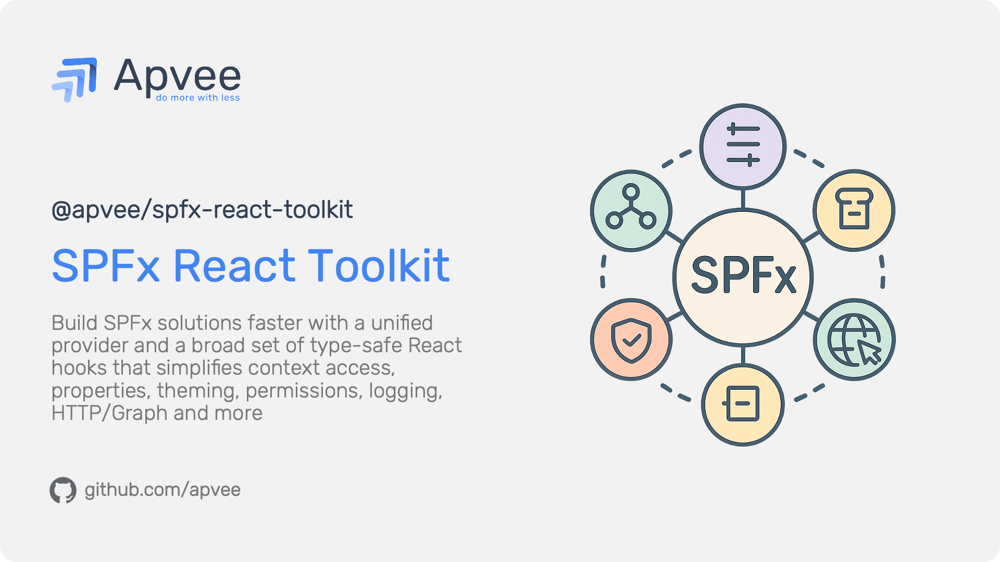

# SPFx React Toolkit

> A comprehensive React runtime and hooks library for SharePoint Framework (SPFx) with 35+ type-safe hooks. Simplifies SPFx development with instance-scoped state isolation and ergonomic hooks API across WebParts, Extensions, and Command Sets.



---

## Table of Contents

- [Overview](#overview)
- [Features](#features)
- [Installation](#installation)
- [Quick Start](#quick-start)
  - [WebPart Setup](#webpart-setup)
  - [ApplicationCustomizer Setup](#applicationcustomizer-setup)
  - [FieldCustomizer Setup](#fieldcustomizer-setup)
  - [ListView CommandSet Setup](#listview-commandset-setup)
  - [Using Hooks in Components](#using-hooks-in-components)
- [Core API](#core-api)
  - [Provider Components](#provider-components)
  - [TypeScript Types](#typescript-types)
- [Hooks API](#hooks-api)
  - [Context & Configuration](#context--configuration)
  - [User & Site Information](#user--site-information)
  - [UI & Layout](#ui--layout)
  - [Storage](#storage)
  - [HTTP Clients](#http-clients)
  - [Performance & Diagnostics](#performance--diagnostics)
  - [Permissions & Security](#permissions--security)
  - [Environment & Platform](#environment--platform)
- [PnPjs Integration (Optional)](#pnpjs-integration-optional)
  - [Installation](#pnpjs-installation)
  - [Available PnP Hooks](#available-pnp-hooks)
- [TypeScript Support](#typescript-support)
- [Architecture](#architecture)
- [Best Practices](#best-practices)
- [Troubleshooting](#troubleshooting)
- [Compatibility](#compatibility)
- [License](#license)
- [Contributing](#contributing)
- [Support](#support)

---

## Overview

**SPFx React Toolkit** is a comprehensive React runtime and hooks library for SharePoint Framework (SPFx) development. It provides a single `SPFxProvider` component that wraps your application and enables access to 35+ strongly-typed, production-ready hooks for seamless integration with SPFx context, properties, HTTP clients, permissions, storage, performance tracking, and more.

Built on [Jotai](https://jotai.org/) atomic state management, this toolkit delivers per-instance state isolation, automatic synchronization, and an ergonomic React Hooks API that works across all SPFx component types: **WebParts**, **Application Customizers**, **Field Customizers**, and **ListView Command Sets**.

### Why SPFx React Toolkit?

- **💪 Type-Safe** - Full TypeScript support with zero `any` usage
- **⚡ Optimized** - Jotai atomic state with per-instance scoping
- **🔄 Auto-Sync** - Bidirectional synchronization
- **🎨 Universal** - Works with all SPFx component types
- **📦 Modular** - Tree-shakeable, minimal bundle impact

---

## Features

- ✅ **Automatic Context Detection** - Detects WebPart, ApplicationCustomizer, CommandSet, or FieldCustomizer
- ✅ **35+ React Hooks** - Comprehensive API surface for all SPFx capabilities
- ✅ **Type-Safe** - Full TypeScript inference with strict typing
- ✅ **Instance Isolation** - State scoped per SPFx instance (multi-instance support)
- ✅ **Bidirectional Sync** - Properties automatically sync between UI and SPFx
- ✅ **PnPjs Integration** - Optional hooks for PnPjs v4 with type-safe filters
- ✅ **Performance Tracking** - Built-in hooks for performance measurement and logging
- ✅ **Cross-Platform** - Teams, SharePoint, and Local Workbench support

---

## Installation

```bash
npm install @apvee/spfx-react-toolkit
```

**Auto-Install (npm 7+):**
The following peer dependencies are automatically installed:
- **Jotai** v2+ - Atomic state management (lightweight ~3KB)
- **PnPjs** v4 - SharePoint API operations

### Peer Dependencies

All peer dependencies (`jotai`, `@pnp/sp`, `@pnp/core`, `@pnp/queryable`) are installed automatically with npm 7+. However:

- ✅ **Jotai** (~3KB) - Always included, core dependency for state management
- ✅ **PnP hooks not used?** - Tree-shaking removes unused PnP code (0 KB overhead)
- ✅ **PnP hooks used?** - Only imported parts included (~30-50 KB compressed)
- ✅ **No webpack errors** - All dependencies resolved
- ✅ **No duplicate installations** - npm reuses existing compatible versions

**All hooks available from single import:**

```typescript
import { 
  useSPFxProperties,     // Core hooks
  useSPFxContext,
  useSPFxPnP,           // PnP hooks
  useSPFxPnPList 
} from '@apvee/spfx-react-toolkit';
```

---

## Quick Start

### WebPart Setup

Wrap your component with `SPFxWebPartProvider` in the `render()` method:

```typescript
import { SPFxWebPartProvider } from 'spfx-react-toolkit';
import MyComponent from './components/MyComponent';

export default class MyWebPart extends BaseClientSideWebPart<IMyWebPartProps> {
  public render(): void {
    const element = React.createElement(
      SPFxWebPartProvider,
      { instance: this },
      React.createElement(MyComponent)
    );
    ReactDom.render(element, this.domElement);
  }
}
```

### ApplicationCustomizer Setup

For Application Customizers, use `SPFxApplicationCustomizerProvider`:

```typescript
import { SPFxApplicationCustomizerProvider } from 'spfx-react-toolkit';
import { PlaceholderName } from '@microsoft/sp-application-base';

export default class MyApplicationCustomizer extends BaseApplicationCustomizer<IMyProps> {
  public onInit(): Promise<void> {
    const placeholder = this.context.placeholderProvider.tryCreateContent(PlaceholderName.Top);
    if (placeholder) {
      const element = React.createElement(
        SPFxApplicationCustomizerProvider,
        { instance: this },
        React.createElement(MyHeaderComponent)
      );
      ReactDom.render(element, placeholder.domElement);
    }
    return Promise.resolve();
  }
}
```

### FieldCustomizer Setup

For Field Customizers, use `SPFxFieldCustomizerProvider`:

```typescript
import { SPFxFieldCustomizerProvider } from 'spfx-react-toolkit';

export default class MyFieldCustomizer extends BaseFieldCustomizer<IMyProps> {
  public onRenderCell(event: IFieldCustomizerCellEventParameters): void {
    const element = React.createElement(
      SPFxFieldCustomizerProvider,
      { instance: this },
      React.createElement(MyFieldRenderer, { value: event.fieldValue })
    );
    ReactDom.render(element, event.domElement);
  }
}
```

### ListView CommandSet Setup

For ListView Command Sets, use `SPFxListViewCommandSetProvider`:

```typescript
import { SPFxListViewCommandSetProvider } from 'spfx-react-toolkit';

export default class MyCommandSet extends BaseListViewCommandSet<IMyProps> {
  public onExecute(event: IListViewCommandSetExecuteEventParameters): void {
    const dialogElement = document.createElement('div');
    document.body.appendChild(dialogElement);
    
    const element = React.createElement(
      SPFxListViewCommandSetProvider,
      { instance: this },
      React.createElement(MyDialogComponent, { items: event.selectedRows })
    );
    ReactDom.render(element, dialogElement);
  }
}
```

### Using Hooks in Components

Once wrapped with a Provider, access SPFx capabilities via hooks:

```typescript
import * as React from 'react';
import {
  useSPFxProperties,
  useSPFxDisplayMode,
  useSPFxThemeInfo,
  useSPFxUserInfo,
  useSPFxSiteInfo,
} from 'spfx-react-toolkit';

interface IMyWebPartProps {
  title: string;
  description: string;
}

const MyComponent: React.FC = () => {
  // Access and update properties
  const { properties, setProperties } = useSPFxProperties<IMyWebPartProps>();
  
  // Check display mode
  const { isEdit } = useSPFxDisplayMode();
  
  // Get theme colors
  const theme = useSPFxThemeInfo();
  
  // Get user information
  const { displayName, email } = useSPFxUserInfo();
  
  // Get site information
  const { title: siteTitle, webUrl } = useSPFxSiteInfo();
  
  return (
    <div style={{ 
      backgroundColor: theme?.semanticColors?.bodyBackground,
      color: theme?.semanticColors?.bodyText,
      padding: '20px'
    }}>
      <h1>{properties?.title || 'Default Title'}</h1>
      <p>{properties?.description}</p>
      <p>Welcome, {displayName} ({email})</p>
      <p>Site: {siteTitle} - {webUrl}</p>
      
      {isEdit && (
        <button onClick={() => setProperties({ title: 'Updated Title' })}>
          Update Title
        </button>
      )}
    </div>
  );
};

export default MyComponent;
```

---

## Core API

### Provider Components

The toolkit provides **4 type-safe Provider components**, one for each SPFx component type. Each Provider automatically detects the component kind, initializes instance-scoped state, and enables all hooks.

#### `SPFxWebPartProvider<TProps>`

Type-safe provider for **WebParts**.

**Description:**  
SPFx context provider specifically for WebParts. This is a type-safe wrapper around the base provider that accepts a WebPart instance directly without requiring type casting. Use this provider in WebParts instead of the generic `SPFxProvider`.

**Type Parameters:**
- `TProps extends {}` - The properties type for the WebPart (defaults to `{}`)

**Props:** `SPFxWebPartProviderProps<TProps>`
- `instance: BaseClientSideWebPart<TProps>` - The SPFx WebPart instance (required)
- `children?: React.ReactNode` - The children to render within the provider (optional)

**Returns:** `JSX.Element`

**Key Features:**
- ✅ Type-safe props inference from WebPart
- ✅ No type casting required (`instance: this` works directly)
- ✅ Automatic Property Pane synchronization (bidirectional)
- ✅ Full access to all 35+ hooks within child components
- ✅ Instance-scoped state isolation (multi-instance support)
- ✅ Display mode detection (Edit/Read)
- ✅ Container size tracking for responsive layouts

**Use Cases:**
- Modern SharePoint WebParts
- Data visualization components
- Forms and input controls
- Dashboard widgets
- Content aggregators
- Interactive reports
- Custom property-driven experiences

**Example:**
```typescript
import { SPFxWebPartProvider, useSPFxProperties, useSPFxDisplayMode, useSPFxThemeInfo } from 'spfx-react-toolkit';

export interface IMyWebPartProps {
  title: string;
  description: string;
}

export default class MyWebPart extends BaseClientSideWebPart<IMyWebPartProps> {
  public render(): void {
    const element = React.createElement(
      SPFxWebPartProvider,
      { instance: this },
      React.createElement(MyComponent)
    );
    ReactDom.render(element, this.domElement);
  }
}

// Component using hooks
const MyComponent: React.FC = () => {
  const { properties, setProperties } = useSPFxProperties<IMyWebPartProps>();
  const { isEdit } = useSPFxDisplayMode();
  const theme = useSPFxThemeInfo();

  return (
    <div style={{ padding: '20px', backgroundColor: theme?.palette.white }}>
      <h1>{properties?.title || 'Default Title'}</h1>
      <p>{properties?.description}</p>
      {isEdit && (
        <button onClick={() => setProperties({ title: 'Updated' })}>
          Update Title
        </button>
      )}
    </div>
  );
};
```

#### `SPFxApplicationCustomizerProvider<TProps>`

Type-safe provider for **Application Customizers**.

**Description:**  
SPFx context provider specifically for Application Customizers. This is a type-safe wrapper around the base provider that accepts an Application Customizer instance directly without requiring type casting. Use this provider in Application Customizers instead of the generic `SPFxProvider`.

**Type Parameters:**
- `TProps extends {}` - The properties type for the Application Customizer (defaults to `{}`)

**Props:** `SPFxApplicationCustomizerProviderProps<TProps>`
- `instance: BaseApplicationCustomizer<TProps>` - The SPFx Application Customizer instance (required)
- `children?: React.ReactNode` - The children to render within the provider (optional)

**Returns:** `JSX.Element`

**Key Features:**
- ✅ Type-safe props inference from Application Customizer
- ✅ No type casting required (`instance: this` works directly)
- ✅ Automatic placeholder management
- ✅ Full access to all 35+ hooks within child components
- ✅ Instance-scoped state isolation (multiple placeholders supported)

**Supported Placeholders:**
- `PlaceholderName.Top` - Header area (above page title)
- `PlaceholderName.Bottom` - Footer area (below page content)

**Example:**
```typescript
import * as React from 'react';
import * as ReactDom from 'react-dom';
import { BaseApplicationCustomizer, PlaceholderName } from '@microsoft/sp-application-base';
import { SPFxApplicationCustomizerProvider } from 'spfx-react-toolkit';
import MyHeaderComponent from './components/MyHeaderComponent';

export interface IMyCustomizerProps {
  message: string;
  showSiteTitle: boolean;
}

export default class MyApplicationCustomizer extends BaseApplicationCustomizer<IMyCustomizerProps> {
  public onInit(): Promise<void> {
    // Create Top placeholder
    const placeholder = this.context.placeholderProvider.tryCreateContent(
      PlaceholderName.Top
    );

    if (placeholder) {
      const element = React.createElement(
        SPFxApplicationCustomizerProvider,
        { instance: this },
        React.createElement(MyHeaderComponent)
      );
      ReactDom.render(element, placeholder.domElement);
    }

    return Promise.resolve();
  }
}

// Component using hooks
const MyHeaderComponent: React.FC = () => {
  const { properties } = useSPFxProperties<IMyCustomizerProps>();
  const theme = useSPFxThemeInfo();
  const { title } = useSPFxSiteInfo();

  return (
    <div style={{ 
      backgroundColor: theme?.palette.themePrimary,
      padding: '10px',
      color: theme?.palette.white
    }}>
      <h3>{properties?.message || 'Welcome'}</h3>
      {properties?.showSiteTitle && <span>Site: {title}</span>}
    </div>
  );
};
```

#### `SPFxFieldCustomizerProvider<TProps>`

Type-safe provider for **Field Customizers**.

**Description:**  
SPFx context provider specifically for Field Customizers. This is a type-safe wrapper around the base provider that accepts a Field Customizer instance directly without requiring type casting. Use this provider in Field Customizers instead of the generic `SPFxProvider`.

**Type Parameters:**
- `TProps extends {}` - The properties type for the Field Customizer (defaults to `{}`)

**Props:** `SPFxFieldCustomizerProviderProps<TProps>`
- `instance: BaseFieldCustomizer<TProps>` - The SPFx Field Customizer instance (required)
- `children?: React.ReactNode` - The children to render within the provider (optional)

**Returns:** `JSX.Element`

**Key Features:**
- ✅ Type-safe props inference from Field Customizer
- ✅ No type casting required (`instance: this` works directly)
- ✅ Cell-level rendering with full SPFx context
- ✅ Full access to all 35+ hooks within child components
- ✅ Instance-scoped state isolation per field
- ✅ Access to field value and list item data

**Use Cases:**
- Custom field rendering (text, numbers, dates, etc.)
- Conditional formatting based on field values
- Interactive field controls (links, buttons, badges)
- Real-time data visualization in list views
- Field-specific permissions or business logic

**Example:**
```typescript
import * as React from 'react';
import * as ReactDom from 'react-dom';
import { BaseFieldCustomizer, IFieldCustomizerCellEventParameters } from '@microsoft/sp-listview-extensibility';
import { SPFxFieldCustomizerProvider } from 'spfx-react-toolkit';
import MyFieldRenderer from './components/MyFieldRenderer';

export interface IMyFieldCustomizerProps {
  highlightThreshold?: number;
  warningColor?: string;
}

export default class MyFieldCustomizer extends BaseFieldCustomizer<IMyFieldCustomizerProps> {
  public onRenderCell(event: IFieldCustomizerCellEventParameters): void {
    const element = React.createElement(
      SPFxFieldCustomizerProvider,
      { instance: this },
      React.createElement(MyFieldRenderer, { value: event.fieldValue })
    );
    ReactDom.render(element, event.domElement);
  }
}

// Component using hooks
const MyFieldRenderer: React.FC<{ value: any }> = ({ value }) => {
  const { properties } = useSPFxProperties<IMyFieldCustomizerProps>();
  const theme = useSPFxThemeInfo();
  const threshold = properties?.highlightThreshold ?? 100;
  const isHighlighted = typeof value === 'number' && value > threshold;

  return (
    <span style={{
      color: isHighlighted ? theme?.palette.red : theme?.palette.neutralPrimary,
      fontWeight: isHighlighted ? 'bold' : 'normal'
    }}>
      {value}
      {isHighlighted && ' ⚠️'}
    </span>
  );
};
```

#### `SPFxListViewCommandSetProvider<TProps>`

Type-safe provider for **ListView Command Sets**.

**Description:**  
SPFx context provider specifically for ListView Command Sets. This is a type-safe wrapper around the base provider that accepts a ListView Command Set instance directly without requiring type casting. Use this provider in ListView Command Sets instead of the generic `SPFxProvider`.

**Type Parameters:**
- `TProps extends {}` - The properties type for the ListView Command Set (defaults to `{}`)

**Props:** `SPFxListViewCommandSetProviderProps<TProps>`
- `instance: BaseListViewCommandSet<TProps>` - The SPFx ListView Command Set instance (required)
- `children?: React.ReactNode` - The children to render within the provider (optional)

**Returns:** `JSX.Element`

**Key Features:**
- ✅ Type-safe props inference from ListView Command Set
- ✅ No type casting required (`instance: this` works directly)
- ✅ Access to selected items and list context
- ✅ Full access to all 35+ hooks within child components
- ✅ Instance-scoped state isolation per command
- ✅ Dialog and panel rendering support

**Use Cases:**
- Custom bulk actions on selected items
- Confirmation dialogs with SPFx context
- Side panels for item editing or details
- Export/import operations with selected rows
- Workflow triggers from list view
- Multi-item batch processing

**Example:**
```typescript
import { SPFxListViewCommandSetProvider, useSPFxProperties, useSPFxThemeInfo } from 'spfx-react-toolkit';

export interface IMyCommandSetProps {
  confirmationMessage?: string;
}

export default class MyCommandSet extends BaseListViewCommandSet<IMyCommandSetProps> {
  public onExecute(event: IListViewCommandSetExecuteEventParameters): void {
    const dialogElement = document.createElement('div');
    document.body.appendChild(dialogElement);
    
    const element = React.createElement(
      SPFxListViewCommandSetProvider,
      { instance: this },
      React.createElement(MyDialogComponent, {
        items: event.selectedRows,
        onDismiss: () => {
          ReactDom.unmountComponentAtNode(dialogElement);
          document.body.removeChild(dialogElement);
        }
      })
    );
    ReactDom.render(element, dialogElement);
  }
}

// Component using hooks
const MyDialogComponent: React.FC<{ items: any[]; onDismiss: () => void }> = ({ items, onDismiss }) => {
  const { properties } = useSPFxProperties<IMyCommandSetProps>();
  const theme = useSPFxThemeInfo();

  return (
    <div style={{ 
      padding: '20px', 
      backgroundColor: theme?.palette.white,
      border: `1px solid ${theme?.palette.neutralLight}` 
    }}>
      <h2>{properties?.confirmationMessage || 'Confirm action'}</h2>
      <p>Selected {items.length} item(s)</p>
      <button onClick={onDismiss}>Close</button>
    </div>
  );
};
```

### TypeScript Types

All Provider props and hook return types are fully typed and exported:

```typescript
import type {
  // Provider Props
  SPFxWebPartProviderProps,
  SPFxApplicationCustomizerProviderProps,
  SPFxFieldCustomizerProviderProps,
  SPFxListViewCommandSetProviderProps,
  
  // Core Context Types
  HostKind,                    // 'WebPart' | 'AppCustomizer' | 'FieldCustomizer' | 'CommandSet' | 'ACE'
  SPFxComponent,               // Union of all SPFx component types
  SPFxContextType,             // Union of all SPFx context types
  SPFxContextValue,            // Context value: { instanceId, spfxContext, kind }
  ContainerSize,               // { width: number, height: number }
  
  // Hook Return Types
  SPFxPropertiesInfo,          // useSPFxProperties
  SPFxDisplayModeInfo,         // useSPFxDisplayMode
  SPFxInstanceInfo,            // useSPFxInstanceInfo
  SPFxEnvironmentInfo,         // useSPFxEnvironmentInfo
  SPFxPageTypeInfo,            // useSPFxPageType
  SPFxUserInfo,                // useSPFxUserInfo
  SPFxSiteInfo,                // useSPFxSiteInfo
  SPFxLocaleInfo,              // useSPFxLocaleInfo
  SPFxListInfo,                // useSPFxListInfo
  SPFxHubSiteInfo,             // useSPFxHubSiteInfo
  SPFxThemeInfo,               // useSPFxThemeInfo
  SPFxFluent9ThemeInfo,        // useSPFxFluent9ThemeInfo
  SPFxContainerInfo,           // useSPFxContainerInfo
  SPFxStorageHook,             // useSPFxLocalStorage / useSPFxSessionStorage
  SPFxPerformanceInfo,         // useSPFxPerformance
  SPFxPerfResult,              // Performance measurement result
  SPFxLoggerInfo,              // useSPFxLogger
  LogEntry,                    // Log entry structure
  LogLevel,                    // Log levels
  SPFxCorrelationInfo,         // useSPFxCorrelationInfo
  SPFxPermissionsInfo,         // useSPFxPermissions
  SPFxTeamsInfo,               // useSPFxTeams
  TeamsTheme,                  // Teams theme type
  SPFxOneDriveAppDataResult,   // useSPFxOneDriveAppData
  
  // PnP Types (if using PnPjs integration)
  PnPContextInfo,              // useSPFxPnPContext
  SPFxPnPInfo,                 // useSPFxPnP
  SPFxPnPListInfo,             // useSPFxPnPList
  SPFxPnPSearchInfo,           // useSPFxPnPSearch
} from 'spfx-react-toolkit';
```

---

## Hooks API

The toolkit provides **33 specialized hooks** organized by functionality. All hooks are type-safe, memoized, and automatically access the instance-scoped state.

### Context & Configuration

#### `useSPFxContext()`

**⚠️ Advanced/Internal Hook** - Access SPFx context metadata directly.

**Description:**  
Internal hook that provides access to the raw SPFx context metadata. Most users should use higher-level hooks like `useSPFxPageContext()`, `useSPFxInstanceInfo()`, etc. instead.

**Returns:** `SPFxContextValue`
- `instanceId: string` - Unique identifier for this SPFx instance
- `spfxContext: WebPartContext | ApplicationCustomizerContext | etc.` - The raw SPFx context object
- `kind: HostKind` - Type of host component ('WebPart' | 'AppCustomizer' | 'FieldCustomizer' | 'CommandSet' | 'ACE')

**Throws:** `Error` if used outside SPFxProvider

**When to use:**
- Accessing raw SPFx context for advanced scenarios
- Custom integrations requiring direct context access
- Building custom hooks on top of the toolkit

**When NOT to use:**
- Use `useSPFxPageContext()` for PageContext access
- Use `useSPFxInstanceInfo()` for instance ID and kind
- Use specific hooks for most common scenarios

**Example:**
```typescript
import { useSPFxContext } from 'spfx-react-toolkit';

function AdvancedComponent() {
  const { instanceId, spfxContext, kind } = useSPFxContext();
  
  console.log('Instance ID:', instanceId);
  console.log('Component Kind:', kind);
  console.log('Raw SPFx Context:', spfxContext);
  
  // Access raw context for advanced scenarios
  if (kind === 'WebPart') {
    const webPartContext = spfxContext as WebPartContext;
    console.log('WebPart instance ID:', webPartContext.instanceId);
  }
  
  return <div>Advanced Context Access</div>;
}
```

**Note:** This hook returns static metadata only. Reactive state is managed via Jotai atoms in isolated stores per Provider instance.

---

#### `useSPFxPageContext()`

Access the full SharePoint PageContext object with comprehensive site, web, user, list, Teams, and locale information.

**Description:**  
Provides access to SharePoint PageContext from SPFx ServiceScope using dependency injection. The service is consumed lazily and cached for performance. PageContext contains comprehensive information about the current SharePoint context including site collection, web, user, list (if applicable), Teams context (if running in Teams), culture/locale settings, and permissions.

**Returns:** `PageContext`  
The native SPFx PageContext object with all properties:
- **web**: Web information (title, absoluteUrl, serverRelativeUrl, id, description, etc.)
- **site**: Site collection information (absoluteUrl, serverRelativeUrl, id, classification, etc.)
- **user**: Current user information (displayName, loginName, email, isAnonymousGuestUser, etc.)
- **list**: List information (id, title, serverRelativeUrl, baseTemplate) - only available in list context
- **listItem**: List item information (id) - only available when viewing/editing items
- **cultureInfo**: Culture and locale settings (currentCultureName, currentUICultureName, isRightToLeft)
- **legacyPageContext**: Legacy page context (for backwards compatibility)
- **aadInfo**: Azure AD information (tenantId, userId)
- **sdks**: SDKs and versions (microsoftTeams, teams)
- **isInitialized**: Whether PageContext is fully initialized

**Key Features:**
- Lazy consumption from ServiceScope (only when hook is used)
- Cached with useMemo for performance
- Guaranteed to be finished by SPFxProvider guard
- Type-safe with native SPFx PageContext type
- Access to all SPFx context properties in one object

**Use Cases:**
- **Site Navigation**: Build breadcrumbs, navigation menus with site hierarchy
- **User Display**: Show current user information, profile, permissions
- **Conditional Rendering**: Render based on site type, list type, or item context
- **Logging/Diagnostics**: Include site/web/user context in logs
- **URL Construction**: Build absolute URLs for REST API calls
- **Locale-Aware UI**: Adapt UI based on culture settings
- **Teams Integration**: Detect Teams context and adapt UI
- **Permission Checks**: Access permission information for conditional features

**Common PageContext Properties:**
```typescript
pageContext.web.title                    // Web title
pageContext.web.absoluteUrl              // Web absolute URL
pageContext.web.serverRelativeUrl        // Web server-relative URL
pageContext.web.id                       // Web GUID
pageContext.site.absoluteUrl             // Site collection URL
pageContext.site.id                      // Site collection GUID
pageContext.user.displayName             // Current user display name
pageContext.user.loginName               // Current user login name
pageContext.user.email                   // Current user email
pageContext.user.isAnonymousGuestUser    // Is anonymous guest
pageContext.list?.title                  // List title (if in list context)
pageContext.list?.id                     // List GUID (if in list context)
pageContext.listItem?.id                 // Item ID (if viewing/editing item)
pageContext.cultureInfo.currentCultureName         // e.g., "en-US"
pageContext.cultureInfo.currentUICultureName       // UI locale
pageContext.cultureInfo.isRightToLeft              // RTL language
pageContext.aadInfo.tenantId             // Azure AD tenant ID
pageContext.sdks.microsoftTeams          // Teams SDK (if in Teams)
```

**Example - Site breadcrumb with user info:**
```typescript
import { useSPFxPageContext } from 'spfx-react-toolkit';
import { Breadcrumb, Persona, PersonaSize } from '@fluentui/react';

function SiteHeader() {
  const pageContext = useSPFxPageContext();
  
  // Build breadcrumb items from site hierarchy
  const breadcrumbItems = [
    {
      text: 'Root',
      key: 'root',
      href: pageContext.site.absoluteUrl
    },
    {
      text: pageContext.web.title,
      key: 'current',
      href: pageContext.web.absoluteUrl,
      isCurrentItem: true
    }
  ];
  
  // Add list to breadcrumb if in list context
  if (pageContext.list) {
    breadcrumbItems.push({
      text: pageContext.list.title,
      key: 'list',
      href: `${pageContext.web.absoluteUrl}${pageContext.list.serverRelativeUrl}`,
      isCurrentItem: !pageContext.listItem
    });
  }
  
  // Add list item to breadcrumb if viewing/editing item
  if (pageContext.listItem) {
    breadcrumbItems.push({
      text: `Item ${pageContext.listItem.id}`,
      key: 'item',
      isCurrentItem: true
    });
  }
  
  return (
    <div style={{ 
      padding: '16px', 
      borderBottom: '1px solid #edebe9',
      display: 'flex',
      justifyContent: 'space-between',
      alignItems: 'center'
    }}>
      <div>
        <Breadcrumb items={breadcrumbItems} />
        
        <div style={{ marginTop: '8px', fontSize: '12px', color: '#666' }}>
          <div>
            <strong>Site:</strong> {pageContext.site.absoluteUrl}
          </div>
          <div>
            <strong>Web:</strong> {pageContext.web.absoluteUrl}
          </div>
          {pageContext.list && (
            <div>
              <strong>List:</strong> {pageContext.list.title} 
              (ID: {pageContext.list.id.toString()})
            </div>
          )}
          <div>
            <strong>Locale:</strong> {pageContext.cultureInfo.currentCultureName}
            {pageContext.cultureInfo.isRightToLeft && ' (RTL)'}
          </div>
          {pageContext.sdks.microsoftTeams && (
            <div>
              <strong>Teams Context:</strong> Yes
            </div>
          )}
        </div>
      </div>
      
      <div>
        <Persona
          text={pageContext.user.displayName}
          secondaryText={pageContext.user.email}
          size={PersonaSize.size40}
          imageUrl={`/_layouts/15/userphoto.aspx?size=M&username=${pageContext.user.loginName}`}
        />
        {pageContext.user.isAnonymousGuestUser && (
          <div style={{ fontSize: '11px', color: '#a4262c', marginTop: '4px' }}>
            (Anonymous Guest)
          </div>
        )}
      </div>
    </div>
  );
}
```

**Best Practices:**
- ✅ Use higher-level hooks (useSPFxSiteInfo, useSPFxUserInfo) for specific data when possible
- ✅ Check for optional properties (list, listItem) before accessing
- ✅ Use PageContext for comprehensive context when multiple properties needed
- ✅ Memoize derived values computed from PageContext
- ✅ Use pageContext.web.absoluteUrl for constructing absolute URLs
- ✅ Check pageContext.sdks.microsoftTeams for Teams-specific features
- ✅ Use pageContext.cultureInfo for locale-aware rendering
- ✅ Include PageContext data in diagnostic logs for troubleshooting
- ✅ Cache PageContext reference (hook already does this internally)
- ❌ Don't access pageContext.list without checking for undefined (not always available)
- ❌ Don't assume all properties are always present (some are context-dependent)
- ❌ Don't use PageContext for simple single-property access (use specific hooks)
- ❌ Don't ignore isAnonymousGuestUser (important for permission-based features)
- ❌ Don't hardcode URLs (use PageContext properties instead)

---

#### `useSPFxProperties<T>()`

**Description:**  
Access and manage SPFx properties with type-safe partial updates and automatic bidirectional synchronization with the Property Pane. Properties are the configuration values for WebParts/Extensions that are set via Property Pane, persist across page loads, and are specific to each instance. This hook provides type-safe access with partial updates (shallow merge), updater function pattern (like React setState), and automatic bidirectional sync with SPFx managed by the Provider. The SPFxProvider automatically handles synchronization: Property Pane changes → Atom → Hook (automatic), Hook updates → Atom → SPFx properties (automatic), and Property Pane refresh for WebParts (automatic).

**Returns:** `SPFxPropertiesInfo<T>`
- `properties: T | undefined` - Current properties object from SPFx instance
- `setProperties: (updates: Partial<T>) => void` - Update properties with partial updates (shallow merge). Changes are automatically synced back to SPFx by the Provider.
- `updateProperties: (updater: (current: T | undefined) => T) => void` - Update properties using updater function (like React setState). Useful for complex updates based on current state. Changes are automatically synced back to SPFx by the Provider.

**Key Features:**
- ✅ **Type-Safe Access** - Use generic type parameter for compile-time type checking
- ✅ **Partial Updates** - Shallow merge with existing properties (no need to spread all fields)
- ✅ **Updater Function Pattern** - Like React setState for complex updates based on current state
- ✅ **Automatic Bidirectional Sync** - Property Pane ↔ Atom ↔ Hook synchronization (managed by Provider)
- ✅ **Property Pane Refresh** - WebParts automatically refresh Property Pane after updates
- ✅ **Instance-Specific** - Each WebPart/Extension instance has its own properties
- ✅ **Persistent** - Properties persist across page loads and browser sessions
- ✅ **Stable References** - setProperties and updateProperties have stable references from Jotai

**Use Cases:**
- **Property Pane Configuration** - Display and modify WebPart/Extension settings
- **Dynamic Title/Description** - Update title or description from component logic
- **List/Library Selection** - Store and update selected list/library IDs
- **Feature Toggles** - Enable/disable features based on property flags
- **User Preferences** - Store user-specific settings per instance
- **Conditional Rendering** - Show/hide UI based on property values
- **Complex Updates** - Use updater function for state-based updates (counters, toggles, etc.)
- **Programmatic Configuration** - Update properties from buttons, forms, or events

**Example:**
```typescript
import { useSPFxProperties } from '@apvee/spfx-react-toolkit';

interface IMyWebPartProps {
  title: string;
  description: string;
  listId?: string;
  showHeader: boolean;
  refreshInterval: number;
}

function MyComponent() {
  const { properties, setProperties, updateProperties } = 
    useSPFxProperties<IMyWebPartProps>();
  
  // Handle undefined properties gracefully
  const title = properties?.title ?? 'Default Title';
  const description = properties?.description ?? 'No description';
  const showHeader = properties?.showHeader ?? true;
  const refreshInterval = properties?.refreshInterval ?? 60;
  
  return (
    <Stack tokens={{ childrenGap: 15 }}>
      {/* Display current properties */}
      {showHeader && (
        <Stack>
          <Text variant="xxLarge">{title}</Text>
          <Text variant="medium">{description}</Text>
        </Stack>
      )}
      
      {/* Partial update - only update specific fields */}
      <Stack horizontal tokens={{ childrenGap: 10 }}>
        <TextField
          label="Title"
          value={title}
          onChange={(_, newValue) => 
            setProperties({ title: newValue || 'Untitled' })
          }
        />
        
        <TextField
          label="Description"
          value={description}
          onChange={(_, newValue) => 
            setProperties({ description: newValue || '' })
          }
        />
      </Stack>
      
      {/* Toggle with partial update */}
      <Toggle
        label="Show Header"
        checked={showHeader}
        onChange={(_, checked) => 
          setProperties({ showHeader: checked ?? true })
        }
      />
      
      {/* Updater function for complex logic */}
      <Stack horizontal tokens={{ childrenGap: 10 }}>
        <PrimaryButton
          text="Increment Interval"
          onClick={() => 
            updateProperties(prev => ({
              ...prev,
              refreshInterval: (prev?.refreshInterval ?? 60) + 10
            }))
          }
        />
        
        <DefaultButton
          text="Decrement Interval"
          onClick={() => 
            updateProperties(prev => ({
              ...prev,
              refreshInterval: Math.max(10, (prev?.refreshInterval ?? 60) - 10)
            }))
          }
        />
        
        <Text>Current interval: {refreshInterval}s</Text>
      </Stack>
      
      {/* Append to existing value with updater */}
      <PrimaryButton
        text="Append Timestamp to Title"
        onClick={() => 
          updateProperties(prev => ({
            ...prev,
            title: `${prev?.title ?? 'Title'} - ${new Date().toLocaleTimeString()}`
          }))
        }
      />
      
      {/* Reset to defaults */}
      <DefaultButton
        text="Reset to Defaults"
        onClick={() => 
          setProperties({
            title: 'Default Title',
            description: 'Default description',
            showHeader: true,
            refreshInterval: 60,
            listId: undefined
          })
        }
      />
      
      {/* Show list selection (if listId exists) */}
      {properties?.listId && (
        <MessageBar messageBarType={MessageBarType.info}>
          Selected List ID: {properties.listId}
        </MessageBar>
      )}
    </Stack>
  );
}

// In WebPart render() - just pass instance, sync is automatic!
const element = React.createElement(
  SPFxProvider,
  { instance: this },
  React.createElement(MyComponent)
);
```

**Best Practices:**

✅ **DO** use generic type parameter for type-safe access (`useSPFxProperties<IMyProps>()`)  
✅ **DO** provide default values with nullish coalescing (`properties?.title ?? 'Default'`)  
✅ **DO** use setProperties() for partial updates (no need to spread all fields)  
✅ **DO** use updateProperties() for complex logic based on current state  
✅ **DO** wrap component tree with SPFxProvider in WebPart/Extension render()  
✅ **DO** rely on automatic sync - Provider handles Property Pane ↔ properties synchronization  
✅ **DO** use updater function for state-based updates (counters, toggles, etc.)  
✅ **DO** handle undefined properties gracefully (properties can be undefined initially)  
✅ **DO** validate property values before using them in critical logic  
✅ **DO** use properties for instance-specific configuration (not global state)  

❌ **DON'T** mutate properties directly - always use setProperties() or updateProperties()  
❌ **DON'T** forget to wrap with SPFxProvider - hook will fail without it  
❌ **DON'T** assume properties are always defined - check for undefined  
❌ **DON'T** use properties for temporary UI state - use React useState instead  
❌ **DON'T** manually sync with Property Pane - Provider handles this automatically  
❌ **DON'T** store large objects in properties (impacts performance and serialization)  
❌ **DON'T** update properties in tight loops or on every render  
❌ **DON'T** use properties for cross-instance communication - use separate state management  
❌ **DON'T** forget that properties persist - clean up unused properties when no longer needed  
❌ **DON'T** bypass setProperties/updateProperties - always use provided setters

---

#### `useSPFxDisplayMode()`

Access display mode (Read/Edit) for conditional rendering. Display mode is readonly and controlled by SharePoint.

**Description:**  
Provides current display mode information for SPFx WebParts and Extensions. Display mode controls whether the component is in Read mode (normal viewing) or Edit mode (editing/configuration). This is a readonly value controlled by SharePoint - it changes when the user clicks the Edit button on the page.

**Returns:** `SPFxDisplayModeInfo`
- `mode: DisplayMode` - Current display mode (`DisplayMode.Read` or `DisplayMode.Edit`)
- `isEdit: boolean` - True if in Edit mode
- `isRead: boolean` - True if Read mode

**Key Features:**
- Readonly value controlled by SharePoint
- Automatically updates when page mode changes
- Boolean helpers for conditional rendering
- Works with all SPFx component types

**Use Cases:**
- Showing/hiding edit controls based on mode
- Conditional rendering for read vs edit layouts
- Different UI for editing vs viewing
- Display placeholders in edit mode
- Enable/disable features based on mode

**Example - Edit-only controls:**
```typescript
import { useSPFxDisplayMode } from 'spfx-react-toolkit';

function EditableComponent() {
  const { isEdit } = useSPFxDisplayMode();
  const [title, setTitle] = useState('My Title');
  
  return (
    <Stack tokens={{ childrenGap: 8 }}>
      {isEdit ? (
        <TextField 
          label="Title" 
          value={title} 
          onChange={(_, val) => setTitle(val || '')} 
        />
      ) : (
        <Text variant="xxLarge">{title}</Text>
      )}
      
      {isEdit && (
        <Stack horizontal tokens={{ childrenGap: 8 }}>
          <PrimaryButton text="Save" onClick={handleSave} />
          <DefaultButton text="Cancel" onClick={handleCancel} />
        </Stack>
      )}
    </Stack>
  );
}
```

**Best Practices:**
- ✅ Use `isEdit`/`isRead` booleans for cleaner conditional logic
- ✅ Show helpful placeholders in edit mode when not configured
- ✅ Use edit mode to expose configuration UI
- ✅ Hide edit controls in read mode for cleaner UI
- ✅ Consider different layouts for edit vs read for better UX
- ✅ Use `useSPFxIsEdit()` shortcut when only checking edit mode
- ❌ Don't try to modify display mode (it's readonly)
- ❌ Don't assume mode persists across page reloads
- ❌ Don't rely on display mode for security (use permissions instead)

---

#### `useSPFxInstanceInfo()`

Access unique instance ID and component kind for debugging, logging, conditional logic, and telemetry.

**Description:**  
Provides essential metadata about the current SPFx component instance. Each SPFx component (WebPart, Extension, etc.) has a unique instance ID that persists across renders and page loads. The `kind` property identifies the component type, enabling conditional logic based on the hosting environment.

**Returns:** `SPFxInstanceInfo`
- `id: string` - Unique identifier for this SPFx instance (GUID format, persists across renders)
- `kind: HostKind` - Component type: `'WebPart' | 'AppCustomizer' | 'FieldCustomizer' | 'CommandSet' | 'ACE'`

**Key Features:**
- Unique instance ID that persists across renders and page navigation
- Component type detection for conditional logic
- Essential for logging, telemetry, and debugging
- Used internally for scoped storage keys
- Enables multi-instance scenarios (multiple WebParts of same type on page)

**Use Cases:**
- **Logging & Telemetry**: Track component usage and errors with instance context
- **Conditional Logic**: Different behavior based on component type (WebPart vs Extension)
- **Scoped Storage**: Create instance-specific localStorage/sessionStorage keys
- **Debug Information**: Display instance metadata for troubleshooting
- **Analytics**: Track individual component instances separately
- **Multi-Instance Scenarios**: Identify which instance triggered an event

**HostKind Values:**
- `'WebPart'` - SharePoint WebPart on modern pages
- `'AppCustomizer'` - Application Customizer (header/footer extensions)
- `'FieldCustomizer'` - Field Customizer (custom field rendering)
- `'CommandSet'` - ListView Command Set (custom list actions)
- `'ACE'` - Adaptive Card Extension (Viva Connections)

**Example - Logging with instance context:**
```typescript
import { useSPFxInstanceInfo } from 'spfx-react-toolkit';
import { useEffect } from 'react';

function MyComponent() {
  const { id, kind } = useSPFxInstanceInfo();
  
  useEffect(() => {
    // Log component initialization with instance context
    console.log(`[${kind}] Instance ${id} initialized`);
    
    // Send telemetry
    if (typeof window !== 'undefined' && (window as any).appInsights) {
      (window as any).appInsights.trackEvent({
        name: 'ComponentInitialized',
        properties: {
          instanceId: id,
          componentKind: kind,
          timestamp: new Date().toISOString()
        }
      });
    }
    
    return () => {
      console.log(`[${kind}] Instance ${id} unmounted`);
    };
  }, [id, kind]);
  
  // Conditional rendering based on component type
  if (kind === 'WebPart') {
    return (
      <div data-instance-id={id}>
        <h3>WebPart View</h3>
        <p>Instance: {id}</p>
      </div>
    );
  }
  
  if (kind === 'AppCustomizer') {
    return (
      <div data-instance-id={id}>
        <span>Extension: {id.substring(0, 8)}</span>
      </div>
    );
  }
  
  return <div>Unsupported component type: {kind}</div>;
}
```

**Best Practices:**
- ✅ Use `id` for logging, telemetry, and analytics
- ✅ Use `kind` for conditional logic based on component type
- ✅ Include instance ID in error logs for easier debugging
- ✅ Use instance ID for scoped storage keys (e.g., `localStorage[id]`)
- ✅ Add `data-instance-id` attribute to root element for debugging
- ✅ Log instance lifecycle events (mount/unmount) with instance ID
- ✅ Use instance ID when reporting issues to support teams
- ❌ Don't use instance ID for business logic (it's for metadata only)
- ❌ Don't assume instance ID format or length (treat as opaque string)
- ❌ Don't use `kind` as the only security check (always verify permissions)
- ❌ Don't hardcode `kind` values (use type checking instead)

---

#### `useSPFxServiceScope()`

**Description:**  
Access SPFx ServiceScope for advanced dependency injection and service consumption. ServiceScope is SPFx's built-in dependency injection container that provides access to built-in SPFx services (HttpClient, MSGraphClientFactory, EventAggregator, etc.) and custom registered services. This hook provides type-safe service consumption with a helper method that wraps the native serviceScope.consume() API. Most common services have dedicated hooks (useSPFxHttpClient, useSPFxMSGraphClient), so use this hook primarily for custom services or advanced scenarios requiring direct ServiceScope access.

**Returns:** `SPFxServiceScopeInfo`
- `serviceScope: ServiceScope | undefined` - Native ServiceScope instance from SPFx. Provides access to SPFx's dependency injection container.
- `consume: <T>(serviceKey: ServiceKey<T>) => T` - Consume a service from the ServiceScope using its ServiceKey. Wraps serviceScope.consume() with type safety and error handling.

**Key Features:**
- ✅ **Type-Safe Service Consumption** - Generic consume() method with TypeScript type inference
- ✅ **Access to Built-in Services** - Consume SPFx services like EventAggregator, HttpClient, etc.
- ✅ **Custom Service Support** - Access custom services registered in your solution
- ✅ **Service Lifecycle Management** - Services are automatically managed by SPFx
- ✅ **Service Isolation** - Each ServiceScope provides isolated service instances
- ✅ **Lazy Service Consumption** - Services are instantiated only when consumed
- ✅ **Error Handling** - consume() throws descriptive error if ServiceScope unavailable
- ✅ **Stable References** - consume callback has stable reference from useCallback

**Use Cases:**
- **Custom Service Consumption** - Access custom services registered in your SPFx solution
- **EventAggregator Access** - Subscribe to and publish events across components
- **Advanced Service Architecture** - Implement service-based patterns and testable code
- **Service Mocking** - Replace services with mocks for testing
- **Service Isolation** - Create child scopes for isolated service instances
- **Built-in Service Access** - Access SPFx services not exposed via context
- **Cross-Component Communication** - Use services for component-to-component messaging
- **Decoupled Components** - Build loosely coupled, testable components

**Example:**
```typescript
import { useSPFxServiceScope } from '@apvee/spfx-react-toolkit';
import { ServiceKey } from '@microsoft/sp-core-library';
import { IEventAggregator } from '@microsoft/sp-core-library';

// Define custom service interface
interface IDataService {
  fetchData(): Promise<any[]>;
  saveData(data: any): Promise<void>;
}

// Service key (typically defined in service file)
const DataServiceKey = ServiceKey.create<IDataService>(
  'my-solution:IDataService',
  IDataService
);

function MyComponent() {
  const { consume, serviceScope } = useSPFxServiceScope();
  const [data, setData] = React.useState<any[]>([]);
  const [events, setEvents] = React.useState<string[]>([]);
  
  // Consume custom service using helper
  const dataService = React.useMemo(
    () => consume<IDataService>(DataServiceKey),
    [consume]
  );
  
  // Fetch data on mount
  React.useEffect(() => {
    dataService.fetchData().then(setData);
  }, [dataService]);
  
  // Subscribe to events using EventAggregator
  React.useEffect(() => {
    if (!serviceScope) return;
    
    // Access built-in EventAggregator service
    const eventAggregator = serviceScope.consume(
      ServiceKey.create<IEventAggregator>('EventAggregator', IEventAggregator)
    );
    
    // Subscribe to custom event
    const subscription = eventAggregator.subscribe('DataUpdated', (args) => {
      setEvents(prev => [...prev, `Event received: ${JSON.stringify(args)}`]);
    });
    
    return () => subscription.dispose();
  }, [serviceScope]);
  
  const handleSave = async () => {
    await dataService.saveData({ name: 'New Item' });
    
    // Publish event after save
    if (serviceScope) {
      const eventAggregator = serviceScope.consume(
        ServiceKey.create<IEventAggregator>('EventAggregator', IEventAggregator)
      );
      eventAggregator.raise('DataUpdated', { timestamp: Date.now() });
    }
  };
  
  return (
    <Stack tokens={{ childrenGap: 15 }}>
      {/* Display data */}
      <Stack>
        <Text variant="xLarge">Data from Service</Text>
        <DetailsList
          items={data}
          columns={[
            { key: 'name', name: 'Name', fieldName: 'name', minWidth: 100 }
          ]}
        />
      </Stack>
      
      {/* Save button */}
      <PrimaryButton text="Save New Item" onClick={handleSave} />
      
      {/* Display events */}
      <Stack>
        <Text variant="large">Events Received:</Text>
        <Stack tokens={{ childrenGap: 5 }}>
          {events.map((event, i) => (
            <Text key={i}>{event}</Text>
          ))}
        </Stack>
      </Stack>
    </Stack>
  );
}

// In WebPart render():
const element = React.createElement(
  SPFxProvider,
  { instance: this },
  React.createElement(MyComponent)
);
```

**Best Practices:**

✅ **DO** use dedicated hooks for common services (useSPFxHttpClient, useSPFxMSGraphClient)  
✅ **DO** memoize consumed services with React.useMemo to avoid recreation  
✅ **DO** dispose subscriptions/resources in useEffect cleanup  
✅ **DO** use ServiceKey.create() with unique identifiers for custom services  
✅ **DO** define service interfaces and keys in separate files  
✅ **DO** handle serviceScope being undefined during initialization  
✅ **DO** use services for cross-component communication and shared logic  
✅ **DO** implement service interfaces for testability and mocking  
✅ **DO** register custom services in WebPart/Extension onInit() method  
✅ **DO** use consume() helper for type-safe service consumption  

❌ **DON'T** consume services directly in render (use useMemo or useEffect)  
❌ **DON'T** create new ServiceKeys on every render (define outside component)  
❌ **DON'T** forget to dispose resources (subscriptions, listeners, etc.)  
❌ **DON'T** use ServiceScope for component state (use React state instead)  
❌ **DON'T** bypass dedicated hooks when available (HttpClient, GraphClient, etc.)  
❌ **DON'T** store consumed services in React state (use useMemo instead)  
❌ **DON'T** consume services conditionally (breaks hooks rules)  
❌ **DON'T** forget error handling for service operations  
❌ **DON'T** create circular service dependencies  
❌ **DON'T** use ServiceScope for simple data sharing (prefer props or context)

---

### User & Site Information

#### `useSPFxUserInfo()`

**Description:**  
Access current user information including display name, email, login name, and external guest status. Provides essential user context for personalization, authorization checks, user-specific logging, and displaying user information throughout your SPFx components. The hook extracts user data from the SPFx PageContext, ensuring consistent access to authenticated user details. Email may be undefined in some scenarios (e.g., certain authentication configurations or guest users without email). External guest users are identified via the isExternal flag, useful for conditional UI rendering or permission checking.

**Parameters:**  
None

**Returns:** `SPFxUserInfo`
- `loginName: string` - User login identifier (e.g., "domain\\user", "user@contoso.com", or "i:0#.f|membership|user@contoso.com")
- `displayName: string` - User's friendly display name shown in SharePoint (e.g., "John Doe")
- `email: string | undefined` - User's email address. May be undefined for certain authentication types or guest users.
- `isExternal: boolean` - Whether the user is an external guest user (not part of the organization's tenant)

**Key Features:**
- ✅ **Current User** - Authenticated user information from SPFx context
- ✅ **Display Name** - Friendly name for personalization
- ✅ **Email Access** - User email when available
- ✅ **Guest Detection** - isExternal flag for external users
- ✅ **Login Name** - Unique identifier for logging/tracking
- ✅ **Zero Dependencies** - Uses SPFx PageContext directly
- ✅ **Type-Safe** - Full TypeScript interface
- ✅ **Always Available** - User context always present in SPFx

**Use Cases:**
- **Personalization** - Greet users by name
- **Authorization** - Conditional UI based on user identity
- **Logging** - Track actions by user
- **User Profiles** - Display user cards or avatars
- **Email Links** - Mailto links with user email
- **Guest Warnings** - Show notices to external users
- **Audit Trails** - Record user actions
- **User-Specific Content** - Filter content by current user

**Example:**
```typescript
import { useSPFxUserInfo } from '@apvee/spfx-react-toolkit';
import { Stack, Text, Persona, PersonaSize, MessageBar, MessageBarType } from '@fluentui/react';

function UserWelcomePanel() {
  const { displayName, email, loginName, isExternal } = useSPFxUserInfo();
  
  return (
    <Stack tokens={{ childrenGap: 16 }} styles={{ root: { padding: 20 } }}>
      {/* Welcome header with personalization */}
      <Stack horizontal verticalAlign="center" tokens={{ childrenGap: 12 }}>
        <Persona
          text={displayName}
          secondaryText={email || 'No email available'}
          size={PersonaSize.size48}
          imageUrl={`/_layouts/15/userphoto.aspx?size=M&username=${email || loginName}`}
        />
        <Stack>
          <Text variant="xLarge" styles={{ root: { fontWeight: 600 } }}>
            Welcome, {displayName}!
          </Text>
          {email && (
            <Text variant="small" styles={{ root: { color: '#666' } }}>
              {email}
            </Text>
          )}
        </Stack>
      </Stack>
      
      {/* Guest user warning */}
      {isExternal && (
        <MessageBar messageBarType={MessageBarType.warning}>
          <strong>Guest User Notice:</strong> You have limited access to this site. 
          Some features may be restricted.
        </MessageBar>
      )}
      
      {/* User actions */}
      <Stack horizontal tokens={{ childrenGap: 10 }}>
        {email && (
          <a
            href={`mailto:${email}`}
            style={{
              textDecoration: 'none',
              padding: '8px 16px',
              backgroundColor: '#0078d4',
              color: 'white',
              borderRadius: 2,
              fontSize: 14
            }}
          >
            📧 Email Me
          </a>
        )}
        
        <a
          href={`/_layouts/15/userdisp.aspx?ID=${loginName}`}
          style={{
            textDecoration: 'none',
            padding: '8px 16px',
            backgroundColor: '#f3f2f1',
            color: '#323130',
            borderRadius: 2,
            fontSize: 14
          }}
        >
          👤 View Profile
        </a>
      </Stack>
      
      {/* User info card */}
      <Stack
        styles={{
          root: {
            backgroundColor: '#f9f9f9',
            padding: 16,
            borderRadius: 4,
            border: '1px solid #e1e1e1'
          }
        }}
        tokens={{ childrenGap: 8 }}
      >
        <Text variant="medium" styles={{ root: { fontWeight: 600 } }}>
          User Details
        </Text>
        
        <Stack tokens={{ childrenGap: 4 }}>
          <Stack horizontal tokens={{ childrenGap: 8 }}>
            <Text styles={{ root: { fontWeight: 600, minWidth: 100 } }}>Display Name:</Text>
            <Text>{displayName}</Text>
          </Stack>
          
          <Stack horizontal tokens={{ childrenGap: 8 }}>
            <Text styles={{ root: { fontWeight: 600, minWidth: 100 } }}>Email:</Text>
            <Text>{email || 'Not available'}</Text>
          </Stack>
          
          <Stack horizontal tokens={{ childrenGap: 8 }}>
            <Text styles={{ root: { fontWeight: 600, minWidth: 100 } }}>Login Name:</Text>
            <Text styles={{ root: { fontFamily: 'monospace', fontSize: 12 } }}>
              {loginName}
            </Text>
          </Stack>
          
          <Stack horizontal tokens={{ childrenGap: 8 }}>
            <Text styles={{ root: { fontWeight: 600, minWidth: 100 } }}>User Type:</Text>
            <Text>
              {isExternal ? (
                <span style={{ color: '#d13438' }}>🌐 External Guest</span>
              ) : (
                <span style={{ color: '#107c10' }}>✓ Internal User</span>
              )}
            </Text>
          </Stack>
        </Stack>
      </Stack>
      
      {/* Conditional content based on user type */}
      {!isExternal && (
        <Stack
          styles={{
            root: {
              backgroundColor: '#e8f4fd',
              padding: 16,
              borderRadius: 4,
              borderLeft: '4px solid #0078d4'
            }
          }}
        >
          <Text variant="medium" styles={{ root: { fontWeight: 600 } }}>
            Internal User Benefits
          </Text>
          <ul style={{ margin: '8px 0 0 0', paddingLeft: 20 }}>
            <li>Full access to all site content</li>
            <li>Can create and edit documents</li>
            <li>Access to internal tools and resources</li>
            <li>Eligible for notifications and alerts</li>
          </ul>
        </Stack>
      )}
      
      {/* Activity log example */}
      <Stack
        styles={{
          root: {
            backgroundColor: '#fff',
            padding: 16,
            borderRadius: 4,
            border: '1px solid #e1e1e1'
          }
        }}
      >
        <Text variant="medium" styles={{ root: { fontWeight: 600, marginBottom: 8 } }}>
          Recent Activity
        </Text>
        <Text styles={{ root: { fontSize: 12, color: '#666', fontFamily: 'monospace' } }}>
          {new Date().toLocaleString()} - User {displayName} ({loginName}) accessed this component
          {isExternal && ' [GUEST]'}
        </Text>
      </Stack>
    </Stack>
  );
}

// Example: User-specific filtering
function MyDocumentsView() {
  const { loginName } = useSPFxUserInfo();
  const { items, isLoading } = useSPFxPnPList('Documents', {
    filter: `Author/Name eq '${loginName}'`
  });
  
  if (isLoading) return <Spinner label="Loading your documents..." />;
  
  return (
    <div>
      <h2>My Documents</h2>
      {items.map(doc => (
        <div key={doc.Id}>{doc.Title}</div>
      ))}
    </div>
  );
}

// Example: Audit logging
function AuditedButton() {
  const { displayName, loginName } = useSPFxUserInfo();
  const logger = useSPFxLogger();
  
  const handleClick = () => {
    logger.info('Button clicked', {
      user: displayName,
      loginName: loginName,
      timestamp: new Date().toISOString()
    });
    
    // Perform action
  };
  
  return <PrimaryButton onClick={handleClick}>Perform Action</PrimaryButton>;
}

// In WebPart render():
const element = React.createElement(
  SPFxProvider,
  { instance: this },
  React.createElement(UserWelcomePanel)
);
```

**Best Practices:**

✅ **DO** use displayName for user-facing text (personalization)  
✅ **DO** check if email is defined before using it  
✅ **DO** use loginName for unique identification and logging  
✅ **DO** show conditional UI based on isExternal flag  
✅ **DO** combine with useSPFxPermissions for authorization  
✅ **DO** use email for mailto links when available  
✅ **DO** include user context in audit logs  
✅ **DO** handle guest users gracefully with appropriate messaging  
✅ **DO** use loginName for filtering list items by author  
✅ **DO** show user photos with userphoto.aspx service  

❌ **DON'T** assume email is always available (check for undefined)  
❌ **DON'T** use loginName for display purposes (use displayName)  
❌ **DON'T** expose sensitive user data without permission checks  
❌ **DON'T** hardcode user checks (use isExternal flag)  
❌ **DON'T** forget to handle guest user scenarios  
❌ **DON'T** use user info for authentication (SPFx handles that)  
❌ **DON'T** store user info in state unnecessarily  
❌ **DON'T** make assumptions about loginName format (it varies)  
❌ **DON'T** bypass permission checks based on user info alone  
❌ **DON'T** forget GDPR/privacy considerations when logging user data

#### `useSPFxSiteInfo()`

**Description:**  
Access comprehensive site collection and web information with flat, predictable property naming. Provides information about the current SharePoint web (site/subsite) and parent site collection in a unified structure. Property naming follows a clear pattern: identity properties (id, url, serverRelativeUrl) are prefixed with `web` or `site` for clarity, web metadata (title, languageId, logoUrl) has no prefix since it's unique to web and most commonly used, and all site collection properties are prefixed with `site` for consistency. In most cases (90%), you'll use web properties; site collection properties are for specialized scenarios like subsites navigation, classification displays, or Microsoft 365 Group detection.

**Returns:** `SPFxSiteInfo`

**Web Properties (primary context - 90% use case):**
- `webId: string` - Web ID (GUID)
- `webUrl: string` - Web absolute URL
- `webServerRelativeUrl: string` - Web server-relative URL
- `title: string` - Web display name (most commonly used)
- `languageId: number` - Web language (LCID). Defaults to 1033 (English) if not available.
- `logoUrl?: string` - Site logo URL (for branding, may be undefined)

**Site Collection Properties (parent context - 30-40% specialized):**
- `siteId: string` - Site collection ID (GUID)
- `siteUrl: string` - Site collection absolute URL
- `siteServerRelativeUrl: string` - Site collection server-relative URL
- `siteClassification?: string` - Enterprise classification label (e.g., "Confidential", "Public", may be undefined)
- `siteGroup?: SPFxGroupInfo` - Microsoft 365 Group information (if group-connected, undefined otherwise)
  - `id: string` - Group ID (GUID)
  - `isPublic: boolean` - Whether group is public (true) or private (false)

**Key Features:**
- ✅ **Flat, Predictable Structure** - All properties at root level with clear prefixes
- ✅ **Web-First Design** - Most common properties (title, languageId) have no prefix
- ✅ **Identity Clarity** - IDs and URLs prefixed with `web` or `site` for disambiguation
- ✅ **Microsoft 365 Group Detection** - siteGroup property indicates group-connected sites
- ✅ **Enterprise Classification** - siteClassification for data governance labels
- ✅ **Branding Support** - logoUrl for custom site branding
- ✅ **Subsite Navigation** - Separate webUrl and siteUrl for breadcrumb navigation
- ✅ **Language Support** - languageId (LCID) for locale-specific features

**Use Cases:**
- **Site Headers** - Display title, logo, and classification badge
- **Breadcrumb Navigation** - Show site collection → web hierarchy
- **Branding** - Use logoUrl for custom site logos
- **Classification Display** - Show enterprise data classification labels
- **Team Detection** - Check if site is Microsoft 365 Group-connected
- **Language-Specific Features** - Use languageId for locale-aware logic
- **Multi-Site Apps** - Differentiate between web and site collection context
- **URL Construction** - Build links using webUrl or siteUrl

**Example:**
```typescript
import { useSPFxSiteInfo } from '@apvee/spfx-react-toolkit';

function SiteHeader() {
  const { 
    // Web properties (most common)
    title,              // Web title - most commonly used
    webUrl,             // Web URL
    webId,              // Web ID
    languageId,         // Web language (LCID)
    logoUrl,            // Site logo (may be undefined)
    
    // Site collection properties (specialized)
    siteUrl,            // Site collection URL
    siteClassification, // Enterprise classification (may be undefined)
    siteGroup           // M365 Group info (may be undefined)
  } = useSPFxSiteInfo();
  
  return (
    <Stack horizontal verticalAlign="center" tokens={{ childrenGap: 15 }}>
      {/* Site logo and title */}
      <Stack horizontal tokens={{ childrenGap: 10 }}>
        {logoUrl && (
          
        )}
        <Stack>
          <Text variant="xLarge" as="h1">{title}</Text>
          <Link href={webUrl} target="_blank">Visit Site</Link>
        </Stack>
      </Stack>
      
      {/* Classification badge */}
      {siteClassification && (
        <MessageBar messageBarType={MessageBarType.warning}>
          <strong>Classification:</strong> {siteClassification}
        </MessageBar>
      )}
      
      {/* Microsoft 365 Group badge */}
      {siteGroup && (
        <TooltipHost content={`Group ID: ${siteGroup.id}`}>
          <Badge 
            color={siteGroup.isPublic ? 'success' : 'info'}
            appearance="filled"
          >
            {siteGroup.isPublic ? '🌐 Public Team' : '🔒 Private Team'}
          </Badge>
        </TooltipHost>
      )}
      
      {/* Language info */}
      <Text variant="small">Language: {languageId}</Text>
      
      {/* Debug info */}
      <Stack styles={{ root: { fontSize: 10, color: '#666' } }}>
        <Text>Web ID: {webId}</Text>
        <Text>Web URL: {webUrl}</Text>
      </Stack>
    </Stack>
  );
}

// Breadcrumb navigation with site collection hierarchy
function SiteBreadcrumb() {
  const { title, webUrl, siteUrl, webServerRelativeUrl, siteServerRelativeUrl } = 
    useSPFxSiteInfo();
  
  // Determine if we're in a subsite
  const isSubsite = webServerRelativeUrl !== siteServerRelativeUrl;
  
  return (
    <Breadcrumb>
      {/* Site collection root */}
      <BreadcrumbItem>
        <Link href={siteUrl}>Site Collection</Link>
      </BreadcrumbItem>
      
      {/* Current web (if different from site collection) */}
      {isSubsite && (
        <BreadcrumbItem>
          <Link href={webUrl}>{title}</Link>
        </BreadcrumbItem>
      )}
      
      {/* Current web (if same as site collection) */}
      {!isSubsite && (
        <BreadcrumbItem isCurrentItem>
          {title}
        </BreadcrumbItem>
      )}
    </Breadcrumb>
  );
}

// In WebPart render():
const element = React.createElement(
  SPFxProvider,
  { instance: this },
  React.createElement(SiteHeader)
);
```

**Best Practices:**

✅ **DO** use `title` for display name (most common property)  
✅ **DO** check for undefined on optional properties (logoUrl, siteClassification, siteGroup)  
✅ **DO** use `webUrl` for current site links and `siteUrl` for site collection root  
✅ **DO** compare webServerRelativeUrl and siteServerRelativeUrl to detect subsites  
✅ **DO** use siteClassification for data governance displays  
✅ **DO** use siteGroup.isPublic to differentiate public/private teams  
✅ **DO** use languageId for locale-specific logic (formatting, translations, etc.)  
✅ **DO** destructure only properties you need for cleaner code  
✅ **DO** use logoUrl for branding and custom headers  
✅ **DO** validate URLs before using them in navigation  

❌ **DON'T** assume logoUrl is always defined (check for undefined)  
❌ **DON'T** confuse webUrl and siteUrl (web is current, site is parent collection)  
❌ **DON'T** assume siteClassification exists (enterprise feature, may be undefined)  
❌ **DON'T** use siteGroup without checking for undefined first  
❌ **DON'T** hardcode site URLs (use properties instead)  
❌ **DON'T** ignore languageId for i18n features  
❌ **DON'T** use this hook for user information (use useSPFxUserInfo instead)  
❌ **DON'T** store site info in React state (hook provides reactive values)  
❌ **DON'T** call this hook conditionally (hooks rules)  
❌ **DON'T** mutate returned properties (they are readonly)

---

#### `useSPFxLocaleInfo()`

Access locale and regional settings for internationalization (i18n) with direct JavaScript Intl API compatibility.

**Description:**  
Provides comprehensive locale and regional information from SPFx PageContext. Uses native SPFx properties (cultureInfo.currentCultureName, cultureInfo.currentUICultureName, cultureInfo.isRightToLeft, web.timeZoneInfo) for accurate regional settings. Locale strings are directly compatible with JavaScript Intl APIs for date, time, number, and currency formatting.

**Returns:** `SPFxLocaleInfo`
- `locale: string` - Current content locale (e.g., "en-US", "it-IT", "fr-FR") - BCP 47 language tag
- `uiLocale: string` - Current UI language locale (may differ from content locale)
- `timeZone?: SPFxTimeZone` - Time zone information from SPWeb (preview API, may be undefined)
- `isRtl: boolean` - Whether the language is right-to-left (Arabic, Hebrew, etc.)

**SPFxTimeZone Interface (Preview API):**
```typescript
interface SPFxTimeZone {
  readonly id: number;              // Time zone ID (numeric identifier)
  readonly offset: number;          // Offset in minutes from UTC
  readonly description: string;     // Description (e.g., "Pacific Standard Time")
  readonly daylightOffset: number;  // DST offset in minutes from UTC
  readonly standardOffset: number;  // Standard time offset in minutes from UTC
}
```

**Key Features:**
- Native SPFx properties (no legacy context)
- Direct compatibility with JavaScript Intl APIs
- Time zone information with DST support (preview API)
- Right-to-left language detection
- Content locale vs UI locale distinction
- BCP 47 compliant locale strings

**Use Cases:**
- **Date/Time Formatting**: Locale-aware date and time display with Intl.DateTimeFormat
- **Number/Currency Formatting**: Regional number and currency display with Intl.NumberFormat
- **RTL Layout**: Conditional CSS for right-to-left languages
- **Multi-lingual Applications**: Display content in user's preferred language
- **Calendar Widgets**: Time zone aware event scheduling
- **String Comparison**: Locale-aware sorting with Intl.Collator
- **Regional Preferences**: Adapt UI based on regional conventions

**JavaScript Intl API Compatibility:**
The locale string can be used directly with:
- `Intl.DateTimeFormat(locale, options)` - Date/time formatting
- `Intl.NumberFormat(locale, options)` - Number/currency formatting
- `Intl.Collator(locale, options)` - String comparison/sorting
- `Intl.RelativeTimeFormat(locale, options)` - Relative time ("2 days ago")
- `Intl.PluralRules(locale, options)` - Plural form selection

**Example - Comprehensive i18n with time zone:**
```typescript
import { useSPFxLocaleInfo } from 'spfx-react-toolkit';
import { useState, useEffect } from 'react';

function InternationalDateDisplay() {
  const { locale, uiLocale, timeZone, isRtl } = useSPFxLocaleInfo();
  const [currentTime, setCurrentTime] = useState(new Date());
  
  // Update time every second
  useEffect(() => {
    const timer = setInterval(() => setCurrentTime(new Date()), 1000);
    return () => clearInterval(timer);
  }, []);
  
  // Format date with locale
  const formatDate = (date: Date) => {
    return new Intl.DateTimeFormat(locale, {
      dateStyle: 'full',
      timeStyle: 'long'
    }).format(date);
  };
  
  // Format currency with locale
  const formatCurrency = (amount: number) => {
    return new Intl.NumberFormat(locale, {
      style: 'currency',
      currency: 'USD'
    }).format(amount);
  };
  
  // Format relative time
  const formatRelativeTime = (days: number) => {
    const rtf = new Intl.RelativeTimeFormat(locale, { numeric: 'auto' });
    return rtf.format(days, 'day');
  };
  
  return (
    <div 
      dir={isRtl ? 'rtl' : 'ltr'} 
      style={{ 
        padding: '16px',
        textAlign: isRtl ? 'right' : 'left'
      }}
    >
      <h3>Internationalization Demo</h3>
      
      <div style={{ marginBottom: '8px' }}>
        <strong>Content Locale:</strong> {locale}
      </div>
      <div style={{ marginBottom: '8px' }}>
        <strong>UI Locale:</strong> {uiLocale}
      </div>
      <div style={{ marginBottom: '8px' }}>
        <strong>Direction:</strong> {isRtl ? 'Right-to-Left (RTL)' : 'Left-to-Right (LTR)'}
      </div>
      
      {timeZone && (
        <div style={{ marginBottom: '8px' }}>
          <strong>Time Zone:</strong> {timeZone.description}
          <br />
          <small>UTC Offset: {timeZone.offset / 60} hours</small>
        </div>
      )}
      
      <hr />
      
      <div style={{ marginTop: '16px' }}>
        <div><strong>Current Date/Time:</strong></div>
        <div>{formatDate(currentTime)}</div>
      </div>
      
      <div style={{ marginTop: '12px' }}>
        <div><strong>Currency Example:</strong></div>
        <div>{formatCurrency(1234.56)}</div>
      </div>
      
      <div style={{ marginTop: '12px' }}>
        <div><strong>Relative Time:</strong></div>
        <div>{formatRelativeTime(-3)} | {formatRelativeTime(5)}</div>
      </div>
    </div>
  );
}
```

**Best Practices:**
- ✅ Use `locale` with JavaScript Intl APIs for formatting
- ✅ Apply `dir={isRtl ? 'rtl' : 'ltr'}` to container elements for RTL support
- ✅ Check `timeZone` for undefined before accessing properties (preview API)
- ✅ Use `uiLocale` for UI strings, `locale` for data formatting
- ✅ Cache formatted values when rendering lists (Intl formatters are expensive)
- ✅ Test with multiple locales (en-US, ar-SA for RTL, de-DE for date formats)
- ✅ Consider fallback locales for unsupported regions
- ✅ Use `Intl.DateTimeFormat().resolvedOptions()` to inspect actual formatting
- ❌ Don't hardcode date/time/number formats (use Intl APIs)
- ❌ Don't assume locale format (US: MM/DD/YYYY vs EU: DD/MM/YYYY)
- ❌ Don't forget RTL layout adjustments (padding, margins, icons)
- ❌ Don't use `timeZone` without checking for undefined (it's a preview API)
- ❌ Don't create new Intl formatters on every render (memoize them)

---

#### `useSPFxListInfo()`

Access comprehensive list information when component is rendered in a list context (Field Customizers, list-scoped WebParts).

**Description:**  
Provides detailed information about the current SharePoint list or library when component is rendered in a list context. Returns `undefined` if not in a list context. List context is available in Field Customizers, ListView Command Sets, and some list-scoped WebParts. Standard page WebParts typically don't have list context.

**Returns:** `SPFxListInfo | undefined`
- `id: string` - List ID (GUID)
- `title: string` - List title (defaults to "Unknown List" if unavailable)
- `serverRelativeUrl: string` - List server-relative URL
- `baseTemplate?: number` - List template type (e.g., 100 = Generic List, 101 = Document Library, 106 = Events List)
- `isDocumentLibrary?: boolean` - Whether list is a document library (baseTemplate === 101)

**Key Features:**
- Returns `undefined` if not in list context (always check before use)
- Automatic document library detection via baseTemplate
- Extracted from PageContext.list
- Available in Field Customizers and list-scoped components
- Safe defaults for missing values

**List Context Availability:**
- ✅ **Field Customizers** - Always available (rendering within list view)
- ✅ **ListView Command Sets** - Always available (list action context)
- ✅ **List-scoped WebParts** - Sometimes available (depends on WebPart configuration)
- ❌ **Standard Page WebParts** - Typically not available
- ❌ **Application Customizers** - Not available (page-level, not list-specific)

**Common List Template Types:**
- `100` - Generic List
- `101` - Document Library
- `102` - Survey
- `103` - Links
- `104` - Announcements
- `105` - Contacts
- `106` - Events (Calendar)
- `107` - Tasks
- `108` - Discussion Board
- `109` - Picture Library

**Use Cases:**
- **Field Customizers**: Access list metadata for custom field rendering
- **Conditional Rendering**: Different UI based on list type (list vs library)
- **List URLs**: Build URLs to list views or items
- **List Metadata Display**: Show list title, type, or ID
- **Document Library Features**: Enable library-specific features (upload, folders)
- **List-specific Operations**: Filter data based on list properties

**Example - Field Customizer with list metadata:**
```typescript
import { useSPFxListInfo } from 'spfx-react-toolkit';
import { Icon } from '@fluentui/react';

function FieldRenderer() {
  const list = useSPFxListInfo();
  
  // Not in list context (e.g., standard WebPart on page)
  if (!list) {
    return <div>Not available in list context</div>;
  }
  
  // Render list metadata
  return (
    <div style={{ padding: '8px' }}>
      <div style={{ display: 'flex', alignItems: 'center', gap: '8px' }}>
        {list.isDocumentLibrary ? (
          <Icon iconName="FabricFolder" title="Document Library" />
        ) : (
          <Icon iconName="BulletedList" title="List" />
        )}
        <strong>{list.title}</strong>
      </div>
      
      <div style={{ fontSize: '12px', color: '#666', marginTop: '4px' }}>
        <div>ID: {list.id}</div>
        <div>URL: {list.serverRelativeUrl}</div>
        {list.baseTemplate && (
          <div>Template: {list.baseTemplate}</div>
        )}
      </div>
      
      {list.isDocumentLibrary && (
        <div style={{ marginTop: '8px', color: '#0078d4' }}>
          📁 Document Library Features Available
        </div>
      )}
    </div>
  );
}
```

**Best Practices:**
- ✅ Always check for `undefined` before accessing properties
- ✅ Use `isDocumentLibrary` helper for document library detection
- ✅ Display appropriate icons/UI based on list type
- ✅ Handle missing list context gracefully (show fallback or hide)
- ✅ Use list ID for API calls requiring list identifier
- ✅ Cache list info if used multiple times in component
- ✅ Test in both list and non-list contexts
- ❌ Don't assume list context is always available
- ❌ Don't use in standard WebParts without checking for undefined
- ❌ Don't hardcode list template numbers (use constants or comments)
- ❌ Don't make API calls using list info without validating it first

---

#### `useSPFxHubSiteInfo()`

Access SharePoint Hub Site association information with automatic hub URL fetching via REST API.

**Description:**  
Provides comprehensive information about SharePoint Hub Site association. Hub Sites are a modern SharePoint feature that enable unified navigation, shared branding, content rollup, and centralized search across related sites. This hook detects hub association, retrieves the hub ID from pageContext, and automatically fetches the hub URL via REST API.

**Returns:** `SPFxHubSiteInfo`
- `isHubSite: boolean` - Whether the current site is associated with a hub (true if hubSiteId exists and is not empty GUID)
- `hubSiteId?: string` - Hub site ID (GUID) if associated, undefined otherwise
- `hubSiteUrl?: string` - Hub site URL (fetched asynchronously via REST API)
- `isLoading: boolean` - Loading state for hub URL fetch
- `error?: Error` - Error during hub URL fetch

**Hub Sites Overview:**
Hub Sites allow:
- ✅ Unified navigation across related sites
- ✅ Shared branding and theming
- ✅ Content rollup from associated sites
- ✅ Centralized search and navigation
- ✅ Logical grouping of related sites

**Key Features:**
- Automatic hub association detection from pageContext
- Asynchronous hub URL fetching via `_api/web/hubsitedata(false)` endpoint
- Optimization: If current site IS the hub, uses current URL directly (no API call)
- Loading and error states for hub URL fetch
- Handles empty GUID and undefined cases correctly

**Use Cases:**
- Hub-aware navigation ("Back to Hub" links)
- Hub branding and theme synchronization
- Content aggregation from hub and associated sites
- Hub site detection for conditional features
- Hub-specific UI components
- Site hierarchy visualization

**Implementation Details:**
- Hub ID retrieved from `pageContext.legacyPageContext.hubSiteId`
- Hub URL fetched via `/_api/web/hubsitedata(false)` (returns nested JSON)
- If current site is the hub (`isHubSite` flag), uses `webAbsoluteUrl` directly
- Empty GUID (`00000000-0000-0000-0000-000000000000`) treated as "no hub"

**Example - Hub-aware navigation:**
```typescript
import { useSPFxHubSiteInfo } from 'spfx-react-toolkit';
import { Spinner, Link } from '@fluentui/react';

function HubNavigation() {
  const { isHubSite, hubSiteId, hubSiteUrl, isLoading, error } = useSPFxHubSiteInfo();
  
  // Not part of a hub
  if (!isHubSite) {
    return null;
  }
  
  // Loading hub URL
  if (isLoading) {
    return <Spinner label="Loading hub info..." size={SpinnerSize.small} />;
  }
  
  // Error loading hub URL
  if (error) {
    console.error('Failed to load hub URL:', error);
    return null;
  }
  
  return (
    <nav style={{ padding: '8px', borderBottom: '1px solid #ccc' }}>
      <Link href={hubSiteUrl}>← Back to Hub</Link>
      <span style={{ marginLeft: '16px', color: '#666', fontSize: '12px' }}>
        Hub ID: {hubSiteId}
      </span>
    </nav>
  );
}
```

**Best Practices:**
- ✅ Check `isHubSite` before rendering hub-specific UI
- ✅ Handle `isLoading` state with spinners or skeletons
- ✅ Handle `error` state gracefully (log and hide or show fallback)
- ✅ Use `hubSiteUrl` for navigation links to hub
- ✅ Cache hub information when appropriate (it doesn't change often)
- ✅ Combine with `useSPFxThemeInfo()` for hub theme synchronization
- ✅ Test with sites that are hubs vs sites associated with hubs
- ❌ Don't assume `hubSiteUrl` is available immediately (it's async)
- ❌ Don't ignore loading and error states
- ❌ Don't make assumptions about hub structure without checking `isHubSite`
- ❌ Don't forget that current site might BE the hub itself

---

### UI & Layout

#### `useSPFxThemeInfo()`

**Description:**  
Access the current SPFx theme (Fluent UI 8) with automatic updates when user switches themes. Theme subscription is managed automatically by SPFxProvider and updates reactively when the user switches between light/dark mode or when theme settings change in SharePoint. Returns the IReadonlyTheme object containing semantic colors, palette, fonts, spacing, and all theme tokens needed for consistent styling. The theme object is undefined only during initial load before SPFxProvider initializes. This hook provides direct access to the SPFx theme atom without any computation overhead.

**Parameters:**  
None

**Returns:** `IReadonlyTheme | undefined`
- `IReadonlyTheme` - Current theme object with:
  - `semanticColors` - Semantic color tokens (bodyBackground, bodyText, link, etc.)
  - `palette` - Color palette (themePrimary, neutralPrimary, neutralLight, etc.)
  - `fonts` - Typography tokens (small, medium, large, etc.)
  - `spacing` - Spacing scale tokens
  - `isInverted` - Boolean indicating dark theme
  - `effects` - Border radius, elevation shadows
- `undefined` - During initial load before theme is available

**Key Features:**
- ✅ **Automatic Updates** - Reactively updates when user switches themes
- ✅ **SPFxProvider Managed** - Theme subscription handled automatically
- ✅ **Fluent UI 8** - Full IReadonlyTheme object with all tokens
- ✅ **Semantic Colors** - Access to bodyBackground, bodyText, link, etc.
- ✅ **Dark Mode Detection** - isInverted flag for theme variant
- ✅ **Zero Overhead** - Direct atom read without computation
- ✅ **Type-Safe** - Full TypeScript support with IReadonlyTheme interface
- ✅ **SharePoint Native** - Uses SPFx's built-in theme system

**Use Cases:**
- **Custom Styling** - Apply theme colors to custom components
- **Dark Mode Support** - Detect and adapt to dark/light themes
- **Consistent UI** - Use semantic colors for brand consistency
- **Dynamic Backgrounds** - Theme-aware background colors
- **Link Styling** - Use theme.semanticColors.link for links
- **Border Colors** - Theme-aware borders and dividers
- **Text Colors** - Use bodyText, bodySubtext for typography
- **Conditional Styling** - Different styles based on isInverted

**Example:**
```typescript
import { useSPFxThemeInfo } from '@apvee/spfx-react-toolkit';
import { Stack, Text, Separator } from '@fluentui/react';

function ThemedCard() {
  const theme = useSPFxThemeInfo();
  
  // Show loading state while theme initializes
  if (!theme) {
    return <div>Loading theme...</div>;
  }
  
  // Detect dark mode
  const isDarkMode = theme.isInverted;
  
  return (
    <div
      style={{
        backgroundColor: theme.semanticColors.bodyBackground,
        color: theme.semanticColors.bodyText,
        border: `1px solid ${theme.semanticColors.bodyDivider}`,
        borderRadius: theme.effects.roundedCorner4,
        padding: theme.spacing.l1,
        boxShadow: theme.effects.elevation8,
        maxWidth: 600,
        margin: '20px auto'
      }}
    >
      <Stack tokens={{ childrenGap: 16 }}>
        {/* Header with primary color */}
        <Text
          variant="xLarge"
          styles={{
            root: {
              color: theme.palette.themePrimary,
              fontWeight: 600
            }
          }}
        >
          Themed Component
        </Text>
        
        <Separator />
        
        {/* Content with semantic colors */}
        <Stack tokens={{ childrenGap: 8 }}>
          <Text styles={{ root: { color: theme.semanticColors.bodyText } }}>
            This component automatically adapts to SharePoint theme changes.
          </Text>
          
          <Text styles={{ root: { color: theme.semanticColors.bodySubtext } }}>
            Current theme mode: <strong>{isDarkMode ? 'Dark' : 'Light'}</strong>
          </Text>
          
          {/* Themed link */}
          <a
            href="#"
            style={{
              color: theme.semanticColors.link,
              textDecoration: 'none'
            }}
            onMouseEnter={(e) => {
              e.currentTarget.style.color = theme.semanticColors.linkHovered || '';
              e.currentTarget.style.textDecoration = 'underline';
            }}
            onMouseLeave={(e) => {
              e.currentTarget.style.color = theme.semanticColors.link;
              e.currentTarget.style.textDecoration = 'none';
            }}
          >
            Learn more about theming
          </a>
        </Stack>
        
        {/* Color palette showcase */}
        <Stack horizontal tokens={{ childrenGap: 8 }} wrap>
          {[
            { label: 'Primary', color: theme.palette.themePrimary },
            { label: 'Secondary', color: theme.palette.themeSecondary },
            { label: 'Tertiary', color: theme.palette.themeTertiary },
            { label: 'Accent', color: theme.palette.accent }
          ].map(({ label, color }) => (
            <div
              key={label}
              style={{
                backgroundColor: color,
                color: theme.palette.white,
                padding: '8px 16px',
                borderRadius: theme.effects.roundedCorner2,
                fontSize: theme.fonts.small.fontSize,
                fontWeight: 600,
                textAlign: 'center',
                minWidth: 80
              }}
            >
              {label}
            </div>
          ))}
        </Stack>
        
        {/* Success/Warning/Error states */}
        <Stack tokens={{ childrenGap: 8 }}>
          <div
            style={{
              backgroundColor: theme.semanticColors.successBackground,
              color: theme.semanticColors.successText,
              padding: theme.spacing.s1,
              borderRadius: theme.effects.roundedCorner2,
              border: `1px solid ${theme.palette.greenLight}`
            }}
          >
            ✓ Success: Operation completed
          </div>
          
          <div
            style={{
              backgroundColor: theme.semanticColors.warningBackground,
              color: theme.semanticColors.warningText,
              padding: theme.spacing.s1,
              borderRadius: theme.effects.roundedCorner2,
              border: `1px solid ${theme.palette.yellowLight}`
            }}
          >
            ⚠ Warning: Review required
          </div>
          
          <div
            style={{
              backgroundColor: theme.semanticColors.errorBackground,
              color: theme.semanticColors.errorText,
              padding: theme.spacing.s1,
              borderRadius: theme.effects.roundedCorner2,
              border: `1px solid ${theme.palette.redDark}`
            }}
          >
            ✗ Error: Action failed
          </div>
        </Stack>
        
        {/* Theme debug info */}
        <details
          style={{
            backgroundColor: isDarkMode 
              ? theme.palette.neutralLighter 
              : theme.palette.neutralLighterAlt,
            padding: theme.spacing.s1,
            borderRadius: theme.effects.roundedCorner2,
            fontSize: theme.fonts.small.fontSize,
            fontFamily: 'monospace'
          }}
        >
          <summary style={{ cursor: 'pointer', fontWeight: 600 }}>
            Theme Details
          </summary>
          <pre style={{ margin: '8px 0 0 0', fontSize: '11px' }}>
            {JSON.stringify(
              {
                isInverted: theme.isInverted,
                themePrimary: theme.palette.themePrimary,
                bodyBackground: theme.semanticColors.bodyBackground,
                bodyText: theme.semanticColors.bodyText,
                fontFamily: theme.fonts.medium.fontFamily
              },
              null,
              2
            )}
          </pre>
        </details>
      </Stack>
    </div>
  );
}

// In WebPart render():
const element = React.createElement(
  SPFxProvider,
  { instance: this },
  React.createElement(ThemedCard)
);
```

**Best Practices:**

✅ **DO** use semantic colors (bodyBackground, bodyText) over palette colors for consistency  
✅ **DO** check for undefined during initial render (`if (!theme) return null`)  
✅ **DO** use theme.isInverted to detect dark mode  
✅ **DO** apply theme colors to all custom elements for consistency  
✅ **DO** use theme.effects for border radius and shadows  
✅ **DO** use theme.spacing for consistent margins/padding  
✅ **DO** use theme.fonts for typography tokens  
✅ **DO** combine with Fluent UI components for best results  
✅ **DO** test components in both light and dark themes  
✅ **DO** use theme.semanticColors for state colors (success, warning, error)  

❌ **DON'T** hardcode colors - always use theme tokens  
❌ **DON'T** forget to handle undefined theme during initialization  
❌ **DON'T** use palette colors directly (use semanticColors instead)  
❌ **DON'T** assume theme will never change (it updates dynamically)  
❌ **DON'T** cache theme values - always read from hook  
❌ **DON'T** use inline styles without theme tokens  
❌ **DON'T** forget about hover/focus states for interactive elements  
❌ **DON'T** mix Fluent UI 8 and 9 themes (use useSPFxFluent9ThemeInfo for Fluent 9)  
❌ **DON'T** use CSS custom properties - SPFx theme doesn't support them  
❌ **DON'T** override theme manually - let SPFxProvider manage it

---

#### `useSPFxFluent9ThemeInfo()`

Access Fluent UI 9 theme with automatic Teams/SharePoint detection and theme conversion.

**Description:**  
Automatically detects the execution context and provides the appropriate Fluent UI 9 theme. In Microsoft Teams, returns native Teams themes (light/dark/contrast). In SharePoint, converts SPFx theme (v8) to Fluent UI 9 theme. Uses memoization to avoid expensive theme conversions on every render. Theme updates are automatically handled when the user switches themes.

**Returns:** `SPFxFluent9ThemeInfo`
- `theme: Theme` - Fluent UI 9 theme object (ready for FluentProvider)
- `isTeams: boolean` - Whether running in Microsoft Teams
- `teamsTheme?: string` - Teams theme name ('default', 'dark', 'highContrast')

**Priority order:**
1. Teams native themes (if in Teams context) - `teamsLightTheme`, `teamsDarkTheme`, `teamsHighContrastTheme`
2. SPFx theme converted to Fluent UI 9 using `createV9Theme()`
3. Default `webLightTheme` as fallback

**Key Features:**
- Automatic context detection (Teams vs SharePoint)
- Native Teams theme support for better integration
- SPFx v8 to Fluent UI 9 theme conversion
- Memoized theme object for performance
- Automatic theme updates via SPFxProvider subscription
- Zero configuration required

**Use Cases:**
- Wrapping components with FluentProvider
- Consistent theming across SharePoint and Teams
- Automatic theme switching when user changes theme
- Building Fluent UI 9 applications in SPFx
- Supporting dark mode and high contrast

**Example - Basic FluentProvider usage:**
```typescript
import { FluentProvider } from '@fluentui/react-components';
import { useSPFxFluent9ThemeInfo } from 'spfx-react-toolkit';

function MyWebPart() {
  const { theme } = useSPFxFluent9ThemeInfo();
  
  return (
    <FluentProvider theme={theme}>
      <MyApp />
    </FluentProvider>
  );
}
```

**Best Practices:**
- ✅ Wrap your entire app/component tree with FluentProvider
- ✅ Call hook once at the root level and pass theme down
- ✅ Use Fluent UI 9 design tokens for theme-aware styling
- ✅ Let the hook handle theme detection automatically
- ✅ Use memoized theme object (hook already does this)
- ✅ Combine with `makeStyles` for consistent theming
- ❌ Don't call hook multiple times unnecessarily
- ❌ Don't override theme manually unless absolutely needed
- ❌ Don't mix Fluent UI v8 and v9 themes in same component
- ❌ Don't forget to import theme from `@fluentui/react-theme`

---

#### `useSPFxContainerSize()`

Get reactive container dimensions with Fluent UI 9 aligned breakpoints. Auto-updates on resize.

**Description:**  
Automatically tracks container size changes and categorizes into Fluent UI 9 compatible size categories. Based on official Fluent UI 9 responsive breakpoints.

**Breakpoints (Fluent UI 9 aligned):**
- **small**: 320-479px (mobile portrait)
- **medium**: 480-639px (mobile landscape, small tablets)
- **large**: 640-1023px (tablets, single column)
- **xLarge**: 1024-1365px (laptop, desktop standard)
- **xxLarge**: 1366-1919px (large desktop, wide screen)
- **xxxLarge**: ≥1920px (4K, ultra-wide, multi-column)

**Returns:** `SPFxContainerSizeInfo`
- `size: SPFxContainerSize` - Category: 'small' | 'medium' | 'large' | 'xLarge' | 'xxLarge' | 'xxxLarge'
- `isSmall: boolean` - 320-479px (mobile portrait)
- `isMedium: boolean` - 480-639px (mobile landscape)
- `isLarge: boolean` - 640-1023px (tablets)
- `isXLarge: boolean` - 1024-1365px (laptop, desktop)
- `isXXLarge: boolean` - 1366-1919px (wide desktop)
- `isXXXLarge: boolean` - ≥1920px (4K, ultra-wide)
- `width: number` - Actual width in pixels
- `height: number` - Actual height in pixels

**Useful for:**
- Responsive layouts based on actual container space
- Adaptive UI that works in sidebars, columns, or full width
- Fluent UI 9 compatible responsive design
- Making layout decisions based on available space

**Reference:**  
Based on official Fluent UI 9 responsive breakpoints:  
https://developer.microsoft.com/en-us/fluentui#/styles/web/responsive

**Example - Size-based decision:**
```typescript
function ResponsiveWebPart() {
  const { size, isSmall, isXXXLarge, width } = useSPFxContainerSize();
  
  // Decision based on size
  if (size === 'small') {
    return <CompactMobileView />;
  }
  
  if (size === 'medium' || size === 'large') {
    return <TabletView />;
  }
  
  if (size === 'xxxLarge') {
    return <UltraWideView columns={6} />;  // 4K/ultra-wide
  }
  
  return <DesktopView columns={size === 'xxLarge' ? 4 : 3} />;
}
```

---

#### `useSPFxContainerInfo()`

Access container DOM element and its size with automatic tracking.

**Description:**  
Automatically tracks container size changes using ResizeObserver. Updates in real-time when container is resized.

**Returns:** `SPFxContainerInfo`
- `element: HTMLElement | undefined` - Container DOM element
- `size: ContainerSize | undefined` - Container dimensions `{ width: number, height: number }`

**Useful for:**
- Responsive layouts
- Dynamic content sizing
- Breakpoint calculations
- Canvas/chart dimensions
- Direct DOM manipulation
- Size monitoring

**Example - Basic usage:**
```typescript
function MyComponent() {
  const { element, size } = useSPFxContainerInfo();
  
  return (
    <div>
      {size && (
        <p>Container: {size.width}px × {size.height}px</p>
      )}
    </div>
  );
}
```

**Example - Direct DOM manipulation:**
```typescript
import { useEffect } from 'react';

function CanvasChart() {
  const { element, size } = useSPFxContainerInfo();
  
  useEffect(() => {
    if (element) {
      // Apply custom styles or manipulate DOM
      element.style.overflow = 'hidden';
      element.classList.add('chart-container');
    }
  }, [element]);
  
  return (
    <canvas 
      width={size?.width || 0} 
      height={size?.height || 0}
    />
  );
}
```

**Example - Responsive content with size breakpoints:**
```typescript
function ResponsiveWidget() {
  const { size } = useSPFxContainerInfo();
  
  const isSmall = size && size.width < 640;
  const isMedium = size && size.width >= 640 && size.width < 1024;
  const isLarge = size && size.width >= 1024;
  
  return (
    <div>
      {isSmall && <MobileView />}
      {isMedium && <TabletView />}
      {isLarge && <DesktopView />}
    </div>
  );
}
```

**Example - Dynamic grid columns based on size:**
```typescript
function DynamicGrid({ items }) {
  const { size } = useSPFxContainerInfo();
  
  const columns = React.useMemo(() => {
    if (!size) return 1;
    if (size.width < 640) return 1;
    if (size.width < 1024) return 2;
    if (size.width < 1366) return 3;
    return 4;
  }, [size]);
  
  return (
    <div style={{ 
      display: 'grid', 
      gridTemplateColumns: `repeat(${columns}, 1fr)`,
      gap: '16px' 
    }}>
      {items.map(item => <GridItem key={item.id} data={item} />)}
    </div>
  );
}
```

---

### Storage

#### `useSPFxLocalStorage<T>(key, defaultValue)`

**Description:**  
Instance-scoped localStorage for persistent data across browser sessions and page reloads. Creates a persisted state atom using Jotai's atomWithStorage with automatic scoping to SPFx instance ID. The storage key is automatically prefixed with "spfx:{instanceId}:" ensuring isolation between different WebParts/Extensions. Data persists across page reloads, browser restarts, and sessions. Use for user preferences, form drafts, long-lived cache, and settings that should survive browser restarts.

**Parameters:**
- `key: string` - Storage key (will be automatically prefixed with "spfx:{instanceId}:")
- `defaultValue: T` - Default value if not in storage or on first render

**Returns:** `SPFxStorageHook<T>`
- `value: T` - Current value from storage or default
- `setValue: (value: T | ((prev: T) => T)) => void` - Set new value (supports updater function like React setState)
- `remove: () => void` - Remove value from storage and reset to default

**Key Features:**
- ✅ **Persistent Storage** - Data survives page reloads and browser restarts
- ✅ **Automatic Instance Scoping** - Keys prefixed with instance ID for isolation
- ✅ **Type-Safe** - Full TypeScript support with generics
- ✅ **Updater Function** - setValue supports functional updates like React setState
- ✅ **Jotai Integration** - Uses atomWithStorage for reactive state
- ✅ **Automatic Serialization** - JSON serialization/deserialization handled automatically
- ✅ **Remove Support** - Clear storage and reset to default with remove()
- ✅ **SSR Safe** - Checks for localStorage availability before access

**Use Cases:**
- **User Preferences** - Theme selection, language preference, layout settings
- **View Settings** - Grid/list view mode, column visibility, sort order
- **Form Drafts** - Auto-save form data to prevent data loss
- **Long-Lived Cache** - Cache data that should persist across sessions
- **Feature Flags** - Store user-specific feature toggles
- **Recently Viewed** - Track recently accessed items
- **Favorites** - Store user's favorite items or bookmarks
- **Configuration** - Store per-instance configuration settings

**Example:**
```typescript
import { useSPFxLocalStorage } from '@apvee/spfx-react-toolkit';

interface UserPreferences {
  viewMode: 'grid' | 'list' | 'compact';
  itemsPerPage: number;
  showImages: boolean;
  sortBy: string;
}

function PreferencesPanel() {
  const { value: prefs, setValue: setPrefs, remove } = 
    useSPFxLocalStorage<UserPreferences>('user-prefs', {
      viewMode: 'grid',
      itemsPerPage: 20,
      showImages: true,
      sortBy: 'title'
    });
  
  return (
    <Stack tokens={{ childrenGap: 15 }}>
      {/* View mode selector */}
      <Stack horizontal tokens={{ childrenGap: 10 }}>
        <Label>View Mode:</Label>
        <ChoiceGroup
          selectedKey={prefs.viewMode}
          options={[
            { key: 'grid', text: 'Grid' },
            { key: 'list', text: 'List' },
            { key: 'compact', text: 'Compact' }
          ]}
          onChange={(_, option) => 
            setPrefs(prev => ({ ...prev, viewMode: option?.key as any }))
          }
        />
      </Stack>
      
      {/* Items per page */}
      <SpinButton
        label="Items per page"
        value={prefs.itemsPerPage.toString()}
        min={10}
        max={100}
        step={10}
        onIncrement={val => 
          setPrefs(prev => ({ ...prev, itemsPerPage: parseInt(val) + 10 }))
        }
        onDecrement={val => 
          setPrefs(prev => ({ ...prev, itemsPerPage: parseInt(val) - 10 }))
        }
      />
      
      {/* Show images toggle */}
      <Toggle
        label="Show Images"
        checked={prefs.showImages}
        onChange={(_, checked) => 
          setPrefs(prev => ({ ...prev, showImages: checked ?? true }))
        }
      />
      
      {/* Sort by dropdown */}
      <Dropdown
        label="Sort By"
        selectedKey={prefs.sortBy}
        options={[
          { key: 'title', text: 'Title' },
          { key: 'date', text: 'Date' },
          { key: 'author', text: 'Author' }
        ]}
        onChange={(_, option) => 
          setPrefs(prev => ({ ...prev, sortBy: option?.key as string }))
        }
      />
      
      {/* Reset to defaults */}
      <DefaultButton
        text="Reset to Defaults"
        onClick={remove}
      />
      
      {/* Debug info */}
      <Text variant="small" styles={{ root: { color: '#666' } }}>
        Storage key: spfx:{'{instanceId}'}:user-prefs
      </Text>
    </Stack>
  );
}

// In WebPart render():
const element = React.createElement(
  SPFxProvider,
  { instance: this },
  React.createElement(PreferencesPanel)
);
```

**Best Practices:**

✅ **DO** use generic type parameter for type safety (`useSPFxLocalStorage<IMyType>()`)  
✅ **DO** provide meaningful default values  
✅ **DO** use updater function for partial updates (`setValue(prev => ({ ...prev, field: value }))`)  
✅ **DO** use remove() to clear storage and reset to defaults  
✅ **DO** use for data that should persist across browser restarts  
✅ **DO** use descriptive keys that indicate purpose  
✅ **DO** validate stored data on read (types may change between versions)  
✅ **DO** handle storage quota exceeded errors in production  
✅ **DO** use for user preferences, view settings, and form drafts  
✅ **DO** consider data migration strategy for breaking changes  

❌ **DON'T** store sensitive data (tokens, passwords, PII)  
❌ **DON'T** store large datasets (localStorage has ~5-10MB limit)  
❌ **DON'T** use for temporary UI state (use React useState instead)  
❌ **DON'T** forget that data persists - clean up when no longer needed  
❌ **DON'T** assume localStorage is always available (could be disabled)  
❌ **DON'T** store functions or non-serializable objects  
❌ **DON'T** use same key across different data types without versioning  
❌ **DON'T** store data that changes frequently (performance impact)  
❌ **DON'T** bypass setValue/remove - always use provided methods  
❌ **DON'T** forget instance scoping - each instance has its own storage

---

#### `useSPFxSessionStorage<T>(key, defaultValue)`

**Description:**  
Instance-scoped sessionStorage for temporary data that persists only for the current browser tab/session. Creates a persisted state atom using Jotai's atomWithStorage with custom sessionStorage implementation. The storage key is automatically prefixed with "spfx:{instanceId}:" ensuring isolation between different WebParts/Extensions. Data is cleared when the tab is closed or browser session ends. Use for temporary state, session-specific cache, tab-specific settings, and wizard/multi-step form state.

**Parameters:**
- `key: string` - Storage key (will be automatically prefixed with "spfx:{instanceId}:")
- `defaultValue: T` - Default value if not in storage or on first render

**Returns:** `SPFxStorageHook<T>`
- `value: T` - Current value from storage or default
- `setValue: (value: T | ((prev: T) => T)) => void` - Set new value (supports updater function like React setState)
- `remove: () => void` - Remove value from storage and reset to default

**Key Features:**
- ✅ **Session-Scoped** - Data cleared when tab closes or browser session ends
- ✅ **Automatic Instance Scoping** - Keys prefixed with instance ID for isolation
- ✅ **Type-Safe** - Full TypeScript support with generics
- ✅ **Updater Function** - setValue supports functional updates like React setState
- ✅ **Jotai Integration** - Uses atomWithStorage with custom sessionStorage implementation
- ✅ **Automatic Serialization** - JSON serialization/deserialization handled automatically
- ✅ **Remove Support** - Clear storage and reset to default with remove()
- ✅ **SSR Safe** - Checks for sessionStorage availability before access

**Use Cases:**
- **Wizard State** - Multi-step form progress and temporary data
- **Session Cache** - Cache data only for current session
- **Tab-Specific Settings** - Settings that differ per browser tab
- **Temporary Filters** - Search filters that reset on tab close
- **Draft Mode** - Temporary editing state
- **Pagination State** - Current page number in session
- **Expanded/Collapsed State** - UI state that resets per session
- **Temporary Selections** - Selected items cleared on tab close

**Example:**
```typescript
import { useSPFxSessionStorage } from '@apvee/spfx-react-toolkit';

interface WizardState {
  currentStep: number;
  completedSteps: number[];
  formData: {
    name?: string;
    email?: string;
    department?: string;
    preferences?: string[];
  };
}

function OnboardingWizard() {
  const { value: wizard, setValue: setWizard, remove } = 
    useSPFxSessionStorage<WizardState>('wizard-state', {
      currentStep: 1,
      completedSteps: [],
      formData: {}
    });
  
  const totalSteps = 4;
  const isStepComplete = wizard.completedSteps.includes(wizard.currentStep);
  
  const goToStep = (step: number) => {
    setWizard(prev => ({ ...prev, currentStep: step }));
  };
  
  const markStepComplete = () => {
    setWizard(prev => ({
      ...prev,
      completedSteps: [...prev.completedSteps, prev.currentStep]
    }));
  };
  
  const updateFormData = (field: string, value: any) => {
    setWizard(prev => ({
      ...prev,
      formData: { ...prev.formData, [field]: value }
    }));
  };
  
  const resetWizard = () => {
    remove(); // Clears session storage and resets to default
  };
  
  return (
    <Stack tokens={{ childrenGap: 20 }}>
      {/* Progress indicator */}
      <ProgressIndicator
        label={`Step ${wizard.currentStep} of ${totalSteps}`}
        percentComplete={wizard.currentStep / totalSteps}
      />
      
      {/* Step navigation */}
      <Stack horizontal tokens={{ childrenGap: 5 }}>
        {Array.from({ length: totalSteps }, (_, i) => i + 1).map(step => (
          <DefaultButton
            key={step}
            text={`Step ${step}`}
            primary={step === wizard.currentStep}
            disabled={!wizard.completedSteps.includes(step - 1) && step !== 1}
            onClick={() => goToStep(step)}
          />
        ))}
      </Stack>
      
      {/* Step content */}
      {wizard.currentStep === 1 && (
        <Stack tokens={{ childrenGap: 10 }}>
          <Text variant="xLarge">Welcome</Text>
          <TextField
            label="Name"
            value={wizard.formData.name || ''}
            onChange={(_, val) => updateFormData('name', val)}
          />
          <TextField
            label="Email"
            value={wizard.formData.email || ''}
            onChange={(_, val) => updateFormData('email', val)}
          />
        </Stack>
      )}
      
      {wizard.currentStep === 2 && (
        <Stack tokens={{ childrenGap: 10 }}>
          <Text variant="xLarge">Department</Text>
          <Dropdown
            label="Select Department"
            selectedKey={wizard.formData.department}
            options={[
              { key: 'it', text: 'IT' },
              { key: 'hr', text: 'HR' },
              { key: 'finance', text: 'Finance' }
            ]}
            onChange={(_, option) => updateFormData('department', option?.key)}
          />
        </Stack>
      )}
      
      {/* Navigation buttons */}
      <Stack horizontal tokens={{ childrenGap: 10 }}>
        <PrimaryButton
          text="Next"
          onClick={() => {
            markStepComplete();
            if (wizard.currentStep < totalSteps) {
              goToStep(wizard.currentStep + 1);
            }
          }}
          disabled={wizard.currentStep >= totalSteps}
        />
        
        <DefaultButton
          text="Back"
          onClick={() => goToStep(wizard.currentStep - 1)}
          disabled={wizard.currentStep <= 1}
        />
        
        <DefaultButton
          text="Reset Wizard"
          onClick={resetWizard}
        />
      </Stack>
      
      {/* Debug info */}
      <MessageBar messageBarType={MessageBarType.info}>
        <Text variant="small">
          Progress saved to sessionStorage. Data will be cleared when you close this tab.
        </Text>
      </MessageBar>
    </Stack>
  );
}

// In WebPart render():
const element = React.createElement(
  SPFxProvider,
  { instance: this },
  React.createElement(OnboardingWizard)
);
```

**Best Practices:**

✅ **DO** use generic type parameter for type safety (`useSPFxSessionStorage<IMyType>()`)  
✅ **DO** provide meaningful default values  
✅ **DO** use updater function for partial updates (`setValue(prev => ({ ...prev, field: value }))`)  
✅ **DO** use remove() to clear storage and reset to defaults  
✅ **DO** use for data that should NOT persist across browser restarts  
✅ **DO** use for wizard/multi-step forms to preserve progress in tab  
✅ **DO** use for temporary filters and pagination state  
✅ **DO** inform users that data is session-specific  
✅ **DO** validate stored data on read (types may change)  
✅ **DO** consider using localStorage if data should persist longer  

❌ **DON'T** store sensitive data (tokens, passwords, PII)  
❌ **DON'T** assume data persists across tabs (each tab has its own sessionStorage)  
❌ **DON'T** use for long-term storage (use useSPFxLocalStorage instead)  
❌ **DON'T** store large datasets (sessionStorage has similar limits to localStorage)  
❌ **DON'T** forget that data is cleared when tab closes  
❌ **DON'T** store functions or non-serializable objects  
❌ **DON'T** assume sessionStorage is always available  
❌ **DON'T** use for cross-tab communication (use localStorage events instead)  
❌ **DON'T** bypass setValue/remove - always use provided methods  
❌ **DON'T** forget instance scoping - each instance has its own storage

---

### HTTP Clients

#### `useSPFxHttpClient()`

Access generic HTTP client with built-in state management for external APIs, webhooks, and non-SharePoint endpoints.

**Description:**  
Provides native HttpClient for generic HTTP requests to external APIs, webhooks, or any non-SharePoint endpoints. For SharePoint REST API calls, use `useSPFxSPHttpClient` instead. Offers two usage patterns: `invoke()` for automatic state management (loading + error tracking) or `client` for direct access with full control.

**Returns:** `SPFxHttpClientInfo`
- `client: HttpClient` - Native HttpClient from SPFx (always available after Provider initialization)
- `invoke: <T>(fn: (client: HttpClient) => Promise<T>) => Promise<T>` - Execute with automatic state management
- `isLoading: boolean` - Loading state during invoke() calls
- `error: Error | undefined` - Last error from invoke() calls
- `clearError: () => void` - Clear the current error

**Key Features:**
- Two usage patterns: invoke() (automatic state) or client (direct access)
- Built-in loading and error state management with invoke()
- Type-safe with TypeScript generics
- Always available (non-undefined) after Provider initialization
- Lazy service consumption with caching for optimal performance

**Key Differences from SPHttpClient:**
- **HttpClient**: Generic HTTP calls to any URL (public APIs, webhooks, external services)
- **SPHttpClient**: SharePoint-specific REST API calls with integrated authentication

Use HttpClient for external APIs, SPHttpClient for SharePoint `/_api/` endpoints.

**Use Cases:**
- External API integration (weather, news, stock data, etc.)
- Webhook calls (Slack, Teams, custom webhooks)
- CORS-enabled REST APIs with custom headers
- Public data sources (GitHub API, Open Data, etc.)
- Third-party service integration
- Polling external endpoints for status updates

**Requirements:**
- SPFx ServiceScope with HttpClient service
- Network access to target endpoints
- CORS configured on external APIs (if applicable)

**Example - Public API with automatic state management:**
```typescript
import { useSPFxHttpClient } from 'spfx-react-toolkit';
import { HttpClient } from '@microsoft/sp-http';
import { Spinner, MessageBar, MessageBarType, Link } from '@fluentui/react';

function WeatherWidget() {
  const { invoke, isLoading, error, clearError } = useSPFxHttpClient();
  const [weather, setWeather] = useState<any>(null);
  
  const loadWeather = () => {
    invoke(client =>
      client.get(
        'https://api.openweathermap.org/data/2.5/weather?q=London&appid=YOUR_KEY',
        HttpClient.configurations.v1
      ).then(res => res.json())
    ).then(data => setWeather(data));
  };
  
  useEffect(() => { loadWeather(); }, []);
  
  if (isLoading) return <Spinner label="Loading weather..." />;
  if (error) return (
    <MessageBar messageBarType={MessageBarType.error}>
      {error.message}
      <Link onClick={() => { clearError(); loadWeather(); }}>Retry</Link>
    </MessageBar>
  );
  
  return (
    <div>
      <h3>Weather in London</h3>
      <p>Temperature: {weather?.main?.temp}°K</p>
      <p>Conditions: {weather?.weather?.[0]?.description}</p>
    </div>
  );
}
```

**Best Practices:**
- ✅ Use `invoke()` for automatic loading and error state management
- ✅ Use `client` directly for advanced scenarios requiring full control
- ✅ Handle CORS issues by configuring target API or using proxy
- ✅ Store API keys securely (never hardcode in client code)
- ✅ Implement retry logic for failed requests with `clearError()`
- ✅ Use `clearError()` before retrying to reset error state
- ✅ Validate response status before parsing JSON
- ✅ Set appropriate headers (Accept, Content-Type, API keys)
- ✅ Handle rate limiting and implement exponential backoff
- ❌ Don't use for SharePoint REST API (use `useSPFxSPHttpClient` instead)
- ❌ Don't ignore CORS errors (configure API or use proxy)
- ❌ Don't expose sensitive API keys in client-side code
- ❌ Don't assume all APIs return JSON (check Content-Type header)
- ❌ Don't forget to handle network timeouts and offline scenarios

---

#### `useSPFxSPHttpClient(initialBaseUrl?)`

**Description:**  
Access SharePoint REST API client (SPHttpClient) with built-in state management for authenticated SharePoint API calls. Provides native SPHttpClient from SPFx for accessing SharePoint REST APIs with automatic authentication and cross-site support. Offers two usage patterns: **invoke()** for automatic state management (loading + error tracking), or **client** for direct access with full control. The client is consumed lazily from SPFx ServiceScope and cached for optimal performance. Always available (non-undefined) after Provider initialization. Supports dynamic baseUrl changes for cross-site queries.

**Parameters:**
- `initialBaseUrl?: string` - Initial base URL for SharePoint site (optional, defaults to current site from PageContext)

**Returns:** `SPFxSPHttpClientInfo`
- `client: SPHttpClient` - Native SPHttpClient instance from SPFx. Always available (non-undefined) after Provider initialization.
- `invoke: <T>(fn: (client: SPHttpClient) => Promise<T>) => Promise<T>` - Execute SharePoint REST API call with automatic state management. Tracks loading state and captures errors automatically.
- `isLoading: boolean` - Loading state during invoke() calls. Does not track direct client usage.
- `error: Error | undefined` - Last error from invoke() calls. Does not capture errors from direct client usage.
- `clearError: () => void` - Clear the current error state.
- `setBaseUrl: (url: string) => void` - Set or change the base URL for cross-site queries. Automatically normalizes URL (removes trailing slash).
- `baseUrl: string` - Current base URL (site absolute URL). Defaults to current site, normalized without trailing slash.

**Key Features:**
- ✅ **Native SPHttpClient** - Built-in authentication for SharePoint REST APIs
- ✅ **Two Usage Patterns** - invoke() with automatic state or client for direct access
- ✅ **Automatic State Management** - Loading and error tracking with invoke()
- ✅ **Cross-Site Support** - Dynamic baseUrl changes for multi-site queries
- ✅ **URL Normalization** - Automatic removal of trailing slashes for consistency
- ✅ **Lazy Service Consumption** - SPHttpClient consumed from ServiceScope only when used
- ✅ **Type-Safe** - Full TypeScript support with @microsoft/sp-http types
- ✅ **CRUD Operations** - Support for GET, POST, MERGE, DELETE operations
- ✅ **Always Available** - Client is non-undefined after Provider initialization
- ✅ **Error Recovery** - clearError() for retry scenarios

**Use Cases:**
- **List Operations** - Read, create, update, delete list items
- **Web/Site Queries** - Fetch web properties, site collection info
- **Library Operations** - Document library CRUD operations
- **Search Queries** - SharePoint search API (/_api/search/query)
- **User Profile** - User properties and profile information
- **Taxonomy/Metadata** - Managed metadata and term store operations
- **Cross-Site Queries** - Query multiple sites with setBaseUrl()
- **Batch Operations** - Multiple API calls in single request (OData batch)

**Example:**
```typescript
import { useSPFxSPHttpClient } from '@apvee/spfx-react-toolkit';
import { SPHttpClient } from '@microsoft/sp-http';

function TasksManager() {
  const { invoke, isLoading, error, clearError, baseUrl } = useSPFxSPHttpClient();
  const [tasks, setTasks] = React.useState([]);
  const [newTaskTitle, setNewTaskTitle] = React.useState('');
  
  // Load tasks on mount
  React.useEffect(() => {
    loadTasks();
  }, []);
  
  // READ - Fetch all tasks
  const loadTasks = () => {
    invoke(client =>
      client.get(
        `${baseUrl}/_api/web/lists/getbytitle('Tasks')/items?$select=Id,Title,Status&$orderby=Created desc`,
        SPHttpClient.configurations.v1
      ).then(res => {
        if (!res.ok) throw new Error(`HTTP ${res.status}: ${res.statusText}`);
        return res.json();
      })
    ).then(data => {
      setTasks(data.value);
    }).catch(err => {
      console.error('Failed to load tasks:', err);
    });
  };
  
  // CREATE - Add new task
  const createTask = () => {
    if (!newTaskTitle.trim()) return;
    
    invoke(client =>
      client.post(
        `${baseUrl}/_api/web/lists/getbytitle('Tasks')/items`,
        SPHttpClient.configurations.v1,
        {
          headers: {
            'Accept': 'application/json;odata=nometadata',
            'Content-Type': 'application/json;odata=nometadata'
          },
          body: JSON.stringify({
            Title: newTaskTitle,
            Status: 'Not Started'
          })
        }
      ).then(res => {
        if (!res.ok) throw new Error(`HTTP ${res.status}: ${res.statusText}`);
        return res.json();
      })
    ).then(() => {
      setNewTaskTitle('');
      loadTasks(); // Reload list
    });
  };
  
  // UPDATE - Update task status
  const updateTask = (id: number, status: string) => {
    invoke(client =>
      client.post(
        `${baseUrl}/_api/web/lists/getbytitle('Tasks')/items(${id})`,
        SPHttpClient.configurations.v1,
        {
          headers: {
            'Accept': 'application/json;odata=nometadata',
            'Content-Type': 'application/json;odata=nometadata',
            'IF-MATCH': '*',
            'X-HTTP-Method': 'MERGE'
          },
          body: JSON.stringify({ Status: status })
        }
      ).then(res => {
        if (!res.ok) throw new Error(`HTTP ${res.status}: ${res.statusText}`);
      })
    ).then(() => {
      loadTasks(); // Reload list
    });
  };
  
  // DELETE - Remove task
  const deleteTask = (id: number) => {
    if (!confirm('Delete this task?')) return;
    
    invoke(client =>
      client.post(
        `${baseUrl}/_api/web/lists/getbytitle('Tasks')/items(${id})`,
        SPHttpClient.configurations.v1,
        {
          headers: {
            'IF-MATCH': '*',
            'X-HTTP-Method': 'DELETE'
          }
        }
      ).then(res => {
        if (!res.ok) throw new Error(`HTTP ${res.status}: ${res.statusText}`);
      })
    ).then(() => {
      loadTasks(); // Reload list
    });
  };
  
  return (
    <Stack tokens={{ childrenGap: 15 }}>
      {/* Error display with retry */}
      {error && (
        <MessageBar
          messageBarType={MessageBarType.error}
          onDismiss={clearError}
          actions={
            <MessageBarButton onClick={() => { clearError(); loadTasks(); }}>
              Retry
            </MessageBarButton>
          }
        >
          Error: {error.message}
        </MessageBar>
      )}
      
      {/* Create new task */}
      <Stack horizontal tokens={{ childrenGap: 10 }}>
        <TextField
          placeholder="New task title"
          value={newTaskTitle}
          onChange={(_, val) => setNewTaskTitle(val || '')}
          disabled={isLoading}
        />
        <PrimaryButton
          text="Add Task"
          onClick={createTask}
          disabled={isLoading || !newTaskTitle.trim()}
        />
      </Stack>
      
      {/* Loading indicator */}
      {isLoading && <Spinner label="Loading..." />}
      
      {/* Task list */}
      <DetailsList
        items={tasks}
        columns={[
          { key: 'id', name: 'ID', fieldName: 'Id', minWidth: 50, maxWidth: 70 },
          { key: 'title', name: 'Title', fieldName: 'Title', minWidth: 200 },
          { key: 'status', name: 'Status', fieldName: 'Status', minWidth: 100 },
          {
            key: 'actions',
            name: 'Actions',
            minWidth: 150,
            onRender: (item) => (
              <Stack horizontal tokens={{ childrenGap: 5 }}>
                <DefaultButton
                  text="Complete"
                  onClick={() => updateTask(item.Id, 'Completed')}
                  disabled={isLoading || item.Status === 'Completed'}
                />
                <IconButton
                  iconProps={{ iconName: 'Delete' }}
                  title="Delete"
                  onClick={() => deleteTask(item.Id)}
                  disabled={isLoading}
                />
              </Stack>
            )
          }
        ]}
      />
      
      {/* Base URL info */}
      <Text variant="small" styles={{ root: { color: '#666' } }}>
        Base URL: {baseUrl}
      </Text>
    </Stack>
  );
}

// In WebPart render():
const element = React.createElement(
  SPFxProvider,
  { instance: this },
  React.createElement(TasksManager)
);
```

**Best Practices:**

✅ **DO** use invoke() for automatic loading/error state management  
✅ **DO** check response.ok and throw errors for non-2xx status codes  
✅ **DO** use OData query parameters ($select, $filter, $orderby) to optimize responses  
✅ **DO** handle errors gracefully with clearError() and retry logic  
✅ **DO** use SPHttpClient.configurations.v1 for API versioning  
✅ **DO** set proper headers for POST/MERGE/DELETE operations  
✅ **DO** use IF-MATCH: '*' for unconditional updates/deletes  
✅ **DO** use X-HTTP-Method: 'MERGE' for partial updates  
✅ **DO** normalize URLs with baseUrl (no trailing slash)  
✅ **DO** use setBaseUrl() for cross-site queries  

❌ **DON'T** forget to check response.ok before parsing JSON  
❌ **DON'T** ignore error handling (always catch errors)  
❌ **DON'T** use direct client access if you need loading/error state  
❌ **DON'T** forget to reload data after create/update/delete operations  
❌ **DON'T** assume all APIs return JSON (check Content-Type header)  
❌ **DON'T** make unnecessary API calls (implement caching and debouncing)  
❌ **DON'T** hardcode site URLs (use baseUrl or PageContext)  
❌ **DON'T** forget IF-MATCH header for update/delete (causes 412 errors)  
❌ **DON'T** use GET for create/update/delete (use POST with X-HTTP-Method)  
❌ **DON'T** store SPHttpClient in React state (use the hook directly)

---

#### `useSPFxMSGraphClient()`

Access Microsoft Graph API client with built-in state management for authenticated API calls.

**Description:**  
Provides native MSGraphClientV3 from SPFx for authenticated Microsoft Graph API access. Offers two usage patterns:
1. **invoke()** - Automatic state management (loading + error tracking)
2. **client** - Direct access for full control

Requires MSGraphClientFactory from SPFx ServiceScope (v1.15.0+) and appropriate Microsoft Graph permissions granted by admin.

**Returns:** `SPFxMSGraphClientInfo`
- `client: MSGraphClientV3 | undefined` - Native MS Graph client instance (undefined until initialized)
- `invoke: <T>(fn: (client: MSGraphClientV3) => Promise<T>) => Promise<T>` - Execute API call with automatic state management
- `isLoading: boolean` - Loading state during invoke() calls (does not track direct client usage)
- `error: Error | undefined` - Last error from invoke() calls (does not capture direct client errors)
- `clearError: () => void` - Clear the current error

**Key Features:**
- Native MSGraphClientV3 with built-in authentication
- Automatic state management with invoke()
- Direct client access for advanced scenarios
- Error handling and retry support
- Lazy initialization via ServiceScope dependency injection
- Type-safe with @microsoft/microsoft-graph-types

**Requirements:**
- SPFx ServiceScope with MSGraphClientFactory service (v1.15.0+)
- Microsoft Graph permissions configured in `package-solution.json`:
  ```json
  "webApiPermissionRequests": [
    {
      "resource": "Microsoft Graph",
      "scope": "User.Read"
    }
  ]
  ```
- Admin must grant permissions in SharePoint Admin Center → API Management

**Type Safety:**
Install @microsoft/microsoft-graph-types for type-safe Graph entities:
```bash
npm install @microsoft/microsoft-graph-types --save-dev
```

```typescript
import { MSGraphClientV3 } from '@microsoft/sp-http';
import type * as MicrosoftGraph from '@microsoft/microsoft-graph-types';
```

**Use Cases:**
- **User Profile**: Fetch current user information (displayName, mail, jobTitle)
- **Group Management**: List groups, create groups, manage membership
- **Email Operations**: Send emails, read messages, manage mailbox
- **Calendar Integration**: Create events, read calendar, manage availability
- **Teams Operations**: List teams, create channels, post messages
- **OneDrive Access**: Upload files, list drives, manage permissions
- **Presence Information**: Get user presence (online, busy, away)
- **Batch Operations**: Execute multiple Graph API calls in a single request

**Graph API Methods:**
- `.api(path)` - Specify API endpoint (e.g., '/me', '/users', '/groups')
- `.version(v)` - Set API version ('v1.0' or 'beta')
- `.select(fields)` - Select specific fields to return
- `.filter(criteria)` - Filter results based on OData filter
- `.orderBy(field)` - Sort results by field
- `.top(n)` - Limit number of results
- `.expand(nav)` - Expand navigation properties
- `.get()` - HTTP GET request
- `.post(data)` - HTTP POST request
- `.patch(data)` - HTTP PATCH request
- `.put(data)` - HTTP PUT request
- `.delete()` - HTTP DELETE request

**Example - User profile with invoke (state management):**
```typescript
import { useSPFxMSGraphClient } from 'spfx-react-toolkit';
import { useState, useEffect } from 'react';
import { Spinner, MessageBar, MessageBarType, Link } from '@fluentui/react';
import type * as MicrosoftGraph from '@microsoft/microsoft-graph-types';

function UserProfile() {
  const { invoke, isLoading, error, clearError } = useSPFxMSGraphClient();
  const [user, setUser] = useState<MicrosoftGraph.User | null>(null);
  const [manager, setManager] = useState<MicrosoftGraph.User | null>(null);
  const [photo, setPhoto] = useState<string | null>(null);
  
  const loadUserData = async () => {
    try {
      // Fetch user profile
      const userData = await invoke(client =>
        client.api('/me')
          .select('displayName,mail,jobTitle,department,officeLocation,mobilePhone')
          .get()
      );
      setUser(userData);
      
      // Fetch manager
      const managerData = await invoke(client =>
        client.api('/me/manager')
          .select('displayName,mail,jobTitle')
          .get()
      );
      setManager(managerData);
      
      // Fetch profile photo (returns blob)
      const photoBlob = await invoke(client =>
        client.api('/me/photo/$value').get()
      );
      if (photoBlob) {
        const url = URL.createObjectURL(photoBlob);
        setPhoto(url);
      }
    } catch (err) {
      console.error('Failed to load user data:', err);
    }
  };
  
  useEffect(() => {
    loadUserData();
    // Cleanup photo URL on unmount
    return () => {
      if (photo) URL.revokeObjectURL(photo);
    };
  }, []);
  
  if (isLoading) return <Spinner label="Loading user profile..." />;
  
  if (error) return (
    <MessageBar messageBarType={MessageBarType.error}>
      Error: {error.message}
      <Link onClick={() => { clearError(); loadUserData(); }}>Retry</Link>
    </MessageBar>
  );
  
  if (!user) return null;
  
  return (
    <div style={{ padding: '16px' }}>
      <div style={{ display: 'flex', alignItems: 'center', gap: '16px' }}>
        {photo && (
          
        )}
        <div>
          <h2>{user.displayName}</h2>
          <p>{user.jobTitle}</p>
          <p><strong>Email:</strong> {user.mail}</p>
          {user.department && <p><strong>Department:</strong> {user.department}</p>}
          {user.officeLocation && <p><strong>Office:</strong> {user.officeLocation}</p>}
          {user.mobilePhone && <p><strong>Mobile:</strong> {user.mobilePhone}</p>}
        </div>
      </div>
      
      {manager && (
        <div style={{ marginTop: '24px' }}>
          <h3>Manager</h3>
          <p><strong>{manager.displayName}</strong> ({manager.jobTitle})</p>
          <p>{manager.mail}</p>
        </div>
      )}
    </div>
  );
}
```

**Best Practices:**
- ✅ Use invoke() for automatic state management (loading, error)
- ✅ Check `client` for undefined before direct usage
- ✅ Use type-safe imports from @microsoft/microsoft-graph-types
- ✅ Use .select() to request only needed fields (improves performance)
- ✅ Implement error handling with clearError() and retry logic
- ✅ Use .top() to limit results and avoid large payloads
- ✅ Configure minimal required Graph permissions in package-solution.json
- ✅ Use batch operations for multiple related API calls
- ✅ Cache Graph API responses when appropriate (user profile, etc.)
- ✅ Clean up blob URLs (URL.revokeObjectURL) when fetching photos
- ✅ Use .version('v1.0') for stable APIs, 'beta' only when necessary
- ✅ Handle 404 errors gracefully (manager, photo may not exist)
- ❌ Don't call Graph APIs in tight loops or on every render
- ❌ Don't request excessive permissions (follow principle of least privilege)
- ❌ Don't ignore error states (always show user feedback)
- ❌ Don't use beta APIs in production without fallback handling
- ❌ Don't fetch large datasets without pagination (.top() and $skiptoken)

---

#### `useSPFxAadHttpClient(initialResourceUrl?)`

Access Azure AD-secured APIs with built-in state management.

**Description:**  
Provides native AadHttpClient for authenticated Azure AD-secured API access. Offers two usage patterns:
1. **invoke()** - Automatic state management (loading + error tracking)
2. **client** - Direct access for full control

**Parameters:**
- `initialResourceUrl?: string` - Azure AD resource URL or App ID (optional, can be set later with `setResourceUrl`)

**Returns:** `SPFxAadHttpClientInfo`
- `client: AadHttpClient | undefined` - Native AadHttpClient from SPFx (undefined until resourceUrl is set)
- `invoke: <T>(fn) => Promise<T>` - Execute API call with automatic state management
- `isLoading: boolean` - Loading state during invoke() calls
- `error: Error | undefined` - Last error from invoke() calls
- `clearError: () => void` - Clear the current error
- `setResourceUrl: (url: string) => void` - Set or change the resource URL (triggers client re-initialization)
- `resourceUrl: string | undefined` - Current Azure AD resource URL or App ID

**Requirements:**
- Add permissions to `package-solution.json` `webApiPermissionRequests`
- Admin must grant permissions in SharePoint Admin Center
- SPFx ServiceScope with AadHttpClientFactory service

**Type Safety:**
```typescript
import { AadHttpClient } from '@microsoft/sp-http';
```

**Example - Using invoke with state management:**
```typescript
import { AadHttpClient } from '@microsoft/sp-http';
import { MessageBar, MessageBarType, Link, Spinner } from '@fluentui/react';

function OrdersList() {
  const { invoke, isLoading, error, clearError, resourceUrl } = useSPFxAadHttpClient(
    'https://api.contoso.com'
  );
  const [orders, setOrders] = useState<Order[]>([]);
  
  const loadOrders = () => {
    invoke(client =>
      client.get(
        `${resourceUrl}/api/orders`,
        AadHttpClient.configurations.v1
      ).then(res => res.json())
    ).then(data => setOrders(data));
  };
  
  useEffect(() => { loadOrders(); }, []);
  
  if (isLoading) return <Spinner label="Loading orders..." />;
  if (error) return (
    <MessageBar messageBarType={MessageBarType.error}>
      {error.message}
      <Link onClick={() => { clearError(); loadOrders(); }}>Retry</Link>
    </MessageBar>
  );
  
  return <ul>{orders.map(o => <li key={o.id}>{o.total}</li>)}</ul>;
}
```

**Example - Using client directly for advanced control:**
```typescript
import { AadHttpClient } from '@microsoft/sp-http';

function ProductsManager() {
  const { client, resourceUrl } = useSPFxAadHttpClient('https://api.contoso.com');
  const [products, setProducts] = useState([]);
  const [loading, setLoading] = useState(false);
  
  if (!client) return <Spinner label="Initializing AAD client..." />;
  
  const loadProducts = async () => {
    setLoading(true);
    try {
      const response = await client.get(
        `${resourceUrl}/api/products`,
        AadHttpClient.configurations.v1
      );
      const data = await response.json();
      setProducts(data);
    } catch (err) {
      console.error(err);
    } finally {
      setLoading(false);
    }
  };
  
  return (
    <>
      <button onClick={loadProducts} disabled={loading}>Load Products</button>
      {loading && <Spinner />}
      <DetailsList items={products} />
    </>
  );
}
```

**Example - CRUD operations:**
```typescript
function ItemsManager() {
  const { invoke, isLoading, error, resourceUrl } = useSPFxAadHttpClient(
    'https://api.contoso.com'
  );
  const [items, setItems] = useState([]);
  
  const loadItems = () => {
    invoke(client =>
      client.get(
        `${resourceUrl}/api/items`,
        AadHttpClient.configurations.v1
      ).then(res => res.json())
    ).then(data => setItems(data));
  };
  
  const createItem = (item: any) => {
    invoke(client =>
      client.post(
        `${resourceUrl}/api/items`,
        AadHttpClient.configurations.v1,
        { body: JSON.stringify(item) }
      ).then(res => res.json())
    ).then(loadItems);
  };
  
  const updateItem = (id: string, changes: any) => {
    invoke(client =>
      client.post(
        `${resourceUrl}/api/items/${id}`,
        AadHttpClient.configurations.v1,
        {
          headers: { 'X-HTTP-Method': 'PATCH' },
          body: JSON.stringify(changes)
        }
      )
    ).then(loadItems);
  };
  
  const deleteItem = (id: string) => {
    invoke(client =>
      client.post(
        `${resourceUrl}/api/items/${id}`,
        AadHttpClient.configurations.v1,
        { headers: { 'X-HTTP-Method': 'DELETE' } }
      )
    ).then(loadItems);
  };
  
  return (
    <ItemsUI 
      items={items} 
      loading={isLoading}
      error={error}
      onCreate={createItem}
      onUpdate={updateItem}
      onDelete={deleteItem}
    />
  );
}
```

**Example - Lazy initialization with setResourceUrl:**
```typescript
function DynamicApi() {
  const { invoke, setResourceUrl, resourceUrl, clearError } = useSPFxAadHttpClient();
  const [data, setData] = useState(null);
  
  const loadFromApi = async (apiUrl: string) => {
    clearError();
    setResourceUrl(apiUrl);
    
    // Wait for client initialization, then fetch
    setTimeout(() => {
      invoke(client =>
        client.get(
          `${apiUrl}/api/data`,
          AadHttpClient.configurations.v1
        ).then(res => res.json())
      ).then(setData);
    }, 100);
  };
  
  return (
    <>
      <button onClick={() => loadFromApi('https://api1.contoso.com')}>API 1</button>
      <button onClick={() => loadFromApi('https://api2.contoso.com')}>API 2</button>
      {data && <pre>{JSON.stringify(data, null, 2)}</pre>}
    </>
  );
}
```

---

#### `useSPFxOneDriveAppData<T>(fileName, folder?, autoFetch?)`

Manage JSON files in user's OneDrive appRoot folder with unified read/write operations and automatic state management.

**Description:**  
Provides unified read/write operations for JSON data stored in OneDrive's special appRoot folder (accessible per-app, user-scoped storage). Features automatic JSON serialization/deserialization, separate loading states for read/write operations, optional auto-fetch on mount, folder/namespace support for file organization, and memory leak protection with mounted state tracking.

**Parameters:**
- `fileName: string` - Name of the JSON file (e.g., 'config.json', 'settings.json')
- `folder?: string` - Optional folder/namespace identifier for file organization (sanitized to prevent path traversal)
- `autoFetch?: boolean` - Whether to automatically load file on mount (default: true)

**Returns:** `SPFxOneDriveAppDataResult<T>`
- `data: T | undefined` - The loaded data from OneDrive (undefined if not loaded yet or on error)
- `isLoading: boolean` - Loading state for read operations (true during initial load or manual load() calls)
- `error: Error | undefined` - Last error from read operations (cleared on successful load or write)
- `isWriting: boolean` - Loading state for write operations (true during write() calls)
- `writeError: Error | undefined` - Last error from write operations (cleared on successful write or load)
- `load: () => Promise<void>` - Manually load/reload the file from OneDrive
- `write: (content: T) => Promise<void>` - Write data to OneDrive file (creates if doesn't exist, updates if it does)
- `isReady: boolean` - Computed state: true if data is loaded successfully (!isLoading && !error && data !== undefined)

**Key Features:**
- Automatic JSON serialization/deserialization
- Separate loading states for read/write operations
- Optional auto-fetch on mount
- Folder/namespace support for file organization
- Type-safe with TypeScript generics
- Memory leak safe with mounted state tracking
- Error handling for both read and write operations
- Path sanitization to prevent path traversal attacks
- Upsert behavior (create if doesn't exist, update if exists)

**Requirements:**
- Microsoft Graph permissions in `package-solution.json`:
  ```json
  "webApiPermissionRequests": [
    {
      "resource": "Microsoft Graph",
      "scope": "Files.ReadWrite"
    }
  ]
  ```
  Or use more restricted scope: `Files.ReadWrite.AppFolder`
- User must be authenticated
- Admin must grant permissions in SharePoint Admin Center → API Management

**File Storage Location:**
- Without folder: `/me/drive/special/appRoot:/{fileName}:/content`
- With folder: `/me/drive/special/appRoot:/{folder}/{fileName}:/content`
- Folder names are sanitized (only alphanumeric, hyphens, underscores allowed)

**Use Cases:**
- **User Preferences**: Store theme, language, UI settings per user
- **Application State**: Persist component state across sessions
- **Cache Storage**: Store API responses, computed data for offline use
- **Per-Instance Data**: Each WebPart instance has its own data (use instanceId as folder)
- **Todo Lists**: Simple CRUD operations for user-specific task lists
- **Form Drafts**: Auto-save form data for later completion
- **User-Specific Configuration**: Store user-scoped app settings

**Example - User preferences with auto-save:**
```typescript
import { useSPFxOneDriveAppData } from 'spfx-react-toolkit';
import { useState, useEffect } from 'react';
import { Spinner, MessageBar, MessageBarType, Dropdown, Toggle, PrimaryButton } from '@fluentui/react';

interface UserPreferences {
  theme: 'light' | 'dark' | 'auto';
  language: string;
  notifications: boolean;
  autoSave: boolean;
  fontSize: number;
}

const DEFAULT_PREFERENCES: UserPreferences = {
  theme: 'auto',
  language: 'en',
  notifications: true,
  autoSave: true,
  fontSize: 14
};

function PreferencesPanel() {
  const { 
    data, 
    isLoading, 
    error, 
    write, 
    isWriting, 
    writeError,
    load,
    isReady 
  } = useSPFxOneDriveAppData<UserPreferences>(
    'preferences.json',
    'my-app'  // Store in appRoot:/my-app/preferences.json
  );
  
  // Local state for form inputs
  const [preferences, setPreferences] = useState<UserPreferences>(DEFAULT_PREFERENCES);
  const [hasChanges, setHasChanges] = useState(false);
  
  // Sync loaded data to local state
  useEffect(() => {
    if (data) {
      setPreferences(data);
      setHasChanges(false);
    }
  }, [data]);
  
  // Auto-save when autoSave is enabled and there are changes
  useEffect(() => {
    if (preferences.autoSave && hasChanges && isReady) {
      const timer = setTimeout(async () => {
        try {
          await write(preferences);
          setHasChanges(false);
        } catch (err) {
          console.error('Auto-save failed:', err);
        }
      }, 1000);  // Debounce 1 second
      
      return () => clearTimeout(timer);
    }
  }, [preferences, hasChanges, isReady]);
  
  const handleChange = (field: keyof UserPreferences, value: any) => {
    setPreferences(prev => ({ ...prev, [field]: value }));
    setHasChanges(true);
  };
  
  const handleSave = async () => {
    try {
      await write(preferences);
      setHasChanges(false);
    } catch (err) {
      console.error('Save failed:', err);
    }
  };
  
  const handleReset = () => {
    setPreferences(data ?? DEFAULT_PREFERENCES);
    setHasChanges(false);
  };
  
  if (isLoading) {
    return <Spinner label="Loading preferences..." />;
  }
  
  if (error) {
    return (
      <MessageBar 
        messageBarType={MessageBarType.error}
        actions={
          <PrimaryButton onClick={load}>Retry</PrimaryButton>
        }
      >
        Failed to load preferences: {error.message}
      </MessageBar>
    );
  }
  
  return (
    <div style={{ padding: '16px', maxWidth: '600px' }}>
      <h2>User Preferences</h2>
      
      {writeError && (
        <MessageBar messageBarType={MessageBarType.warning}>
          Failed to save: {writeError.message}
        </MessageBar>
      )}
      
      <div style={{ marginTop: '16px' }}>
        <Dropdown
          label="Theme"
          selectedKey={preferences.theme}
          onChange={(_, option) => handleChange('theme', option?.key)}
          options={[
            { key: 'light', text: 'Light' },
            { key: 'dark', text: 'Dark' },
            { key: 'auto', text: 'Auto (System)' }
          ]}
          disabled={isWriting}
        />
      </div>
      
      <div style={{ marginTop: '16px' }}>
        <Dropdown
          label="Language"
          selectedKey={preferences.language}
          onChange={(_, option) => handleChange('language', option?.key)}
          options={[
            { key: 'en', text: 'English' },
            { key: 'it', text: 'Italiano' },
            { key: 'de', text: 'Deutsch' },
            { key: 'fr', text: 'Français' }
          ]}
          disabled={isWriting}
        />
      </div>
      
      <div style={{ marginTop: '16px' }}>
        <Toggle
          label="Enable Notifications"
          checked={preferences.notifications}
          onChange={(_, checked) => handleChange('notifications', checked)}
          disabled={isWriting}
        />
      </div>
      
      <div style={{ marginTop: '16px' }}>
        <Toggle
          label="Auto-Save Changes"
          checked={preferences.autoSave}
          onChange={(_, checked) => handleChange('autoSave', checked)}
          disabled={isWriting}
          onText="Enabled (1s debounce)"
          offText="Disabled"
        />
      </div>
      
      <div style={{ marginTop: '16px' }}>
        <label>Font Size: {preferences.fontSize}px</label>
        <input
          type="range"
          min="12"
          max="20"
          value={preferences.fontSize}
          onChange={(e) => handleChange('fontSize', parseInt(e.target.value))}
          disabled={isWriting}
          style={{ width: '100%', marginTop: '8px' }}
        />
      </div>
      
      <div style={{ marginTop: '24px', display: 'flex', gap: '8px' }}>
        <PrimaryButton
          onClick={handleSave}
          disabled={!hasChanges || isWriting || preferences.autoSave}
        >
          {isWriting ? 'Saving...' : 'Save Changes'}
        </PrimaryButton>
        
        <PrimaryButton
          onClick={handleReset}
          disabled={!hasChanges || isWriting}
        >
          Reset
        </PrimaryButton>
      </div>
      
      {preferences.autoSave && hasChanges && (
        <div style={{ marginTop: '8px', fontSize: '12px', color: '#666' }}>
          Changes will be saved automatically...
        </div>
      )}
    </div>
  );
}
```

**Best Practices:**
- ✅ Use folder parameter for namespace isolation (avoid file conflicts)
- ✅ Use instanceId as folder for per-instance storage (multi-instance support)
- ✅ Implement auto-save with debouncing (avoid excessive writes)
- ✅ Use isReady for conditional rendering (ensures data is loaded)
- ✅ Handle both read and write errors separately (error, writeError)
- ✅ Provide retry functionality for failed loads
- ✅ Use TypeScript generics for type-safe data access
- ✅ Set autoFetch to false for lazy loading scenarios
- ✅ Clean up resources on unmount (hook handles this internally)
- ✅ Use default values when data is undefined
- ✅ Debounce write operations to avoid excessive API calls
- ✅ Show loading/saving states to user (isLoading, isWriting)
- ❌ Don't write on every keystroke without debouncing (rate limiting)
- ❌ Don't store large files in appRoot (use OneDrive files API instead)
- ❌ Don't ignore write errors (always handle and show to user)
- ❌ Don't use synchronous operations (all operations are async)
- ❌ Don't store sensitive data without encryption (OneDrive is not encrypted at rest by app)

---

#### `useSPFxUserPhoto(options?)`

**Description:**  
Load user profile photos from Microsoft Graph API with automatic blob URL management and memory leak prevention. Provides easy access to user profile photos for displaying avatars, profile cards, and team member images. Supports loading current user's photo or any user's photo by Microsoft Graph ID or email address. Features automatic blob URL creation and cleanup, multiple photo sizes (48x48 to 648x648), configurable auto-fetch behavior, manual reload function, and comprehensive error handling. The hook manages blob URL lifecycle to prevent memory leaks by revoking URLs on unmount. Requires appropriate Microsoft Graph API permissions depending on whether you're accessing current user or other users' photos.

**Parameters:**
- `options?: SPFxUserPhotoOptions` - Optional configuration object:
  - `userId?: string` - Microsoft Graph user ID (Azure AD Object ID). Example: 'abc-123-def-456'
  - `email?: string` - User email/UPN (User Principal Name). Example: 'user@contoso.com'. Alternative to userId.
  - `size?: SPFxUserPhotoSize` - Photo size to retrieve. Default: '240x240'. Available: '48x48', '64x64', '96x96', '120x120', '240x240', '360x360', '432x432', '504x504', '648x648'
  - `autoFetch?: boolean` - Whether to automatically fetch photo on mount. Default: true

**Microsoft Graph Permissions Required:**
- **User.Read**: Required for current user's photo (`/me/photo`)
- **User.ReadBasic.All**: Required for other users' photos (`/users/{id}/photo`)
- **User.Read.All**: Alternative permission for other users (more privileged)
- Permissions must be configured in Azure AD and consented by admin or user
- 404 errors typically mean user has no photo (not a permission issue)
- 403 errors indicate insufficient permissions

**Returns:** `SPFxUserPhotoResult`
- `photoUrl: string | undefined` - Photo URL ready for use in ``. Generated using URL.createObjectURL() from blob. Undefined if not loaded yet, on error, or if photo doesn't exist.
- `photoBlob: Blob | undefined` - Raw photo blob data. Useful for processing, uploading, or transforming the image.
- `isLoading: boolean` - Loading state. True while fetching photo from Microsoft Graph.
- `error: Error | undefined` - Last error encountered. Common errors: 404 (photo not found), 403 (insufficient permissions), 401 (authentication failed).
- `reload: () => Promise<void>` - Manually reload the photo. Useful for refresh buttons or retry logic.
- `isReady: boolean` - Computed ready state. True when photo is loaded successfully (photoUrl is available). False while loading, on error, or if photo doesn't exist.

**Key Features:**
- ✅ **Current or Specific User** - Load current user or any user by ID/email
- ✅ **Multiple Sizes** - 9 photo sizes from 48x48 to 648x648 pixels
- ✅ **Automatic Blob Management** - Creates and revokes blob URLs automatically
- ✅ **Memory Leak Prevention** - Revokes blob URLs on unmount
- ✅ **Type-Safe** - Full TypeScript support with typed sizes
- ✅ **Auto-Fetch** - Configurable automatic loading on mount
- ✅ **Manual Reload** - reload() function for refresh/retry
- ✅ **Error Handling** - Enhanced error messages for common issues
- ✅ **Raw Blob Access** - Access photoBlob for advanced processing
- ✅ **Ready State** - isReady computed property for conditional rendering

**Use Cases:**
- **User Avatars** - Display profile pictures throughout UI
- **Profile Cards** - Show user photos in profile displays
- **Team Member Lists** - Display team photos in lists
- **Comment Sections** - User avatars next to comments
- **People Picker** - Photo suggestions in user selection
- **Org Charts** - Employee photos in organizational views
- **Contact Lists** - User photos in contact directories
- **Responsive Images** - Multiple sizes for different screen sizes

**Example:**
```typescript
import { useSPFxUserPhoto } from '@apvee/spfx-react-toolkit';
import { Stack, Spinner, MessageBar, MessageBarType, PrimaryButton, DefaultButton } from '@fluentui/react';

// Example 1: Current user avatar with loading and error states
function CurrentUserAvatar() {
  const { photoUrl, isLoading, error, reload } = useSPFxUserPhoto({
    size: '240x240'
  });
  
  if (isLoading) {
    return (
      <Stack horizontalAlign="center" verticalAlign="center" styles={{ root: { width: 240, height: 240 } }}>
        <Spinner label="Loading photo..." />
      </Stack>
    );
  }
  
  if (error) {
    return (
      <Stack tokens={{ childrenGap: 10 }} horizontalAlign="center">
        <MessageBar messageBarType={MessageBarType.error}>
          Failed to load photo: {error.message}
        </MessageBar>
        <DefaultButton onClick={reload} text="Retry" />
      </Stack>
    );
  }
  
  return (
    <Stack tokens={{ childrenGap: 10 }} horizontalAlign="center">
      
      <DefaultButton
        iconProps={{ iconName: 'Refresh' }}
        onClick={reload}
        text="Refresh Photo"
      />
    </Stack>
  );
}

// Example 2: Team member grid with photos by email
interface TeamMember {
  name: string;
  email: string;
  title: string;
}

function TeamMemberCard({ member }: { member: TeamMember }) {
  const { photoUrl, isLoading, error } = useSPFxUserPhoto({
    email: member.email,
    size: '96x96'
  });
  
  return (
    <Stack
      styles={{
        root: {
          padding: 16,
          backgroundColor: '#fff',
          border: '1px solid #e1e1e1',
          borderRadius: 4,
          width: 200
        }
      }}
      horizontalAlign="center"
      tokens={{ childrenGap: 8 }}
    >
      {isLoading ? (
        <Spinner size={SpinnerSize.medium} />
      ) : (
        
      )}
      
      <Stack horizontalAlign="center">
        <Text variant="medium" styles={{ root: { fontWeight: 600 } }}>
          {member.name}
        </Text>
        <Text variant="small" styles={{ root: { color: '#666' } }}>
          {member.title}
        </Text>
        <Text variant="xSmall" styles={{ root: { color: '#999' } }}>
          {member.email}
        </Text>
      </Stack>
    </Stack>
  );
}

function TeamGrid() {
  const teamMembers: TeamMember[] = [
    { name: 'Alice Johnson', email: 'alice@contoso.com', title: 'Product Manager' },
    { name: 'Bob Smith', email: 'bob@contoso.com', title: 'Developer' },
    { name: 'Carol Davis', email: 'carol@contoso.com', title: 'Designer' },
    { name: 'David Brown', email: 'david@contoso.com', title: 'QA Engineer' }
  ];
  
  return (
    <Stack
      horizontal
      wrap
      tokens={{ childrenGap: 16 }}
      styles={{ root: { padding: 20 } }}
    >
      {teamMembers.map((member) => (
        <TeamMemberCard key={member.email} member={member} />
      ))}
    </Stack>
  );
}

// Example 3: Lazy loading with manual trigger
function LazyLoadAvatar({ userId }: { userId: string }) {
  const { photoUrl, reload, isLoading, isReady } = useSPFxUserPhoto({
    userId,
    size: '120x120',
    autoFetch: false  // Don't load automatically
  });
  
  return (
    <Stack horizontalAlign="center" tokens={{ childrenGap: 10 }}>
      {isReady ? (
        
      ) : (
        <div
          style={{
            width: 120,
            height: 120,
            borderRadius: '50%',
            backgroundColor: '#f3f2f1',
            display: 'flex',
            alignItems: 'center',
            justifyContent: 'center'
          }}
        >
          {isLoading ? (
            <Spinner />
          ) : (
            <PrimaryButton onClick={reload} text="Load Photo" />
          )}
        </div>
      )}
    </Stack>
  );
}

// Example 4: Responsive images with multiple sizes
function ResponsiveUserAvatar() {
  const small = useSPFxUserPhoto({ size: '96x96' });
  const medium = useSPFxUserPhoto({ size: '240x240' });
  const large = useSPFxUserPhoto({ size: '360x360' });
  
  if (small.isLoading || medium.isLoading || large.isLoading) {
    return <Spinner label="Loading photos..." />;
  }
  
  return (
    <picture>
      {/* Desktop: 360x360 */}
      <source
        media="(min-width: 1024px)"
        srcSet={large.photoUrl || '/assets/default-avatar.png'}
      />
      
      {/* Tablet: 240x240 */}
      <source
        media="(min-width: 768px)"
        srcSet={medium.photoUrl || '/assets/default-avatar.png'}
      />
      
      {/* Mobile: 96x96 */}
      
    </picture>
  );
}

// Example 5: Access raw blob for processing/uploading
function PhotoProcessor() {
  const { photoUrl, photoBlob, isReady } = useSPFxUserPhoto({ size: '360x360' });
  const [uploading, setUploading] = useState(false);
  
  const handleUploadToAzure = async () => {
    if (!photoBlob) return;
    
    setUploading(true);
    
    try {
      const formData = new FormData();
      formData.append('photo', photoBlob, 'profile-photo.jpg');
      
      await fetch('/api/upload-to-azure', {
        method: 'POST',
        body: formData
      });
      
      console.log('Photo uploaded successfully!');
    } catch (err) {
      console.error('Upload failed:', err);
    } finally {
      setUploading(false);
    }
  };
  
  if (!isReady) {
    return <Spinner label="Loading photo..." />;
  }
  
  return (
    <Stack tokens={{ childrenGap: 16 }} horizontalAlign="center">
      
      
      <Stack horizontal tokens={{ childrenGap: 10 }}>
        <PrimaryButton
          onClick={handleUploadToAzure}
          disabled={uploading || !photoBlob}
          text={uploading ? 'Uploading...' : 'Upload to Azure Storage'}
        />
        
        <DefaultButton
          text="Download"
          onClick={() => {
            if (!photoBlob) return;
            const url = URL.createObjectURL(photoBlob);
            const a = document.createElement('a');
            a.href = url;
            a.download = 'profile-photo.jpg';
            a.click();
            URL.revokeObjectURL(url);
          }}
        />
      </Stack>
      
      {photoBlob && (
        <Text variant="small" styles={{ root: { color: '#666' } }}>
          Blob size: {(photoBlob.size / 1024).toFixed(2)} KB
        </Text>
      )}
    </Stack>
  );
}

// Example 6: Comment section with user avatars
interface Comment {
  id: number;
  author: string;
  authorEmail: string;
  text: string;
  timestamp: Date;
}

function CommentItem({ comment }: { comment: Comment }) {
  const { photoUrl, isLoading } = useSPFxUserPhoto({
    email: comment.authorEmail,
    size: '48x48'
  });
  
  return (
    <Stack
      horizontal
      tokens={{ childrenGap: 12 }}
      styles={{
        root: {
          padding: 12,
          borderBottom: '1px solid #e1e1e1'
        }
      }}
    >
      {/* Avatar */}
      {isLoading ? (
        <Spinner size={SpinnerSize.small} />
      ) : (
        
      )}
      
      {/* Comment content */}
      <Stack tokens={{ childrenGap: 4 }} styles={{ root: { flex: 1 } }}>
        <Stack horizontal tokens={{ childrenGap: 8 }} verticalAlign="center">
          <Text variant="medium" styles={{ root: { fontWeight: 600 } }}>
            {comment.author}
          </Text>
          <Text variant="small" styles={{ root: { color: '#666' } }}>
            {comment.timestamp.toLocaleString()}
          </Text>
        </Stack>
        
        <Text variant="small">{comment.text}</Text>
      </Stack>
    </Stack>
  );
}

function CommentsList({ comments }: { comments: Comment[] }) {
  return (
    <Stack styles={{ root: { border: '1px solid #e1e1e1', borderRadius: 4 } }}>
      {comments.map((comment) => (
        <CommentItem key={comment.id} comment={comment} />
      ))}
    </Stack>
  );
}

// In WebPart render():
const element = React.createElement(
  SPFxProvider,
  { instance: this },
  React.createElement(TeamGrid)
);
```

**Best Practices:**

✅ **DO** provide fallback images for when photo is unavailable  
✅ **DO** handle loading states with spinners or placeholders  
✅ **DO** handle errors gracefully with retry buttons  
✅ **DO** use appropriate photo sizes for different UI contexts  
✅ **DO** check isReady before displaying photo  
✅ **DO** revoke blob URLs manually if creating them outside the hook  
✅ **DO** use smaller sizes (48x48, 64x64, 96x96) for lists and grids  
✅ **DO** use larger sizes (240x240+) for profile cards and details  
✅ **DO** set autoFetch=false for lazy loading scenarios  
✅ **DO** configure proper Microsoft Graph permissions in Azure AD  

❌ **DON'T** assume photo is always available (404 is common)  
❌ **DON'T** forget to handle permission errors (403)  
❌ **DON'T** load unnecessarily large photos for small avatars  
❌ **DON'T** forget loading states (poor UX)  
❌ **DON'T** expose raw error messages to users  
❌ **DON'T** create multiple instances for same user (performance)  
❌ **DON'T** forget that blob URLs consume memory  
❌ **DON'T** use user photos without proper consent/privacy policies  
❌ **DON'T** assume email always maps to Graph user (external users)  
❌ **DON'T** bypass Microsoft Graph permission requirements

---

#### `useSPFxTenantProperty<T>(key, autoFetch?)`

**Description:**  
Manage tenant-wide properties using SharePoint StorageEntity API with smart serialization and automatic permission checking. Provides read/write operations for tenant-scoped properties stored in the SharePoint tenant app catalog. Properties are accessible across all sites in the tenant and support metadata (description field only - SharePoint limitation). Features automatic app catalog URL discovery, permission checking (canWrite flag), smart serialization for primitives/Date/complex objects, and memory leak safety with mounted state tracking. The hook manages separate loading states for read and write operations, with corresponding error states for detailed error handling.

**Parameters:**
- `key: string` - Unique property key (e.g., 'appVersion', 'apiEndpoint', 'featureFlags')
- `autoFetch?: boolean` - Whether to automatically load property on mount. Default: true

**Returns:** `SPFxTenantPropertyResult<T>`
- `data: T | undefined` - Loaded property value from tenant app catalog. Undefined if not loaded yet or on error.
- `description: string | undefined` - Property description metadata (optional). SharePoint StorageEntity only supports description, not comment.
- `isLoading: boolean` - Loading state for read operations. True during initial load or manual load() calls.
- `error: Error | undefined` - Last error from read operations. Cleared on successful load or write.
- `isWriting: boolean` - Loading state for write operations. True during write() calls.
- `writeError: Error | undefined` - Last error from write operations. Cleared on successful write or load.
- `canWrite: boolean` - Whether the current user has permission to write tenant properties. False if user lacks Site Collection Admin permissions on tenant app catalog.
- `load: () => Promise<void>` - Manually load/reload the property from tenant app catalog. Updates data, description, isLoading, and error states.
- `write: (content: T, description?: string) => Promise<void>` - Write property to tenant app catalog. Creates property if it doesn't exist, updates if it does. Uses smart serialization: primitives → String(), Date → ISO string, objects/arrays → JSON.stringify().
- `remove: () => Promise<void>` - Remove property from tenant app catalog. Requires Site Collection Admin permissions.
- `isReady: boolean` - Computed state: true if data is loaded successfully. Equivalent to: !isLoading && !error && data !== undefined.

**Key Features:**
- ✅ **Tenant-Wide Storage** - Centralized properties accessible across all sites in tenant
- ✅ **Smart Serialization** - Automatic handling of primitives, Date, and complex objects
- ✅ **Permission Checking** - canWrite flag indicates Site Collection Admin status
- ✅ **Metadata Support** - Description field for property documentation (SharePoint limitation: no comment field)
- ✅ **Type-Safe** - Full TypeScript support with generics
- ✅ **Memory Leak Safe** - Mounted state tracking prevents state updates after unmount
- ✅ **Automatic Discovery** - App catalog URL discovered automatically
- ✅ **Separate Error States** - Read errors (error) vs write errors (writeError)
- ✅ **CRUD Operations** - Full create, read, update, delete support
- ✅ **isReady Helper** - Convenient computed state for conditional rendering

**Use Cases:**
- **Tenant Configuration** - Centralized app configuration across all sites
- **Feature Flags** - Global feature toggles for rollout control
- **API Endpoints** - Environment-specific API URLs
- **Version Tracking** - Track deployed application version
- **Maintenance Mode** - Global maintenance flag
- **Max Upload Sizes** - Tenant-wide file size limits
- **License Keys** - Store application license information
- **Theme Settings** - Global theme configuration

**Requirements:**
- Tenant app catalog must be provisioned
- **Read**: Any authenticated user
- **Write/Remove**: Must be Site Collection Administrator of tenant app catalog
- **Important**: Being a Tenant Admin is NOT sufficient - you must be explicitly added as Site Collection Administrator to the tenant app catalog site (Site Settings → Site Collection Administrators)

**Smart Serialization:**
- Primitives (string, number, boolean, null, bigint) → stored as string via String(content)
- Date objects → stored as ISO 8601 string via toISOString()
- Objects/arrays → stored as JSON string via JSON.stringify(content)

**Example:**
```typescript
import { useSPFxTenantProperty } from '@apvee/spfx-react-toolkit';

interface FeatureFlags {
  enableChat: boolean;
  enableAnalytics: boolean;
  maxUsers: number;
  betaFeatures: string[];
}

function TenantConfigPanel() {
  // String property - auto-loads on mount
  const { 
    data: appVersion, 
    isLoading: versionLoading,
    error: versionError,
    write: writeVersion,
    canWrite: canWriteVersion
  } = useSPFxTenantProperty<string>('appVersion');
  
  // Boolean property
  const { 
    data: maintenanceMode,
    write: setMaintenanceMode,
    canWrite: canWriteMaintenance
  } = useSPFxTenantProperty<boolean>('maintenanceMode');
  
  // Complex object property
  const {
    data: featureFlags,
    isLoading: flagsLoading,
    error: flagsError,
    write: writeFlags,
    isWriting: writingFlags,
    writeError: flagsWriteError,
    canWrite: canWriteFlags,
    load: reloadFlags,
    remove: removeFlags
  } = useSPFxTenantProperty<FeatureFlags>('featureFlags');
  
  // State for editing
  const [editVersion, setEditVersion] = React.useState('');
  const [editFlags, setEditFlags] = React.useState<FeatureFlags | null>(null);
  
  // Initialize edit state when data loads
  React.useEffect(() => {
    if (appVersion) setEditVersion(appVersion);
  }, [appVersion]);
  
  React.useEffect(() => {
    if (featureFlags) setEditFlags(featureFlags);
  }, [featureFlags]);
  
  // Handle version update
  const handleUpdateVersion = async () => {
    if (!canWriteVersion) {
      alert('Insufficient permissions. You must be Site Collection Admin on tenant app catalog.');
      return;
    }
    
    try {
      await writeVersion(editVersion, 'Current application version');
      console.log('Version updated successfully!');
    } catch (err) {
      console.error('Version update failed:', err);
    }
  };
  
  // Handle maintenance mode toggle
  const toggleMaintenanceMode = async () => {
    if (!canWriteMaintenance) {
      alert('Insufficient permissions');
      return;
    }
    
    try {
      await setMaintenanceMode(!maintenanceMode, 'Maintenance mode flag');
    } catch (err) {
      console.error('Failed to toggle maintenance mode:', err);
    }
  };
  
  // Handle feature flags update
  const handleUpdateFlags = async () => {
    if (!canWriteFlags || !editFlags) return;
    
    try {
      await writeFlags(editFlags, 'Global feature flags configuration');
      console.log('Feature flags updated!');
    } catch (err) {
      console.error('Failed to update flags:', err);
    }
  };
  
  // Handle feature flags removal
  const handleRemoveFlags = async () => {
    if (!canWriteFlags) return;
    if (!confirm('Delete feature flags? This cannot be undone.')) return;
    
    try {
      await removeFlags();
      setEditFlags(null);
      console.log('Feature flags removed');
    } catch (err) {
      console.error('Failed to remove flags:', err);
    }
  };
  
  // Show maintenance mode banner
  if (maintenanceMode) {
    return (
      <MessageBar messageBarType={MessageBarType.blocked}>
        <strong>System Under Maintenance</strong>
        <p>The system is currently unavailable. Please try again later.</p>
        {canWriteMaintenance && (
          <PrimaryButton onClick={toggleMaintenanceMode}>Disable Maintenance Mode</PrimaryButton>
        )}
      </MessageBar>
    );
  }
  
  return (
    <Stack tokens={{ childrenGap: 20 }}>
      <Text variant="xxLarge">Tenant Configuration</Text>
      
      {/* Permission warning */}
      {(!canWriteVersion || !canWriteMaintenance || !canWriteFlags) && (
        <MessageBar messageBarType={MessageBarType.warning}>
          You have read-only access. To edit tenant properties, you must be added as Site Collection Administrator 
          to the tenant app catalog site.
        </MessageBar>
      )}
      
      {/* App Version Section */}
      <Stack tokens={{ childrenGap: 10 }}>
        <Text variant="xLarge">Application Version</Text>
        
        {versionLoading && <Spinner label="Loading version..." />}
        
        {versionError && (
          <MessageBar messageBarType={MessageBarType.error} onDismiss={() => {}}>
            Failed to load version: {versionError.message}
          </MessageBar>
        )}
        
        {!versionLoading && !versionError && (
          <Stack horizontal tokens={{ childrenGap: 10 }} verticalAlign="end">
            <TextField
              label="Version"
              value={editVersion}
              onChange={(_, val) => setEditVersion(val || '')}
              disabled={!canWriteVersion}
              placeholder="e.g., 2.0.1"
            />
            <PrimaryButton
              text="Update Version"
              onClick={handleUpdateVersion}
              disabled={!canWriteVersion || editVersion === appVersion}
            />
          </Stack>
        )}
      </Stack>
      
      {/* Maintenance Mode Section */}
      <Stack tokens={{ childrenGap: 10 }}>
        <Text variant="xLarge">Maintenance Mode</Text>
        
        <Toggle
          label="Enable Maintenance Mode"
          checked={maintenanceMode ?? false}
          onChange={toggleMaintenanceMode}
          disabled={!canWriteMaintenance}
          onText="Enabled"
          offText="Disabled"
        />
      </Stack>
      
      {/* Feature Flags Section */}
      <Stack tokens={{ childrenGap: 10 }}>
        <Stack horizontal horizontalAlign="space-between" verticalAlign="center">
          <Text variant="xLarge">Feature Flags</Text>
          <Stack horizontal tokens={{ childrenGap: 5 }}>
            <DefaultButton
              text="Reload"
              iconProps={{ iconName: 'Refresh' }}
              onClick={reloadFlags}
              disabled={flagsLoading}
            />
            {canWriteFlags && featureFlags && (
              <DefaultButton
                text="Remove"
                iconProps={{ iconName: 'Delete' }}
                onClick={handleRemoveFlags}
              />
            )}
          </Stack>
        </Stack>
        
        {flagsLoading && <Spinner label="Loading feature flags..." />}
        
        {flagsError && (
          <MessageBar messageBarType={MessageBarType.error}>
            Failed to load flags: {flagsError.message}
          </MessageBar>
        )}
        
        {flagsWriteError && (
          <MessageBar messageBarType={MessageBarType.error} onDismiss={() => {}}>
            Failed to update flags: {flagsWriteError.message}
          </MessageBar>
        )}
        
        {!flagsLoading && !flagsError && editFlags && (
          <Stack tokens={{ childrenGap: 10 }}>
            <Toggle
              label="Enable Chat"
              checked={editFlags.enableChat}
              onChange={(_, checked) => 
                setEditFlags({ ...editFlags, enableChat: checked ?? false })
              }
              disabled={!canWriteFlags}
            />
            
            <Toggle
              label="Enable Analytics"
              checked={editFlags.enableAnalytics}
              onChange={(_, checked) => 
                setEditFlags({ ...editFlags, enableAnalytics: checked ?? false })
              }
              disabled={!canWriteFlags}
            />
            
            <SpinButton
              label="Max Users"
              value={editFlags.maxUsers.toString()}
              min={1}
              max={10000}
              step={100}
              onIncrement={val => 
                setEditFlags({ ...editFlags, maxUsers: parseInt(val) + 100 })
              }
              onDecrement={val => 
                setEditFlags({ ...editFlags, maxUsers: Math.max(1, parseInt(val) - 100) })
              }
              disabled={!canWriteFlags}
            />
            
            <PrimaryButton
              text={writingFlags ? 'Saving...' : 'Save Feature Flags'}
              onClick={handleUpdateFlags}
              disabled={!canWriteFlags || writingFlags || JSON.stringify(editFlags) === JSON.stringify(featureFlags)}
            />
          </Stack>
        )}
        
        {!flagsLoading && !flagsError && !featureFlags && (
          <MessageBar messageBarType={MessageBarType.info}>
            No feature flags configured. {canWriteFlags && 'Click below to create.'}
          </MessageBar>
        )}
      </Stack>
      
      {/* Debug Info */}
      <Separator />
      <Stack styles={{ root: { padding: 10, background: '#f5f5f5' } }}>
        <Text variant="small" styles={{ root: { fontFamily: 'monospace' } }}>
          <strong>Debug Info:</strong>
          <pre>
            App Version: {appVersion ?? 'Not Set'}\n
            Maintenance Mode: {String(maintenanceMode ?? false)}\n
            Feature Flags: {featureFlags ? JSON.stringify(featureFlags, null, 2) : 'Not Set'}
          </pre>
        </Text>
      </Stack>
    </Stack>
  );
}

// In WebPart render():
const element = React.createElement(
  SPFxProvider,
  { instance: this },
  React.createElement(TenantConfigPanel)
);
```

**Best Practices:**

✅ **DO** use generic type parameter for type safety (`useSPFxTenantProperty<IMyType>()`)  
✅ **DO** check canWrite before showing edit UI or calling write operations  
✅ **DO** handle both error and writeError separately (read vs write errors)  
✅ **DO** provide meaningful descriptions when writing properties  
✅ **DO** use isReady for conditional rendering (data loaded successfully)  
✅ **DO** validate data before using it (types may change between deployments)  
✅ **DO** use remove() to clean up deprecated properties  
✅ **DO** set autoFetch=false for lazy loading scenarios  
✅ **DO** display clear permission error messages to users  
✅ **DO** use for tenant-wide settings that should be centralized  

❌ **DON'T** store sensitive data (passwords, tokens) without encryption  
❌ **DON'T** store large datasets (use SharePoint lists instead)  
❌ **DON'T** forget that write requires Site Collection Admin on app catalog  
❌ **DON'T** assume Tenant Admin role is sufficient for write operations  
❌ **DON'T** write frequently changing data (impacts app catalog performance)  
❌ **DON'T** forget to handle undefined data (property may not exist)  
❌ **DON'T** ignore errors (always check error and writeError states)  
❌ **DON'T** use same key for different data types without versioning  
❌ **DON'T** forget that tenant app catalog must be provisioned first  
❌ **DON'T** bypass permission checks (respect canWrite flag)

---

### Performance & Diagnostics

#### `useSPFxPerformance()`

Performance measurement API with automatic SPFx context integration for monitoring, profiling, and bottleneck detection.

**Description:**  
Provides access to the Performance API for measuring code execution time with automatic SPFx context enrichment (instanceId, correlationId, host). Supports three measurement methods: mark() for creating named marks, measure() for calculating duration between marks, and time() for wrapping async operations with automatic timing. All measurements include SPFx context for integration with logging and monitoring systems.

**Returns:** `SPFxPerformanceInfo`
- `mark: (name: string) => void` - Create named performance mark
- `measure: (name: string, startMark: string, endMark?: string) => SPFxPerfResult` - Measure duration between marks
- `time: <T>(name: string, fn: () => Promise<T> | T) => Promise<SPFxPerfResult<T>>` - Time async operations with automatic measurement

**SPFxPerfResult Interface:**
```typescript
interface SPFxPerfResult<T = unknown> {
  readonly name: string;                    // Measurement name
  readonly durationMs: number;              // Duration in milliseconds
  readonly result?: T;                      // Optional result from timed operation
  readonly instanceId: string;              // SPFx instance ID
  readonly host: string;                    // Host kind (WebPart, Extension)
  readonly correlationId: string | undefined; // Correlation ID for tracking
}
```

**Key Features:**
- Native Performance API integration (performance.mark, performance.measure)
- Automatic SPFx context enrichment (instanceId, correlationId, host)
- Type-safe with TypeScript generics
- Error handling (swallows Performance API errors)
- Three measurement patterns (mark, measure, time)
- Integration-ready for Application Insights and custom dashboards
- Zero-cost when Performance API is not available (graceful fallback)

**Use Cases:**
- **Performance Profiling**: Measure component render times, data fetching, computations
- **Bottleneck Detection**: Identify slow operations in code
- **Real-World Monitoring**: Track actual user-facing performance
- **Application Insights Integration**: Send performance metrics to Azure Monitor
- **Custom Dashboards**: Build performance monitoring dashboards
- **A/B Testing**: Compare performance of different implementations
- **Regression Detection**: Track performance changes over time

**Measurement Patterns:**

1. **mark()** - Create named marks:
```typescript
mark('data-fetch-start');
// ... operation ...
mark('data-fetch-end');
```

2. **measure()** - Calculate duration between marks:
```typescript
mark('start');
// ... operation ...
const result = measure('operation', 'start');
console.log(`Duration: ${result.durationMs}ms`);
```

3. **time()** - Wrap async operations (recommended):
```typescript
const result = await time('fetch-data', async () => {
  const response = await fetch('/api/data');
  return response.json();
});
console.log(`Fetch took ${result.durationMs}ms`);
const data = result.result; // Access operation result
```

**Example - Comprehensive performance monitoring:**
```typescript
import { useSPFxPerformance } from 'spfx-react-toolkit';
import { useSPFxLogger } from 'spfx-react-toolkit';
import { useState, useEffect } from 'react';
import { Spinner, MessageBar, MessageBarType } from '@fluentui/react';

interface PerformanceMetrics {
  fetchTime: number;
  renderTime: number;
  totalTime: number;
}

function PerformanceMonitoredComponent() {
  const { time, mark, measure } = useSPFxPerformance();
  const logger = useSPFxLogger();
  const [data, setData] = useState<any[]>([]);
  const [metrics, setMetrics] = useState<PerformanceMetrics | null>(null);
  const [isLoading, setIsLoading] = useState(false);
  
  const loadData = async () => {
    setIsLoading(true);
    mark('load-start');
    
    try {
      // Time the data fetch operation
      const fetchResult = await time('data-fetch', async () => {
        const response = await fetch('https://jsonplaceholder.typicode.com/posts');
        if (!response.ok) throw new Error('Fetch failed');
        return response.json();
      });
      
      logger.info('Data fetch completed', {
        durationMs: fetchResult.durationMs,
        itemCount: fetchResult.result.length
      });
      
      // Time the data processing
      const processResult = await time('data-process', async () => {
        return fetchResult.result
          .slice(0, 20)
          .map((item: any) => ({
            ...item,
            processed: true,
            timestamp: Date.now()
          }));
      });
      
      setData(processResult.result);
      
      // Measure total time
      const totalResult = measure('total-load', 'load-start');
      
      // Calculate metrics
      const performanceMetrics: PerformanceMetrics = {
        fetchTime: fetchResult.durationMs,
        renderTime: processResult.durationMs,
        totalTime: totalResult.durationMs
      };
      
      setMetrics(performanceMetrics);
      
      // Log performance metrics
      logger.info('Performance metrics collected', {
        ...performanceMetrics,
        correlationId: totalResult.correlationId
      });
      
      // Send to Application Insights (example)
      if (window.appInsights) {
        window.appInsights.trackMetric({
          name: 'DataLoadTime',
          average: totalResult.durationMs,
          properties: {
            instanceId: totalResult.instanceId,
            host: totalResult.host,
            correlationId: totalResult.correlationId
          }
        });
      }
      
    } catch (error) {
      logger.error('Data load failed', {
        error,
        errorMessage: (error as Error).message
      });
    } finally {
      setIsLoading(false);
    }
  };
  
  // Time component mount
  useEffect(() => {
    const mountStart = performance.now();
    mark('component-mount-start');
    
    loadData();
    
    return () => {
      const mountDuration = performance.now() - mountStart;
      logger.debug('Component lifecycle', {
        event: 'unmount',
        mountDurationMs: mountDuration
      });
    };
  }, []);
  
  if (isLoading) {
    return <Spinner label="Loading data..." />;
  }
  
  return (
    <div style={{ padding: '16px' }}>
      <h2>Performance Monitored Component</h2>
      
      {metrics && (
        <MessageBar messageBarType={MessageBarType.success}>
          <strong>Performance Metrics:</strong>
          <ul style={{ margin: '8px 0', paddingLeft: '20px' }}>
            <li>Data Fetch: {metrics.fetchTime.toFixed(2)}ms</li>
            <li>Data Processing: {metrics.renderTime.toFixed(2)}ms</li>
            <li>Total Load Time: {metrics.totalTime.toFixed(2)}ms</li>
          </ul>
          {metrics.totalTime > 1000 && (
            <div style={{ color: '#a4262c', marginTop: '8px' }}>
              ⚠️ Warning: Load time exceeds 1 second. Consider optimization.
            </div>
          )}
        </MessageBar>
      )}
      
      <div style={{ marginTop: '16px' }}>
        <button onClick={loadData} style={{ marginBottom: '16px' }}>
          Reload Data
        </button>
        
        <h3>Data Items ({data.length})</h3>
        <ul>
          {data.map((item) => (
            <li key={item.id}>
              <strong>{item.title}</strong>
              <div style={{ fontSize: '12px', color: '#666' }}>
                {item.body.substring(0, 100)}...
              </div>
            </li>
          ))}
        </ul>
      </div>
    </div>
  );
}
```

**Best Practices:**
- ✅ Use time() for simple async operation timing (recommended pattern)
- ✅ Use mark()/measure() for granular control over measurements
- ✅ Include correlationId in logs for distributed tracing
- ✅ Send performance metrics to Application Insights or monitoring service
- ✅ Set performance budgets and alert on slow operations (e.g., > 1000ms)
- ✅ Measure both successful and failed operations
- ✅ Track performance over time to detect regressions
- ✅ Use meaningful measurement names (descriptive, kebab-case)
- ✅ Clean up marks after measurements to avoid memory leaks
- ✅ Combine with useSPFxLogger for comprehensive monitoring
- ❌ Don't measure trivial operations (adds overhead)
- ❌ Don't create too many marks (can impact performance)
- ❌ Don't block UI with synchronous performance.measure() calls
- ❌ Don't ignore performance results (analyze and act on data)
- ❌ Don't forget to handle Performance API unavailability (hook does this automatically)

---

#### `useSPFxLogger(handler?)`

Structured logging with automatic SPFx context enrichment for diagnostic tracking and error monitoring.

**Description:**  
Provides structured logging methods that automatically include comprehensive SPFx context: instance ID, host kind (WebPart/Extension), current user, site/web URLs, correlation ID, and timestamp. By default logs to console with formatted output, but accepts custom handler for integration with Application Insights, Log Analytics, or other logging services. Ideal for diagnostic logging, error tracking, performance monitoring, and support troubleshooting.

**Parameters:**
- `handler?: (entry: LogEntry) => void` - Optional custom log handler for external logging services

**Returns:** `SPFxLoggerInfo`
- `debug: (message: string, extra?: Record<string, unknown>) => void` - Log debug message
- `info: (message: string, extra?: Record<string, unknown>) => void` - Log info message  
- `warn: (message: string, extra?: Record<string, unknown>) => void` - Log warning message
- `error: (message: string, extra?: Record<string, unknown>) => void` - Log error message

**LogEntry Structure:**
```typescript
interface LogEntry {
  readonly level: 'debug' | 'info' | 'warn' | 'error';  // Log level
  readonly message: string;                              // Log message
  readonly ts: string;                                   // ISO 8601 timestamp
  readonly instanceId: string;                           // SPFx instance ID
  readonly host: string;                                 // Host kind (WebPart, Extension, etc.)
  readonly user: string;                                 // Current user (displayName + loginName)
  readonly siteUrl: string | undefined;                  // Site collection URL
  readonly webUrl: string | undefined;                   // Web URL
  readonly correlationId: string | undefined;            // Correlation ID for distributed tracing
  readonly webPartTag?: string;                          // WebPart tag (WebPart contexts only)
  readonly extra?: Record<string, unknown>;              // Custom metadata
}
```

**Key Features:**
- Automatic context enrichment (instance, user, site, correlation ID)
- Default console output with formatted timestamps and context
- Custom handler support for external logging services
- WebPart tag extraction (WebPart contexts only)
- Type-safe extra metadata via Record<string, unknown>
- ISO 8601 timestamps for consistency
- Appropriate console methods (console.log for debug, console.warn, console.error)

**Use Cases:**
- **Diagnostic Logging**: Track user actions and component lifecycle events
- **Error Tracking**: Capture errors with full context for debugging
- **Performance Monitoring**: Log timing metrics and performance data
- **User Activity Tracking**: Monitor user interactions and behaviors
- **Support Troubleshooting**: Include correlation IDs in support tickets
- **Application Insights Integration**: Forward logs to Azure Monitor
- **Custom Logging Services**: Send logs to third-party services (Datadog, Splunk, etc.)

**Default Console Output Format:**
```
[LEVEL] ISO_TIMESTAMP HOST/INSTANCE_OR_TAG – MESSAGE { extra }
```
Example: `[INFO] 2025-12-12T10:30:45.123Z WebPart/HelloWorldWebPart – Button clicked { buttonId: 'save' }`

**Example - Application Insights integration:**
```typescript
import { useSPFxLogger } from 'spfx-react-toolkit';
import { ApplicationInsights } from '@microsoft/applicationinsights-web';
import { useState } from 'react';

// Initialize Application Insights
const appInsights = new ApplicationInsights({
  config: {
    instrumentationKey: 'YOUR-INSTRUMENTATION-KEY',
    enableAutoRouteTracking: true
  }
});
appInsights.loadAppInsights();

// Custom handler for Application Insights
const appInsightsHandler = (entry: LogEntry) => {
  // Map log levels to Application Insights severity
  const severityMap = {
    debug: 0,  // Verbose
    info: 1,   // Information
    warn: 2,   // Warning
    error: 3   // Error
  };
  
  appInsights.trackTrace({
    message: entry.message,
    severityLevel: severityMap[entry.level],
    properties: {
      instanceId: entry.instanceId,
      host: entry.host,
      user: entry.user,
      siteUrl: entry.siteUrl,
      webUrl: entry.webUrl,
      correlationId: entry.correlationId,
      webPartTag: entry.webPartTag,
      timestamp: entry.ts,
      ...entry.extra
    }
  });
  
  // Also track errors separately for better alerting
  if (entry.level === 'error' && entry.extra?.error) {
    appInsights.trackException({
      exception: entry.extra.error as Error,
      properties: {
        instanceId: entry.instanceId,
        correlationId: entry.correlationId,
        ...entry.extra
      }
    });
  }
};

function MonitoredComponent() {
  const logger = useSPFxLogger(appInsightsHandler);
  const [count, setCount] = useState(0);
  
  const handleClick = () => {
    logger.info('Button clicked', {
      buttonId: 'increment',
      previousCount: count,
      timestamp: Date.now()
    });
    setCount(count + 1);
  };
  
  const handleError = async () => {
    try {
      await fetch('/api/data');
    } catch (error) {
      logger.error('API request failed', {
        error,
        errorMessage: (error as Error).message,
        stack: (error as Error).stack,
        endpoint: '/api/data',
        timestamp: Date.now()
      });
    }
  };
  
  const handleWarning = () => {
    logger.warn('Deprecated feature used', {
      feature: 'legacyAPI',
      migrationGuide: 'https://docs.example.com/migration'
    });
  };
  
  // Debug logging for development
  logger.debug('Component rendered', {
    count,
    renderTime: performance.now()
  });
  
  return (
    <div>
      <h3>Monitored Component</h3>
      <p>Count: {count}</p>
      <button onClick={handleClick}>Increment</button>
      <button onClick={handleError}>Trigger Error</button>
      <button onClick={handleWarning}>Show Warning</button>
    </div>
  );
}
```

**Best Practices:**
- ✅ Use custom handler for production logging (Application Insights, Log Analytics)
- ✅ Include correlation IDs in all logs for distributed tracing
- ✅ Log errors with full context (error message, stack trace, extra metadata)
- ✅ Use appropriate log levels (debug for dev, info for user actions, error for failures)
- ✅ Include timestamp in extra metadata for time-based analysis
- ✅ Track user actions with meaningful metadata (button IDs, action types)
- ✅ Use structured metadata (Record<string, unknown>) instead of string concatenation
- ✅ Implement error boundaries that use logger for unhandled errors
- ✅ Test logging with different contexts (WebPart, Field Customizer, Extension)
- ✅ Monitor log volume and implement sampling for high-traffic scenarios
- ✅ Use debug logs sparingly (they can impact performance)
- ❌ Don't log sensitive data (passwords, tokens, PII) in extra metadata
- ❌ Don't log in tight loops or high-frequency events without throttling
- ❌ Don't rely solely on console logs in production (use custom handler)
- ❌ Don't ignore log levels (use appropriate level for each scenario)
- ❌ Don't log large objects without truncation (can cause memory issues)

---

#### `useSPFxCorrelationInfo()`

Access correlation ID and tenant ID for distributed tracing and diagnostics.

**Description:**  
Provides diagnostic IDs for tracking and monitoring across SPFx → SharePoint → Microsoft Graph. Essential for distributed tracing, log correlation, and support tickets.

**Returns:** `SPFxCorrelationInfo`
- `correlationId: string | undefined` - Correlation ID for tracking requests across services
- `tenantId: string | undefined` - Azure AD tenant identifier

**These IDs are essential for:**
- Distributed tracing across Microsoft services
- Log correlation and aggregation
- Support tickets and diagnostics
- Security auditing
- Performance monitoring

**Useful for:**
- Structured logging (Application Insights, etc.)
- Error tracking and monitoring
- Support requests with context
- Performance monitoring
- Multi-service request tracking

**Example - Application Insights integration:**
```typescript
import { ApplicationInsights } from '@microsoft/applicationinsights-web';
import { useSPFxCorrelationInfo } from 'spfx-react-toolkit';

function MonitoredComponent() {
  const { correlationId, tenantId } = useSPFxCorrelationInfo();
  const appInsights = new ApplicationInsights({ 
    config: { 
      instrumentationKey: 'YOUR-KEY',
      enableAutoRouteTracking: true 
    } 
  });
  appInsights.loadAppInsights();
  
  const trackEvent = (eventName: string, properties?: any) => {
    appInsights.trackEvent({
      name: eventName,
      properties: {
        ...properties,
        correlationId,
        tenantId,
      }
    });
  };
  
  const trackException = (error: Error) => {
    appInsights.trackException({
      exception: error,
      properties: { correlationId, tenantId }
    });
  };
  
  const handleAction = () => {
    try {
      trackEvent('UserAction', { action: 'ButtonClick' });
    } catch (error) {
      trackException(error as Error);
    }
  };
  
  return <button onClick={handleAction}>Track Action</button>;
}
```

---

### Permissions & Security

#### `useSPFxPermissions()`

**Description:**  
Provides access to current user's SharePoint permissions at multiple scopes (site collection, web, list) with helper methods for permission checking. Returns SPPermission objects for each scope and convenience methods for checking specific permissions using the SPPermission enum. Useful for security trimming, conditional UI rendering, feature availability checks, and authorization workflows.

**Returns:** `SPFxPermissionsInfo`
- `sitePermissions: SPPermission | undefined` - Site collection level permissions
- `webPermissions: SPPermission | undefined` - Web (subsite) level permissions
- `listPermissions: SPPermission | undefined` - List level permissions (available when in list context)
- `hasWebPermission: (permission: SPPermission) => boolean` - Check if user has specific web permission
- `hasSitePermission: (permission: SPPermission) => boolean` - Check if user has specific site collection permission
- `hasListPermission: (permission: SPPermission) => boolean` - Check if user has specific list permission

**Key Features:**
- ✅ **Multi-Scope Permission Access** - Retrieves permissions at site, web, and list levels from PageContext
- ✅ **SPPermission Enum Integration** - Works with standard SPPermission enum for all permission checks
- ✅ **Helper Methods** - Provides convenient boolean methods for permission validation
- ✅ **Null-Safe Checking** - Handles undefined permissions gracefully, returning false when permissions are unavailable
- ✅ **Context-Aware** - List permissions only available when component is in list context
- ✅ **Performance Optimized** - Uses useCallback for memoized permission checking functions
- ✅ **Type-Safe** - Full TypeScript support with SPPermission type safety
- ✅ **Reactive** - Permission checks update when PageContext changes

**Use Cases:**
- **Conditional UI Rendering** - Show/hide UI elements based on user permissions (buttons, menus, panels)
- **Security Trimming** - Implement security-trimmed navigation and features
- **Feature Availability** - Enable/disable features based on permission levels
- **Authorization Checks** - Validate user authorization before executing actions
- **Administrative Panels** - Display admin controls only to users with management permissions
- **Item Operations** - Control add/edit/delete operations based on list permissions
- **Permission Auditing** - Log or display current user's effective permissions
- **Multi-Level Security** - Implement layered security checks (site → web → list)

**Common SPPermission Values:**
- `SPPermission.manageWeb` - Manage web/subsite settings
- `SPPermission.addListItems` - Add items to lists
- `SPPermission.editListItems` - Edit list items
- `SPPermission.deleteListItems` - Delete list items
- `SPPermission.viewListItems` - View list items
- `SPPermission.managePermissions` - Manage permissions
- `SPPermission.manageLists` - Create and delete lists

**Example:**
```typescript
import { SPPermission } from '@microsoft/sp-page-context';

function SecureAdminPanel() {
  const { 
    sitePermissions,
    hasWebPermission, 
    hasSitePermission,
    hasListPermission 
  } = useSPFxPermissions();
  
  // Check permissions at different scopes
  const canManageWeb = hasWebPermission(SPPermission.manageWeb);
  const canManageSite = hasSitePermission(SPPermission.manageWeb);
  const canAddItems = hasListPermission(SPPermission.addListItems);
  const canEditItems = hasListPermission(SPPermission.editListItems);
  const canDeleteItems = hasListPermission(SPPermission.deleteListItems);
  
  if (!sitePermissions) {
    return <div>Loading permissions...</div>;
  }
  
  return (
    <div>
      <h2>Admin Panel</h2>
      
      {/* Site-level controls */}
      {canManageSite && (
        <section>
          <h3>Site Administration</h3>
          <button>Manage Site Settings</button>
          <button>Configure Features</button>
        </section>
      )}
      
      {/* Web-level controls */}
      {canManageWeb && (
        <section>
          <h3>Web Administration</h3>
          <button>Manage Web Settings</button>
          <button>Edit Navigation</button>
        </section>
      )}
      
      {/* List-level controls */}
      <section>
        <h3>List Operations</h3>
        {canAddItems && <button>Add New Item</button>}
        {canEditItems && <button>Edit Items</button>}
        {canDeleteItems && <button>Delete Items</button>}
        {!canAddItems && !canEditItems && !canDeleteItems && (
          <p>Read-only access</p>
        )}
      </section>
      
      {/* Permission status */}
      {!canManageWeb && !canManageSite && (
        <div style={{ color: 'orange' }}>
          ⚠️ You have limited permissions
        </div>
      )}
    </div>
  );
}
```

**Best Practices:**

✅ **DO** use helper methods (`hasWebPermission`, etc.) instead of direct SPPermission.hasPermission() calls  
✅ **DO** check for undefined permissions before performing sensitive operations  
✅ **DO** implement multi-level security checks when appropriate (site → web → list)  
✅ **DO** provide user feedback when actions are blocked due to insufficient permissions  
✅ **DO** use specific permission checks rather than broad administrator checks  
✅ **DO** cache permission check results within component renders to avoid redundant checks  
✅ **DO** use permission checks for security trimming in navigation and menus  
✅ **DO** validate permissions on both client and server side (client for UX, server for security)  
✅ **DO** test components with different permission levels to verify security trimming  
✅ **DO** consider permission inheritance when checking list-level permissions  

❌ **DON'T** rely solely on client-side permission checks for security enforcement  
❌ **DON'T** assume permissions are available immediately - handle undefined state  
❌ **DON'T** perform permission checks in tight loops or frequently called functions  
❌ **DON'T** use permission checks as the only authorization mechanism for critical operations  
❌ **DON'T** hardcode permission logic - use SPPermission enum values  
❌ **DON'T** check list permissions when not in a list context (will always return false)  
❌ **DON'T** forget that permissions can change during user session (role changes, etc.)  
❌ **DON'T** display error messages that reveal permission structure to unauthorized users  
❌ **DON'T** use overly broad permission checks (e.g., checking manageWeb for simple operations)  
❌ **DON'T** bypass permission checks for "convenience" - always validate user authorization

---

#### `useSPFxCrossSitePermissions(siteUrl?, options?)`

Retrieve permissions for a different site/web/list (cross-site permission check).

**Description:**  
Fetches and checks permissions across different SharePoint sites, webs, or lists. Supports lazy loading pattern - no fetch occurs until siteUrl is provided. Useful for multi-site scenarios, permission delegation checks, and conditional UI rendering based on cross-site permissions.

**Parameters:**
- `siteUrl?: string` - Target site URL (optional - no fetch if undefined/empty, enabling lazy loading)
- `options?: SPFxCrossSitePermissionsOptions`
  - `webUrl?: string` - Specific web URL within the site (e.g., subweb)
  - `listId?: string` - GUID of list to retrieve list-level permissions

**Returns:** `SPFxCrossSitePermissionsInfo`
- `sitePermissions?: SPPermission` - Site collection-level permissions
- `webPermissions?: SPPermission` - Web-level permissions
- `listPermissions?: SPPermission` - List-level permissions (if listId provided)
- `hasWebPermission: (permission: SPPermission) => boolean` - Check if user has specific web permission
- `hasSitePermission: (permission: SPPermission) => boolean` - Check if user has specific site permission
- `hasListPermission: (permission: SPPermission) => boolean` - Check if user has specific list permission
- `isLoading: boolean` - Loading state (true during fetch)
- `error?: Error` - Error state (if fetch fails)

**Key Features:**
- Lazy loading - no fetch until URL is set
- Parallel fetching of site/web/list permissions
- Helper methods for permission checks
- Automatic error handling
- Loading state tracking
- Support for subwebs and specific lists

**Use Cases:**
- Cross-site permission validation before operations
- Multi-site UI conditional rendering
- Permission delegation checks
- Security auditing across sites
- List-level permission verification

**Example - Lazy loading with permission check:**
```typescript
import { SPPermission } from '@microsoft/sp-page-context';
import { useSPFxCrossSitePermissions } from 'spfx-react-toolkit';

function CrossSiteCheck() {
  const [targetUrl, setTargetUrl] = useState<string | undefined>();
  
  const { hasWebPermission, isLoading, error } = useSPFxCrossSitePermissions(
    targetUrl,
    { webUrl: 'https://contoso.sharepoint.com/sites/target/subweb' }
  );
  
  // Trigger fetch when ready
  const checkPermissions = () => {
    setTargetUrl('https://contoso.sharepoint.com/sites/target');
  };
  
  if (isLoading) return <Spinner label="Checking permissions..." />;
  if (error) return <MessageBar messageBarType={MessageBarType.error}>{error.message}</MessageBar>;
  
  const canAdd = hasWebPermission(SPPermission.addListItems);
  const canEdit = hasWebPermission(SPPermission.editListItems);
  const canDelete = hasWebPermission(SPPermission.deleteListItems);
  
  return (
    <div>
      <button onClick={checkPermissions}>Check Permissions</button>
      {targetUrl && (
        <Stack tokens={{ childrenGap: 8 }}>
          <Text>Can add items: {canAdd ? '✅' : '❌'}</Text>
          <Text>Can edit items: {canEdit ? '✅' : '❌'}</Text>
          <Text>Can delete items: {canDelete ? '✅' : '❌'}</Text>
        </Stack>
      )}
    </div>
  );
}
```

**Best Practices:**
- ✅ Use lazy loading (pass undefined) to avoid unnecessary fetches
- ✅ Handle loading and error states for better UX
- ✅ Use helper methods instead of raw SPPermission checks
- ✅ Check permissions at appropriate level (site/web/list)
- ✅ Cache results when checking multiple permissions
- ❌ Don't fetch permissions unnecessarily
- ❌ Don't ignore error states
- ❌ Don't use for current site (use `useSPFxPermissions` instead)
- ❌ Don't poll frequently (permissions rarely change)

---

### Environment & Platform

#### `useSPFxEnvironmentInfo()`

Detect execution environment (Local, SharePoint, Teams, Office, Outlook).

**Description:**  
Detects the current host environment where the SPFx component is running. Essential for environment-specific rendering, feature availability checks, and API endpoint selection. Uses priority detection: Local > Teams > Outlook > Office > SharePointOnPrem > SharePoint.

**Returns:** `SPFxEnvironmentInfo`
- `type: SPFxEnvironmentType` - Current environment type (see below)
- `isLocal: boolean` - Running in local workbench (localhost/127.0.0.1)
- `isWorkbench: boolean` - Running in any workbench (local or hosted)
- `isSharePoint: boolean` - SharePoint Online
- `isSharePointOnPrem: boolean` - SharePoint On-Premises
- `isTeams: boolean` - Microsoft Teams
- `isOffice: boolean` - Office application
- `isOutlook: boolean` - Outlook

**Environment Types:**
- `'Local'` - Local workbench (localhost)
- `'SharePoint'` - SharePoint Online
- `'SharePointOnPrem'` - SharePoint On-Premises
- `'Teams'` - Microsoft Teams
- `'Office'` - Office applications
- `'Outlook'` - Outlook

**Key Features:**
- Priority-based detection algorithm
- Boolean helpers for all environment types
- Workbench detection (local or hosted)
- SDK-based detection for Teams/Office/Outlook
- Support for SharePoint On-Premises

**Use Cases:**
- Environment-specific UI rendering
- Feature availability checks
- API endpoint selection (dev vs prod)
- Debugging information display
- Mock data for local development
- Teams-specific features

**Example - Environment-specific rendering:**
```typescript
import { useSPFxEnvironmentInfo } from 'spfx-react-toolkit';

function AdaptiveUI() {
  const { type, isTeams, isLocal } = useSPFxEnvironmentInfo();
  
  if (isLocal) {
    return (
      <Stack tokens={{ childrenGap: 8 }}>
        <MessageBar messageBarType={MessageBarType.warning}>
          Running in local workbench - using mock data
        </MessageBar>
        <DevModeBanner />
      </Stack>
    );
  }
  
  if (isTeams) {
    return <TeamsOptimizedUI />;
  }
  
  return <SharePointUI />;
}
```

**Best Practices:**
- ✅ Use for environment-specific feature toggling
- ✅ Show mock data warnings in local workbench
- ✅ Select appropriate API endpoints based on environment
- ✅ Hide debug info in production (check `!isLocal`)
- ✅ Optimize UI for Teams context when `isTeams` is true
- ✅ Use boolean helpers for cleaner conditional logic
- ✅ Cache environment checks in useMemo if used multiple times
- ❌ Don't assume SharePoint-specific features work in all environments
- ❌ Don't expose sensitive debug info in production
- ❌ Don't hardcode environment-specific logic without checking
- ❌ Don't forget to handle SharePoint On-Premises scenarios

---

#### `useSPFxPageType()`

Detect SharePoint page type with automatic classification for modern site pages, classic pages, list views, and forms.

**Description:**  
Detects the current SharePoint page type by analyzing PageContext properties (both modern and legacy). Uses multi-level detection: first checks modern page.type, then legacy pageContext.pageType, and finally infers from context (list ID, form type). Provides helper flags for common page type checks.

**Returns:** `SPFxPageTypeInfo`
- `pageType: SPFxPageType` - Current page type:
  - `'sitePage'` - Modern site page (Site Pages library)
  - `'webPartPage'` - Classic web part page
  - `'listPage'` - List view page
  - `'listFormPage'` - List form (new/edit/display item)
  - `'profilePage'` - User profile page
  - `'searchPage'` - Search results page
  - `'unknown'` - Unable to determine
- `isModernPage: boolean` - True for modern site pages (sitePage)
- `isSitePage: boolean` - True for site pages (modern)
- `isListPage: boolean` - True for list view pages
- `isListFormPage: boolean` - True for list form pages
- `isWebPartPage: boolean` - True for classic web part pages

**Detection Strategy:**
1. **Modern page.type** - Check modern PageContext.page.type first
2. **Legacy pageType** - Fall back to legacyPageContext.pageType
3. **Context inference** - Infer from list ID and form type if still unknown
4. **Helper flags** - Calculate boolean flags for common checks

**Key Features:**
- Multi-level detection (modern → legacy → inference)
- Type-safe with TypeScript enums and boolean flags
- No external dependencies (uses PageContext only)
- Handles both modern and classic SharePoint pages
- Supports list context detection (view vs form)
- Cached detection (useSPFxPageContext is memoized)

**Use Cases:**
- **Feature Gating**: Enable/disable features based on page type
- **Conditional Rendering**: Show different UI for modern vs classic pages
- **Page-Specific Behavior**: Adapt component behavior per page type
- **Analytics/Telemetry**: Track usage by page type
- **Compatibility Checks**: Detect classic pages for fallback UI
- **Form Customization**: Identify list forms for field customizers
- **List View Customization**: Detect list views for view formatters

**Example - Feature gating with fallback:**
```typescript
import { useSPFxPageType } from 'spfx-react-toolkit';
import { MessageBar, MessageBarType, Spinner } from '@fluentui/react';

function AdaptiveComponent() {
  const { 
    pageType, 
    isModernPage, 
    isSitePage, 
    isListPage,
    isListFormPage,
    isWebPartPage 
  } = useSPFxPageType();
  
  // Feature only available on modern site pages
  if (!isModernPage) {
    return (
      <MessageBar messageBarType={MessageBarType.warning}>
        <strong>Modern Page Required</strong>
        <p>
          This feature is only available on modern SharePoint pages.
          Current page type: <code>{pageType}</code>
        </p>
        {isWebPartPage && (
          <p>
            You are on a classic web part page. 
            Consider migrating to a modern site page for full functionality.
          </p>
        )}
      </MessageBar>
    );
  }
  
  // Different UI for different page types
  return (
    <div style={{ padding: '16px' }}>
      <h2>Adaptive Component</h2>
      
      <div style={{ marginBottom: '16px' }}>
        <strong>Page Type:</strong> {pageType}
      </div>
      
      {isSitePage && (
        <div>
          <h3>Site Page Features</h3>
          <ul>
            <li>✅ Modern UI components</li>
            <li>✅ Fluent Design System</li>
            <li>✅ Responsive layout</li>
            <li>✅ Section backgrounds</li>
          </ul>
          <ModernPageFeature />
        </div>
      )}
      
      {isListPage && (
        <div>
          <h3>List View Customizer</h3>
          <p>Detected list view page. Showing list-specific features:</p>
          <ListViewCustomizer />
          <ListViewCommands />
        </div>
      )}
      
      {isListFormPage && (
        <div>
          <h3>List Form Customizer</h3>
          <p>Detected list form page. Showing form-specific features:</p>
          <FormFieldCustomizer />
          <FormValidationRules />
        </div>
      )}
      
      {isWebPartPage && (
        <div>
          <MessageBar messageBarType={MessageBarType.info}>
            <strong>Classic Page Detected</strong>
            <p>Using compatibility mode for classic web part pages.</p>
          </MessageBar>
          <ClassicFallbackUI />
        </div>
      )}
    </div>
  );
}

// Example: Modern-only feature with graceful degradation
function ModernPageFeature() {
  const { isModernPage, pageType } = useSPFxPageType();
  
  if (!isModernPage) {
    return (
      <div style={{ padding: '8px', backgroundColor: '#fff4ce', borderRadius: '4px' }}>
        <strong>Limited Functionality</strong>
        <p>Some features are disabled on {pageType} pages.</p>
      </div>
    );
  }
  
  return (
    <div>
      <h4>Modern Page Feature Enabled</h4>
      <p>Full functionality available with modern components.</p>
      {/* Advanced modern UI features */}
    </div>
  );
}

// Example: List view customizer
function ListViewCustomizer() {
  return (
    <div style={{ padding: '8px', border: '1px solid #edebe9', borderRadius: '4px' }}>
      <h5>List View Enhancements</h5>
      <ul>
        <li>Custom command bar buttons</li>
        <li>Row formatting preview</li>
        <li>Bulk operations</li>
      </ul>
    </div>
  );
}

// Example: Form field customizer
function FormFieldCustomizer() {
  return (
    <div style={{ padding: '8px', border: '1px solid #edebe9', borderRadius: '4px' }}>
      <h5>Form Field Enhancements</h5>
      <ul>
        <li>Custom field renderers</li>
        <li>Inline validation</li>
        <li>Conditional visibility</li>
      </ul>
    </div>
  );
}
```

**Best Practices:**
- ✅ Use boolean flags (isModernPage, isSitePage) for simple checks
- ✅ Check pageType for granular page type detection
- ✅ Provide fallback UI for classic pages when feature requires modern
- ✅ Use for feature gating (enable/disable based on page type)
- ✅ Track page type in analytics for usage insights
- ✅ Test components on all page types (modern, classic, list, form)
- ✅ Show informative messages when features are page-type specific
- ✅ Use isListPage/isListFormPage for list-specific customizations
- ✅ Consider graceful degradation for classic page compatibility
- ❌ Don't assume all pages are modern (test on classic pages)
- ❌ Don't ignore unknown page type (handle gracefully)
- ❌ Don't use hard-coded page type checks (use this hook instead)
- ❌ Don't forget that isModernPage only includes sitePage (not all modern contexts)
- ❌ Don't show errors for unsupported pages (show informative messages)

---

#### `useSPFxTeams()`

**Description:**  
Access Microsoft Teams context with automatic SDK initialization supporting both Teams v1 and v2 APIs. Provides Teams-specific context (team, channel, user info), theme detection (default, dark, highContrast), and environment detection. Automatically initializes Teams SDK asynchronously on first mount and stores the result in Jotai atom for global state. The hook detects which Teams API version is available and uses the appropriate initialization method (v2 app.getContext() or v1 getContext callback). Useful for Teams-specific features, theme synchronization, user/channel/team information, and Teams app integration.

**Returns:** `SPFxTeamsInfo`
- `supported: boolean` - Whether Teams context is available. True if running in Microsoft Teams, false otherwise.
- `context: unknown | undefined` - Teams context object containing team, channel, user info, and other Teams-specific data. Undefined if not in Teams. Cast to appropriate type based on Teams SDK version.
- `theme: TeamsTheme | undefined` - Current Teams theme: 'default', 'dark', or 'highContrast'. Undefined if not in Teams. Use for theme synchronization.

**Key Features:**
- ✅ **Automatic SDK Detection** - Detects and initializes Teams SDK v1 or v2 automatically
- ✅ **Async Initialization** - Non-blocking initialization on first mount
- ✅ **Theme Support** - Detects Teams theme (default, dark, highContrast)
- ✅ **Context Access** - Full Teams context with team, channel, user info
- ✅ **Environment Detection** - Supported flag indicates Teams availability
- ✅ **Version Compatibility** - Works with both Teams v1 and v2 APIs
- ✅ **Global State** - Uses Jotai atom for shared state across components
- ✅ **One-Time Init** - Initialization happens once per app lifecycle

**Use Cases:**
- **Teams-Specific Features** - Enable/disable features based on Teams environment
- **Theme Synchronization** - Match component theme to Teams theme
- **User Context** - Access Teams user ID and profile information
- **Team/Channel Info** - Display current team and channel names
- **Conditional Rendering** - Show/hide UI based on Teams availability
- **Teams Integration** - Deep linking, task modules, adaptive cards
- **Channel Tabs** - Build channel-specific tab experiences
- **Personal Apps** - Create personal app experiences in Teams

**Example:**
```typescript
import { useSPFxTeams } from '@apvee/spfx-react-toolkit';

// Teams context type (adjust based on your Teams SDK version)
interface ITeamsContext {
  user?: {
    id: string;
    userPrincipalName: string;
    displayName?: string;
  };
  team?: {
    displayName: string;
    internalId: string;
  };
  channel?: {
    displayName: string;
    id: string;
  };
  app?: {
    theme?: string;
  };
  theme?: string; // v1 API
}

function TeamsIntegration() {
  const { supported, context, theme } = useSPFxTeams();
  
  // Not in Teams - show fallback UI
  if (!supported) {
    return (
      <MessageBar messageBarType={MessageBarType.info}>
        This component is optimized for Microsoft Teams but works in SharePoint too.
      </MessageBar>
    );
  }
  
  // Cast context to appropriate type
  const teamsContext = context as ITeamsContext;
  
  // Apply Teams theme to component
  const themeClass = `teams-theme-${theme || 'default'}`;
  
  return (
    <Stack className={themeClass} tokens={{ childrenGap: 15 }}>
      {/* Teams branding header */}
      <Stack horizontal verticalAlign="center" tokens={{ childrenGap: 10 }}>
        <Icon iconName="TeamsLogo" styles={{ root: { fontSize: 32 } }} />
        <Text variant="xLarge">Running in Microsoft Teams</Text>
      </Stack>
      
      {/* Team information */}
      {teamsContext.team && (
        <MessageBar messageBarType={MessageBarType.success}>
          <Stack tokens={{ childrenGap: 5 }}>
            <Text variant="medium">
              <strong>Team:</strong> {teamsContext.team.displayName}
            </Text>
            {teamsContext.channel && (
              <Text variant="small">
                <strong>Channel:</strong> {teamsContext.channel.displayName}
              </Text>
            )}
          </Stack>
        </MessageBar>
      )}
      
      {/* User information */}
      {teamsContext.user && (
        <Stack tokens={{ childrenGap: 5 }}>
          <Text variant="medium">
            <strong>User:</strong> {teamsContext.user.displayName || teamsContext.user.userPrincipalName}
          </Text>
          <Text variant="small" styles={{ root: { color: '#666' } }}>
            User ID: {teamsContext.user.id}
          </Text>
        </Stack>
      )}
      
      {/* Theme indicator */}
      <Stack horizontal tokens={{ childrenGap: 10 }}>
        <Label>Current Theme:</Label>
        <Badge 
          appearance="filled"
          color={theme === 'dark' ? 'dark' : theme === 'highContrast' ? 'warning' : 'success'}
        >
          {theme}
        </Badge>
      </Stack>
      
      {/* Teams-specific features */}
      <Stack tokens={{ childrenGap: 10 }}>
        <Text variant="large">Teams-Only Features</Text>
        
        <PrimaryButton
          text="Open Task Module"
          iconProps={{ iconName: 'OpenInNewWindow' }}
          onClick={() => {
            // Task module integration (requires Teams SDK)
            console.log('Open task module in Teams');
          }}
        />
        
        <DefaultButton
          text="Send Adaptive Card"
          iconProps={{ iconName: 'MessageFill' }}
          onClick={() => {
            // Adaptive card integration
            console.log('Send adaptive card to channel');
          }}
        />
      </Stack>
      
      {/* Debug context */}
      <Separator />
      <Stack styles={{ root: { padding: 10, background: '#f5f5f5' } }}>
        <Text variant="small" styles={{ root: { fontFamily: 'monospace' } }}>
          <strong>Teams Context (debug):</strong>
          <pre>{JSON.stringify(teamsContext, null, 2)}</pre>
        </Text>
      </Stack>
    </Stack>
  );
}

// In WebPart render():
const element = React.createElement(
  SPFxProvider,
  { instance: this },
  React.createElement(TeamsIntegration)
);
```

**Best Practices:**

✅ **DO** check `supported` flag before accessing context or theme  
✅ **DO** cast context to appropriate type based on Teams SDK version  
✅ **DO** provide fallback UI for non-Teams environments  
✅ **DO** use theme value for visual consistency with Teams  
✅ **DO** handle undefined values gracefully (context, theme, team, channel)  
✅ **DO** use Teams context for deep linking and navigation  
✅ **DO** test in both Teams and SharePoint environments  
✅ **DO** use Teams-specific features (task modules, adaptive cards) only when supported  
✅ **DO** document which Teams SDK version your types are based on  
✅ **DO** memoize context parsing to avoid repeated type casting  

❌ **DON'T** assume `supported` is always true (component may run in SharePoint)  
❌ **DON'T** access context without checking if it's defined  
❌ **DON'T** hardcode Teams-specific logic without checking supported flag  
❌ **DON'T** forget that context structure differs between Teams v1 and v2  
❌ **DON'T** ignore theme value (users expect consistent theming)  
❌ **DON'T** use Teams APIs directly without checking supported flag  
❌ **DON'T** assume team or channel info is always present (personal app context)  
❌ **DON'T** store sensitive data in component state (use context only when needed)  
❌ **DON'T** call this hook conditionally (hooks rules)  
❌ **DON'T** manually initialize Teams SDK (hook handles it automatically)

---

## PnPjs Integration (Optional)

This toolkit provides optional hooks for working with **PnPjs v4** for SharePoint REST API operations.

### <a id="pnpjs-installation"></a>Installation

All dependencies (Jotai + PnPjs) are **peer dependencies** and installed automatically:

```bash
npm install @apvee/spfx-react-toolkit
# Automatically installs (npm 7+):
# - jotai ^2.0.0
# - @pnp/sp, @pnp/core, @pnp/queryable ^4.0.0
```

**Import Pattern:**

All hooks (core and PnP) are available from the main entry point:

```typescript
import { 
  // Core hooks
  useSPFxProperties,
  useSPFxContext,
  useSPFxSPHttpClient,
  
  // PnP hooks  
  useSPFxPnP,
  useSPFxPnPList,
  useSPFxPnPSearch,
  useSPFxPnPContext 
} from '@apvee/spfx-react-toolkit';
```

**Bundle Size Optimization:**

- **Don't use PnP hooks?** Tree-shaking removes all PnP code from your bundle (0 KB overhead)
- **Use PnP hooks?** Only imported hooks and their dependencies are bundled (~30-50 KB compressed)
- **SPFx bundler optimization:** Webpack automatically excludes unused code

**When to use PnP hooks:**
- ✅ You prefer PnPjs fluent API over native SPHttpClient
- ✅ You need advanced features like batching, caching, selective queries
- ✅ You want cleaner, more maintainable code for SharePoint operations

See [PNPJS_SETUP.md](./PNPJS_SETUP.md) for complete installation and troubleshooting guide.

### Available PnP Hooks

#### `useSPFxPnPContext(siteUrl?, config?)`

**Description:**  
Factory hook for creating configured PnPjs SPFI instances with automatic SPFx context integration, authentication, and optional caching/batching. Creates and configures a PnPjs SPFI instance for the specified SharePoint site with full support for cross-site operations, custom headers, and performance optimizations. If no siteUrl is provided, uses the current site from SPFx context. The returned SPFI instance can be injected into other PnP hooks (useSPFxPnP, useSPFxPnPList) to enable cross-site operations while maintaining type safety and state isolation. Implements selective imports for optimal tree-shaking (only imports @pnp/sp/webs and @pnp/sp/batching).

**Parameters:**
- `siteUrl?: string` - SharePoint site URL (optional)
  - `undefined` - Uses current site from SPFx context
  - Relative path - `/sites/hr` (automatically resolves to absolute URL)
  - Absolute URL - `https://contoso.sharepoint.com/sites/hr`
- `config?: PnPContextConfig` - Optional configuration object
  - `cache?: { enabled: boolean, storage?: 'session' | 'local', timeout?: number, keyFactory?: (url: string) => string }` - Caching configuration
  - `batch?: { enabled: boolean, maxRequests?: number }` - Batching configuration (default maxRequests: 100)
  - `headers?: Record<string, string>` - Custom HTTP headers to inject

**Returns:** `PnPContextInfo`
- `sp: SPFI | undefined` - Configured SPFI instance. Undefined if initialization failed. Check error property for failure details.
- `isInitialized: boolean` - True if SPFI instance was successfully initialized. False if initialization failed.
- `error: Error | undefined` - Error that occurred during initialization. Undefined if initialization succeeded.
- `siteUrl: string` - Effective site URL being used (resolved from parameter or current site context).

**Key Features:**
- ✅ **Automatic SPFx Context Integration** - Handles authentication via SPFx context automatically
- ✅ **URL Resolution** - Supports absolute URLs, relative paths (/sites/hr), or current site (undefined)
- ✅ **Optional Caching** - Session/local storage with configurable timeout (default 5 minutes)
- ✅ **Optional Batching** - Bulk operations support with configurable max requests per batch
- ✅ **Custom Headers** - Inject custom HTTP headers for all requests (Accept-Language, X-Custom, etc.)
- ✅ **Memoized** - Avoids re-initialization on re-renders, optimized for performance
- ✅ **Error Handling** - Detailed error state with isInitialized flag for safe usage
- ✅ **Cross-Site Operations** - Create multiple instances for different sites with separate configs
- ✅ **Selective Imports** - Only imports base modules (@pnp/sp/webs, batching) for tree-shaking
- ✅ **State Isolation** - Each context maintains separate configuration and cache
- ✅ **Config Flexibility** - Works without memoization (DX priority), tiny overhead if not memoized (~0.01-0.05ms)

**Use Cases:**
- **Cross-Site Dashboards** - Create multiple contexts for different sites (HR, Finance, etc.)
- **Caching Scenarios** - Enable caching for frequently accessed data (user profiles, static lists)
- **Custom Headers** - Inject Accept-Language, X-Custom headers, or authentication tokens
- **Bulk Operations** - Enable batching for dashboard loading or batch updates
- **Context Injection** - Pass configured contexts to specialized hooks (useSPFxPnP, useSPFxPnPList)
- **Current Site Operations** - Use default (no params) for operations on current site
- **Relative Path Access** - Use relative paths for tenant-agnostic code
- **Multi-Tenant Apps** - Configure different instances per tenant with custom headers

**Selective Imports Pattern:**
```typescript
// This hook only imports base modules:
import '@pnp/sp/webs';      // Imported by useSPFxPnPContext
import '@pnp/sp/batching';  // Imported by useSPFxPnPContext

// Specialized hooks import their own modules:
// useSPFxPnPList imports '@pnp/sp/lists' and '@pnp/sp/items'
// useSPFxPnP allows user-side selective imports
// This enables optimal tree-shaking and minimal bundle size
```

**Performance Characteristics:**
```typescript
// This hook uses JSON.stringify for config stability:
// ✅ Works perfectly without memoization (DX priority)
// ⚠️ Tiny overhead (~0.01-0.05ms) per render if config not memoized
// ✅ Zero overhead if config reference is stable (memoized or constant)

// The overhead is negligible compared to SPFx operations:
// - Network calls: 100-500ms
// - React rendering: 1-5ms  
// - Config serialization: ~0.01-0.05ms (< 1% of render cost)

// When to memoize config:
// ✅ Component re-renders frequently (100+ times/sec)
// ✅ Config derived from props/state
// ❌ Config is static (not worth boilerplate)
// ❌ Component renders rarely (mount + updates only)
```

**Example:**
```typescript
import { useSPFxPnPContext } from '@apvee/spfx-react-toolkit';

function MultiSiteDashboard() {
  // Current site (no parameters)
  const currentContext = useSPFxPnPContext();
  
  // Cross-site with caching (inline config - works perfectly)
  const hrContext = useSPFxPnPContext('/sites/hr', {
    cache: {
      enabled: true,
      storage: 'session',
      timeout: 600000  // 10 minutes
    }
  });
  
  // Cross-site with memoized config (optimal for frequent re-renders)
  const financeConfig = useMemo(() => ({
    cache: {
      enabled: true,
      storage: 'local',
      timeout: 300000  // 5 minutes
    },
    headers: {
      'Accept-Language': 'it-IT',
      'X-Department': 'Finance'
    }
  }), []);
  
  const financeContext = useSPFxPnPContext(
    'https://contoso.sharepoint.com/sites/finance',
    financeConfig
  );
  
  // Error handling
  if (currentContext.error) {
    return (
      <MessageBar messageBarType={MessageBarType.error}>
        Current site error: {currentContext.error.message}
      </MessageBar>
    );
  }
  
  if (hrContext.error) {
    if (hrContext.error.message.includes('403')) {
      return <MessageBar>Access denied to HR site</MessageBar>;
    }
    return <MessageBar>HR site error: {hrContext.error.message}</MessageBar>;
  }
  
  if (financeContext.error) {
    return <MessageBar>Finance site error: {financeContext.error.message}</MessageBar>;
  }
  
  // Loading state
  if (!currentContext.isInitialized || !hrContext.isInitialized || !financeContext.isInitialized) {
    return <Spinner label="Initializing connections..." />;
  }
  
  return (
    <Stack tokens={{ childrenGap: 20 }}>
      <Text variant="xxLarge">Multi-Site Dashboard</Text>
      
      {/* Current site section */}
      <section>
        <Text variant="xLarge">Current Site</Text>
        <Text>Connected to: {currentContext.siteUrl}</Text>
        <CurrentSiteWidget context={currentContext} />
      </section>
      
      {/* HR section with caching */}
      <section>
        <Text variant="xLarge">HR Department</Text>
        <Text>Connected to: {hrContext.siteUrl} (cached)</Text>
        <HRWidget context={hrContext} />
      </section>
      
      {/* Finance section with caching + custom headers */}
      <section>
        <Text variant="xLarge">Finance Department</Text>
        <Text>Connected to: {financeContext.siteUrl} (cached, custom headers)</Text>
        <FinanceWidget context={financeContext} />
      </section>
    </Stack>
  );
}

// Usage in child components
function HRWidget({ context }: { context: PnPContextInfo }) {
  // Inject context into useSPFxPnP
  const { invoke, isLoading } = useSPFxPnP(context);
  const [employees, setEmployees] = useState([]);
  
  useEffect(() => {
    if (context.sp) {
      invoke(sp => sp.web.lists.getByTitle('Employees').items.top(10)())
        .then(setEmployees);
    }
  }, [context.sp]);
  
  if (isLoading) return <Shimmer />;
  return <DetailsList items={employees} />;
}
```

**Best Practices:**

✅ **DO** check `isInitialized` before using the sp instance  
✅ **DO** handle `error` state to provide user feedback on initialization failures  
✅ **DO** use relative paths (/sites/hr) for tenant-agnostic code  
✅ **DO** enable caching for frequently accessed data (user profiles, static lists)  
✅ **DO** reuse context instances across multiple components (pass as prop or context)  
✅ **DO** use memoized config for components that re-render frequently (>100/sec)  
✅ **DO** use inline config for static configurations (no memoization needed)  
✅ **DO** handle 403 errors gracefully for cross-site operations (permission issues)  
✅ **DO** create separate contexts for different sites with different cache/header configs  
✅ **DO** set appropriate cache timeout based on data volatility (static: 10min+, dynamic: 1-5min)  
✅ **DO** inject custom headers for Accept-Language, X-Custom headers, or correlation IDs  
✅ **DO** use undefined siteUrl for current site operations (simplest pattern)  
✅ **DO** validate siteUrl format and handle initialization errors  

❌ **DON'T** create new context instances on every render (memoize or move to parent)  
❌ **DON'T** forget to check `isInitialized` before accessing sp instance  
❌ **DON'T** use absolute URLs when relative paths work (reduces tenant coupling)  
❌ **DON'T** enable caching for highly dynamic data (real-time updates, user input)  
❌ **DON'T** ignore error state - always provide feedback to users  
❌ **DON'T** assume permissions are available for cross-site operations  
❌ **DON'T** over-memoize config for static values (unnecessary boilerplate)  
❌ **DON'T** set cache timeout too high for frequently changing data  
❌ **DON'T** use batching for single operations (overhead not worth it)  
❌ **DON'T** hardcode tenant URLs - use relative paths or current site when possible  
❌ **DON'T** create contexts in loops or conditional blocks (unstable references)

---

#### `useSPFxPnP(pnpContext?)`

**Description:**  
General-purpose wrapper for PnPjs SPFI instance with built-in state management and batching support. Provides three usage patterns: **invoke()** for single operations with automatic state management, **batch()** for multiple operations in one HTTP request, and **sp** for direct access in advanced scenarios. Wraps the SPFI instance from `useSPFxPnPContext` and adds React state management for common patterns. Requires selective imports of PnP modules to enable tree-shaking and minimize bundle size.

**Parameters:**
- `pnpContext?: PnPContextInfo` - Optional context from `useSPFxPnPContext`. If not provided, creates default context for current site.

**Returns:** `SPFxPnPInfo`
- `sp: SPFI | undefined` - Configured SPFI instance for direct access (advanced scenarios). Undefined if initialization failed.
- `invoke: <T>(fn: (sp: SPFI) => Promise<T>) => Promise<T>` - Execute single PnPjs operation with automatic state management. Tracks loading state and captures errors automatically.
- `batch: <T>(fn: (batchedSP: SPFI) => Promise<T>) => Promise<T>` - Execute multiple PnPjs operations in a single batch request. Automatically handles batch execution and state management.
- `isLoading: boolean` - Loading state tracking invoke() and batch() calls. Does not track direct sp usage. Shared between operations.
- `error: Error | undefined` - Last error from invoke/batch calls or initialization error from context. Prioritizes operation errors over context errors. Does not capture errors from direct sp usage.
- `clearError: () => void` - Clear current error state. Useful for retry patterns in UI.
- `isInitialized: boolean` - True if sp instance is successfully initialized and ready to use. False if initialization failed.
- `siteUrl: string` - Effective site URL being used (resolved from context or current site).

**Key Features:**
- ✅ **Three Usage Patterns** - invoke() for single ops, batch() for multiple ops, sp for direct access
- ✅ **Automatic State Management** - Built-in loading and error tracking for invoke/batch operations
- ✅ **Batch Operations** - Reduce network roundtrips by combining multiple operations into single HTTP request
- ✅ **Selective Module Imports** - User-side imports enable optimal tree-shaking and minimal bundle size
- ✅ **Cross-Site Support** - Pass PnPContextInfo for operations on different sites with separate configurations
- ✅ **Error Handling** - Automatic error capture with clearError() for retry patterns
- ✅ **Performance Optimized** - Memoized invoke/batch functions with useCallback, reuses SPFI instance
- ✅ **Context Reuse** - No re-initialization of SPFI, wraps existing context instance
- ✅ **Type-Safe** - Full TypeScript support with generic return types
- ✅ **Initialization Check** - isInitialized flag to verify sp instance readiness

**Use Cases:**
- **Single Operations** - Use invoke() for individual list queries, user lookups, or file operations
- **Dashboard Loading** - Use batch() to load multiple lists/resources in one HTTP request
- **Multi-Site Integration** - Pass different PnPContextInfo instances for cross-site operations
- **Advanced Scenarios** - Use direct sp access for manual batch control or custom configurations
- **Error Recovery** - Implement retry patterns using error state and clearError()
- **Optimized Loading States** - Distinguish between initial load, refresh, and initialization errors
- **Mixed Operations** - Combine invoke() for ad-hoc operations and batch() for bulk loading
- **Caching Integration** - Use with cached PnPContextInfo for improved performance

**Selective Imports Required:**
```typescript
// This hook provides base SPFI instance with minimal imports
// Import specific PnP modules in your code:

import '@pnp/sp/lists';        // For lists operations
import '@pnp/sp/items';        // For list items
import '@pnp/sp/files';        // For files and folders
import '@pnp/sp/folders';      // For folder operations
import '@pnp/sp/search';       // For search queries
import '@pnp/sp/profiles';     // For user profiles
import '@pnp/sp/taxonomy';     // For managed metadata
import '@pnp/sp/site-users';   // For site users
import '@pnp/sp/site-groups';  // For site groups

// This approach enables optimal tree-shaking and keeps bundle size minimal
```

**Example:**
```typescript
import '@pnp/sp/lists';
import '@pnp/sp/items';
import { useSPFxPnP } from '@apvee/spfx-react-toolkit';

function DashboardComponent() {
  const { batch, isLoading, error, clearError, isInitialized } = useSPFxPnP();
  const [dashboardData, setDashboardData] = useState(null);
  
  const loadDashboard = async () => {
    try {
      // All operations in ONE HTTP request using batch()
      const [user, tasks, announcements, events] = await batch(async (batchedSP) => {
        const user = batchedSP.web.currentUser();
        const tasks = batchedSP.web.lists
          .getByTitle('Tasks')
          .items
          .select('Id', 'Title', 'Status', 'DueDate')
          .filter("Status eq 'Active'")
          .orderBy('DueDate')
          .top(10)();
        
        const announcements = batchedSP.web.lists
          .getByTitle('Announcements')
          .items
          .top(5)();
        
        const events = batchedSP.web.lists
          .getByTitle('Events')
          .items
          .select('Id', 'Title', 'EventDate', 'Location')
          .filter(`EventDate ge datetime'${new Date().toISOString()}'`)
          .orderBy('EventDate')
          .top(10)();
        
        return Promise.all([user, tasks, announcements, events]);
      });
      
      setDashboardData({ user, tasks, announcements, events });
    } catch (err) {
      console.error('Failed to load dashboard:', err);
      // Error already tracked in state
    }
  };
  
  useEffect(() => {
    if (isInitialized) {
      loadDashboard();
    }
  }, [isInitialized]);
  
  // Handle initialization failure
  if (!isInitialized && error) {
    return (
      <MessageBar messageBarType={MessageBarType.error}>
        Failed to initialize PnP: {error.message}
      </MessageBar>
    );
  }
  
  // Handle loading state
  if (isLoading && !dashboardData) {
    return <Spinner label="Loading dashboard..." />;
  }
  
  // Handle error with retry
  if (error) {
    return (
      <MessageBar
        messageBarType={MessageBarType.error}
        actions={
          <MessageBarButton onClick={() => { clearError(); loadDashboard(); }}>
            Retry
          </MessageBarButton>
        }
      >
        {error.message}
      </MessageBar>
    );
  }
  
  if (!dashboardData) {
    return <div>No data available</div>;
  }
  
  return (
    <Stack tokens={{ childrenGap: 20 }}>
      <Text variant="xLarge">Welcome, {dashboardData.user?.Title}</Text>
      
      <section>
        <Text variant="large">My Tasks ({dashboardData.tasks.length})</Text>
        {isLoading && <Shimmer />}
        <DetailsList
          items={dashboardData.tasks}
          columns={[
            { key: 'Title', name: 'Title', fieldName: 'Title', minWidth: 200 },
            { key: 'Status', name: 'Status', fieldName: 'Status', minWidth: 100 },
            { key: 'DueDate', name: 'Due Date', fieldName: 'DueDate', minWidth: 120 }
          ]}
        />
      </section>
      
      <section>
        <Text variant="large">Recent Announcements</Text>
        <List items={dashboardData.announcements} />
      </section>
      
      <section>
        <Text variant="large">Upcoming Events</Text>
        <List items={dashboardData.events} />
      </section>
      
      <DefaultButton onClick={loadDashboard} disabled={isLoading}>
        {isLoading ? 'Refreshing...' : 'Refresh Dashboard'}
      </DefaultButton>
    </Stack>
  );
}
```

**Best Practices:**

✅ **DO** use batch() to load multiple resources for dashboards or reports (reduces network roundtrips)  
✅ **DO** check isInitialized before making PnP operations  
✅ **DO** import only the PnP modules you actually use (enables tree-shaking)  
✅ **DO** use invoke() for single operations and batch() for multiple operations  
✅ **DO** implement error handling with clearError() for retry patterns  
✅ **DO** distinguish between initialization errors and operation errors  
✅ **DO** show different loading states for initial load vs refresh  
✅ **DO** pass PnPContextInfo for cross-site operations with different configurations  
✅ **DO** reuse PnPContextInfo instances across multiple components (avoid re-initialization)  
✅ **DO** use direct sp access only for advanced scenarios requiring manual control  
✅ **DO** handle undefined sp gracefully in edge cases  
✅ **DO** combine related operations in a single batch() call for optimal performance  
✅ **DO** use Promise.all() within batch callback to execute operations in parallel  

❌ **DON'T** rely on isLoading or error for direct sp usage (not tracked)  
❌ **DON'T** import all PnP modules - only import what you need  
❌ **DON'T** make sequential invoke() calls when you can use batch()  
❌ **DON'T** forget to check for undefined sp before direct usage  
❌ **DON'T** create new PnPContextInfo instances unnecessarily (reuse when possible)  
❌ **DON'T** ignore initialization errors - check isInitialized and error state  
❌ **DON'T** use batch() for single operations (overhead not worth it)  
❌ **DON'T** nest batch() calls - use single batch with all operations  
❌ **DON'T** forget to handle errors in invoke/batch operations  
❌ **DON'T** assume permissions are available - handle permission errors gracefully  
❌ **DON'T** perform heavy operations on every render - use useEffect with proper dependencies

---

#### `useSPFxPnPList<T>(listTitle, options?, pnpContext?)`

**Description:**  
Specialized hook for SharePoint list operations with native PnPjs fluent API, automatic .top() detection, CRUD operations, batch operations, pagination, and state management. Provides query execution with smart page size handling (detects user .top() calls vs pageSize option), full CRUD operations with automatic refetch, and cross-site support via PnPContextInfo. Uses recursive Proxy to detect if .top() is called in queryBuilder - if specified, uses that value; if not but pageSize option provided, adds .top(pageSize) automatically; if neither, no limit (SharePoint default ~100-5000). Each hook instance maintains its own local state per component.

**Parameters:**
- `listTitle: string` - The title of the SharePoint list (required)
- `options?: UseSPFxPnPListOptions` - Optional configuration
  - `pageSize?: number` - Page size for pagination (default: undefined). Used by loadMore() and automatic .top() if user doesn't specify .top() in queryBuilder.
- `pnpContext?: PnPContextInfo` - Optional PnP context from useSPFxPnPContext for cross-site operations (default: current site)

**Returns:** `SPFxPnPListInfo<T>`
- `query: (queryBuilder?: (items: IItems) => IItems, options?: { pageSize?: number }) => Promise<T[]>` - Executes query with automatic .top() detection. Hook detects if .top() is called - if yes, uses that; if no but pageSize, adds .top(pageSize); if neither, no limit.
- `items: T[]` - Array of list items from last query
- `loading: boolean` - True during query execution
- `loadingMore: boolean` - True during loadMore() execution
- `error: Error | undefined` - Error from any operation
- `isEmpty: boolean` - True if items array is empty
- `hasMore: boolean` - True if more items available (only meaningful with pagination)
- `refetch: () => Promise<void>` - Re-executes last query with same parameters, resets pagination
- `loadMore: () => Promise<T[]>` - Loads next page using last query, appends to items array
- `clearError: () => void` - Clears current error state
- `getById: (id: number) => Promise<T | undefined>` - Retrieves single item by ID
- `create: (item: Partial<T>) => Promise<number>` - Creates new item, auto-refetches, returns ID
- `update: (id: number, item: Partial<T>) => Promise<void>` - Updates item by ID, auto-refetches
- `remove: (id: number) => Promise<void>` - Deletes item by ID, auto-refetches
- `createBatch: (items: Partial<T>[]) => Promise<number[]>` - Batch creates multiple items, auto-refetches, returns IDs
- `updateBatch: (updates: Array<{ id: number; item: Partial<T> }>) => Promise<void>` - Batch updates, auto-refetches
- `removeBatch: (ids: number[]) => Promise<void>` - Batch deletes, auto-refetches

**Key Features:**
- ✅ **Native PnPjs Fluent API** - Full type-safe query building with IItems interface
- ✅ **Smart .top() Detection** - Recursive Proxy detects user .top() calls vs pageSize option, no conflicts
- ✅ **CRUD Operations** - create, read, update, delete with automatic refetch after mutations
- ✅ **Batch Operations** - Bulk create/update/delete in single batched request
- ✅ **Pagination Support** - loadMore(), hasMore flag for infinite scroll patterns
- ✅ **Automatic Refetch** - CRUD operations trigger debounced refetch (100ms delay)
- ✅ **Local State Management** - Per-component instance state (items, loading, error)
- ✅ **Cross-Site Support** - Pass PnPContextInfo for operations on different sites
- ✅ **ES5 Compatible** - Works in IE11 with Proxy polyfill
- ✅ **Type-Safe** - Full TypeScript support with generic type parameter
- ✅ **Error Handling** - Comprehensive error capture with clearError() for retry patterns
- ✅ **Query Flexibility** - Supports select, filter, orderBy, top, expand, and all OData operators

**Use Cases:**
- **List Queries** - Use query() for ad-hoc list data retrieval with filters/sorts
- **Pagination** - Use loadMore() for infinite scroll or "Load More" button patterns
- **CRUD Forms** - Create/update/delete forms with automatic list refresh
- **Batch Operations** - Bulk import/export, multi-select delete, batch status updates
- **Cross-Site Dashboards** - Query lists from different sites using PnPContextInfo
- **Type-Safe Filters** - Use fluent filter API for compile-time type checking
- **Real-Time Lists** - Use refetch() to manually refresh data on demand
- **Conditional Loading** - Control when queries execute based on user interactions

**Smart .top() Detection:**
```typescript
// How it works:
// 1. If .top() specified → uses that value
// 2. If no .top() but pageSize option → adds .top(pageSize) automatically  
// 3. If neither → no limit (SharePoint default ~100-5000)
// 4. If both → .top() wins, warning logged

// Example 1: User specifies .top() explicitly
query(q => q.select('Id', 'Title').top(100))  // Uses 100

// Example 2: pageSize option, no .top() in query
const { query } = useSPFxPnPList('Tasks', { pageSize: 50 });
query(q => q.select('Id', 'Title'))  // Automatically adds .top(50)

// Example 3: Neither specified
query(q => q.select('Id', 'Title'))  // No limit (SharePoint default)

// Example 4: Both specified (warning logged)
const { query } = useSPFxPnPList('Tasks', { pageSize: 50 });
query(q => q.select('Id', 'Title').top(100))  // Uses 100, logs warning
```

**Type-Safe Fluent Filter (PnPjs v4):**
```typescript
interface Task {
  Id: number;
  Title: string;
  Status: string;
  Priority: number;
  DueDate: string;
}

// Type-safe fluent filter (compile-time type checking)
const { items } = useSPFxPnPList<Task>('Tasks', { pageSize: 50 });

query(q => 
  q.select('Id', 'Title', 'Status', 'Priority')
   .filter(f => f.text("Status").equals("Active")
                 .and()
                 .number("Priority").greaterThan(3))
   .orderBy('Priority', false)  // false = descending
);
```

**Example:**
```typescript
import { useSPFxPnPList } from '@apvee/spfx-react-toolkit';
import '@pnp/sp/lists';
import '@pnp/sp/items';

interface Task {
  Id: number;
  Title: string;
  Status: string;
  Priority: number;
  DueDate: string;
  AssignedTo: { Title: string };
}

function TaskListWithPagination() {
  const {
    query,
    items,
    loading,
    loadingMore,
    hasMore,
    loadMore,
    isEmpty,
    error,
    clearError,
    create,
    update,
    remove
  } = useSPFxPnPList<Task>('Tasks', { pageSize: 50 });

  useEffect(() => {
    query(q => 
      q.select('Id', 'Title', 'Status', 'Priority', 'DueDate', 'AssignedTo/Title')
       .expand('AssignedTo')
       .filter("Status ne 'Archived'")
       .orderBy('Priority', false)  // descending
       .orderBy('DueDate', true)    // then ascending by date
    );
  }, [query]);

  const handleCreateTask = async () => {
    try {
      const newId = await create({
        Title: 'New High Priority Task',
        Status: 'Active',
        Priority: 5,
        DueDate: new Date(Date.now() + 7 * 24 * 60 * 60 * 1000).toISOString()
      });
      console.log('Created task with ID:', newId);
      // List automatically refetches
    } catch (err) {
      console.error('Create failed:', err);
    }
  };

  const handleCompleteTask = async (id: number) => {
    await update(id, { Status: 'Completed' });
    // List automatically refetches
  };

  const handleDeleteTask = async (id: number) => {
    if (confirm('Delete this task?')) {
      await remove(id);
      // List automatically refetches
    }
  };

  // Error handling with retry
  if (error) {
    return (
      <MessageBar
        messageBarType={MessageBarType.error}
        actions={
          <MessageBarButton onClick={() => { clearError(); refetch(); }}>
            Retry
          </MessageBarButton>
        }
      >
        {error.message}
      </MessageBar>
    );
  }

  // Initial loading
  if (loading && items.length === 0) {
    return <Spinner label="Loading tasks..." />;
  }

  // Empty state
  if (isEmpty) {
    return (
      <MessageBar messageBarType={MessageBarType.info}>
        No tasks found. <Link onClick={handleCreateTask}>Create one</Link>
      </MessageBar>
    );
  }

  return (
    <Stack tokens={{ childrenGap: 20 }}>
      <CommandBar
        items={[
          {
            key: 'create',
            text: 'New Task',
            iconProps: { iconName: 'Add' },
            onClick: handleCreateTask
          },
          {
            key: 'refresh',
            text: 'Refresh',
            iconProps: { iconName: 'Refresh' },
            onClick: () => refetch()
          }
        ]}
      />

      {/* Task list */}
      <div>
        {items.map(task => (
          <Card key={task.Id} tokens={{ childrenMargin: 12 }}>
            <Card.Section>
              <Stack horizontal horizontalAlign="space-between">
                <Stack>
                  <Text variant="large">{task.Title}</Text>
                  <Text variant="small">Priority: {task.Priority} | Status: {task.Status}</Text>
                  <Text variant="small">Due: {new Date(task.DueDate).toLocaleDateString()}</Text>
                  {task.AssignedTo && (
                    <Text variant="small">Assigned to: {task.AssignedTo.Title}</Text>
                  )}
                </Stack>
                <Stack horizontal tokens={{ childrenGap: 8 }}>
                  {task.Status !== 'Completed' && (
                    <IconButton
                      iconProps={{ iconName: 'CheckMark' }}
                      title="Complete"
                      onClick={() => handleCompleteTask(task.Id)}
                    />
                  )}
                  <IconButton
                    iconProps={{ iconName: 'Delete' }}
                    title="Delete"
                    onClick={() => handleDeleteTask(task.Id)}
                  />
                </Stack>
              </Stack>
            </Card.Section>
          </Card>
        ))}
      </div>

      {/* Load more button */}
      {hasMore && (
        <Stack horizontalAlign="center">
          <PrimaryButton
            text={loadingMore ? 'Loading...' : `Load More (${items.length} loaded)`}
            onClick={loadMore}
            disabled={loadingMore}
          />
        </Stack>
      )}

      {/* Refreshing indicator */}
      {loading && items.length > 0 && (
        <Shimmer />
      )}
    </Stack>
  );
}
```

**Best Practices:**

✅ **DO** import PnP modules you need (`import '@pnp/sp/lists'; import '@pnp/sp/items';`)  
✅ **DO** use type parameter for type-safe queries (`useSPFxPnPList<Task>(...)`)  
✅ **DO** use pageSize option for consistent pagination across queries  
✅ **DO** check isEmpty for empty state UI before mapping items  
✅ **DO** use loadMore() with hasMore flag for infinite scroll patterns  
✅ **DO** handle loading and error states appropriately  
✅ **DO** use clearError() with refetch() for retry patterns  
✅ **DO** rely on automatic refetch after CRUD operations  
✅ **DO** use batch operations (createBatch, updateBatch, removeBatch) for bulk operations  
✅ **DO** use expand() for lookup columns and select related fields  
✅ **DO** use orderBy() multiple times for multi-level sorting  
✅ **DO** filter on indexed columns for lists with >5000 items  
✅ **DO** pass PnPContextInfo for cross-site list operations  
✅ **DO** use fluent filter API for type-safe filter building  

❌ **DON'T** specify both .top() and pageSize option (warning logged, .top() wins)  
❌ **DON'T** forget to import '@pnp/sp/lists' and '@pnp/sp/items'  
❌ **DON'T** query lists with >5000 items without indexed column filters  
❌ **DON'T** call refetch() immediately after CRUD operations (already automatic)  
❌ **DON'T** use pageSize >5000 (SharePoint list view threshold)  
❌ **DON'T** forget error handling - always check error state  
❌ **DON'T** use string filters for type-safe queries - use fluent filter API  
❌ **DON'T** create new hook instances in loops or conditional blocks  
❌ **DON'T** assume CRUD operations are synchronous - always await  
❌ **DON'T** ignore loading states - show spinners/shimmers during operations  
❌ **DON'T** fetch all fields - use select() to minimize payload

---

#### `useSPFxPnPSearch<T>(options?, pnpContext?)`

**Description:**  
Specialized hook for SharePoint Search API using PnPjs SearchQueryBuilder with search execution, suggestions (autocomplete), refiners (facets), pagination, verticals support, and state management. Provides native PnPjs fluent API for building complex search queries, auto-parsing of search result Cells to typed objects, and cross-site search capabilities. Supports both simple text queries and advanced SearchQueryBuilder patterns with automatic default options application (selectProperties, refiners, pageSize) before user callback, allowing overrides.

**Parameters:**
- `options?: UseSPFxPnPSearchOptions` - Optional configuration
  - `pageSize?: number` - Results per page for pagination (default: 50)
  - `selectProperties?: string[]` - Default managed properties to select (can be overridden per query)
  - `refiners?: string` - Comma-separated managed property names for facets (e.g., 'FileType,Author,ModifiedBy')
- `pnpContext?: PnPContextInfo` - Optional PnP context for cross-site search (default: current site)

**Returns:** `SPFxPnPSearchInfo<T>`
- `search: (query: string | SearchQueryBuilderFn, options?: { pageSize?: number }) => Promise<SearchResult<T>[]>` - Execute search query (text or builder function). Hook applies default options before user callback.
- `suggest: (queryText: string) => Promise<string[]>` - Get search suggestions (autocomplete) for partial query text
- `results: SearchResult<T>[]` - Current search results with parsed data
- `totalResults: number` - Total results available (may be > results.length if paginated)
- `refiners: SearchRefiner[]` - Available refiners (facets) from last search with entries and counts
- `loading: boolean` - True during search execution
- `loadingMore: boolean` - True during loadMore() execution
- `hasMore: boolean` - True if more results available to load
- `error: Error | undefined` - Error from last operation
- `loadMore: () => Promise<SearchResult<T>[]>` - Load next page, appends to results array
- `refetch: () => Promise<void>` - Re-execute last search, resets pagination
- `applyRefiner: (refinerName: string, refinerValue: string) => Promise<void>` - Apply refiner filter to current search, auto re-executes
- `clearError: () => void` - Clear error state

**SearchResult Type:**
```typescript
interface SearchResult<T> {
  id: string;              // Unique ID (from Path or DocId)
  data: T;                 // Parsed result as typed object
  raw: unknown;            // Raw ISearchResult from SharePoint
  rank?: number;           // Relevance score
}

interface SearchRefiner {
  name: string;            // Managed property name
  entries: Array<{
    value: string;         // Refiner value
    count: number;         // Result count for this value
    token: string;         // Refinement token
  }>;
}
```

**Key Features:**
- ✅ **Native PnPjs SearchQueryBuilder** - Full type-safe query building with fluent API
- ✅ **Auto-Parsing** - Converts search result Cells to typed objects for convenience
- ✅ **Search Suggestions** - Autocomplete support via suggest() for search-as-you-type
- ✅ **Refiners (Facets)** - Request and apply refiners for filtered search experiences
- ✅ **Pagination Support** - loadMore(), hasMore flag for infinite scroll patterns
- ✅ **Verticals Support** - SearchVerticals constants (People, Videos, Sites, Documents, etc.)
- ✅ **Cross-Site Search** - Pass PnPContextInfo to search across different sites
- ✅ **Local State Management** - Per-component instance state (results, refiners, loading, error)
- ✅ **ES5 Compatible** - Works in IE11 environments
- ✅ **Type-Safe** - Full TypeScript support with generic type parameter
- ✅ **Flexible Queries** - Supports simple text queries and advanced builder patterns

**Use Cases:**
- **Document Search** - Find documents by content type, file type, or metadata
- **People Search** - Search user profiles with verticals (People vertical)
- **Site Search** - Discover SharePoint sites, subsites, or workspaces
- **Autocomplete** - Implement search-as-you-type with suggest()
- **Faceted Search** - Use refiners for filtered browsing (by author, file type, date, etc.)
- **Cross-Site Discovery** - Search across multiple sites with PnPContextInfo
- **Advanced Queries** - Complex queries with sorting, property selection, row limits
- **Pagination** - Infinite scroll or "Load More" patterns for large result sets

**SearchVerticals Constants:**
```typescript
import { SearchVerticals } from '@apvee/spfx-react-toolkit';

// Available verticals:
SearchVerticals.All           // undefined - all results (default)
SearchVerticals.People        // User profiles and people
SearchVerticals.Videos        // Video content (.mp4, .avi, embedded)
SearchVerticals.Sites         // SharePoint sites, subsites, workspaces
SearchVerticals.Documents     // Documents (.docx, .pdf, .xlsx, etc.)
SearchVerticals.Conversations // Yammer, Teams messages
SearchVerticals.Pages         // Modern pages, wiki pages

// Usage:
search(builder => 
  builder
    .text("john")
    .sourceId(SearchVerticals.People)
);
```

**Example:**
```typescript
import { useSPFxPnPSearch, SearchVerticals } from '@apvee/spfx-react-toolkit';
import '@pnp/sp/search';

interface Document {
  Title: string;
  Path: string;
  FileType: string;
  Author: string;
  LastModifiedTime: string;
  FileExtension: string;
}

function DocumentSearchWithRefiners() {
  const {
    search,
    results,
    refiners,
    loading,
    loadingMore,
    hasMore,
    loadMore,
    applyRefiner,
    error,
    clearError
  } = useSPFxPnPSearch<Document>({
    selectProperties: [
      'Title',
      'Path',
      'FileType',
      'Author',
      'LastModifiedTime',
      'FileExtension'
    ],
    refiners: 'FileType,Author',
    pageSize: 50
  });

  const [searchQuery, setSearchQuery] = useState('training');

  const handleSearch = useCallback(() => {
    search(builder => 
      builder
        .text(searchQuery)
        .sourceId(SearchVerticals.Documents)
        .sortList({ Property: 'LastModifiedTime', Direction: 1 })
    );
  }, [search, searchQuery]);

  useEffect(() => {
    handleSearch();
  }, [handleSearch]);

  // Error handling
  if (error) {
    return (
      <MessageBar
        messageBarType={MessageBarType.error}
        actions={
          <MessageBarButton onClick={() => { clearError(); handleSearch(); }}>
            Retry
          </MessageBarButton>
        }
      >
        Search failed: {error.message}
      </MessageBar>
    );
  }

  // Loading state
  if (loading && results.length === 0) {
    return <Spinner label="Searching..." />;
  }

  return (
    <Stack tokens={{ childrenGap: 20 }}>
      {/* Search box */}
      <SearchBox
        placeholder="Search documents..."
        value={searchQuery}
        onChange={(_, newValue) => setSearchQuery(newValue || '')}
        onSearch={handleSearch}
      />

      <Stack horizontal tokens={{ childrenGap: 30 }}>
        {/* Refiners sidebar */}
        <Stack styles={{ root: { width: 250 } }} tokens={{ childrenGap: 15 }}>
          <Text variant="xLarge">Filters</Text>
          
          {refiners.map(refiner => (
            <Stack key={refiner.name} tokens={{ childrenGap: 8 }}>
              <Text variant="large">{refiner.name}</Text>
              {refiner.entries.slice(0, 10).map(entry => (
                <Stack horizontal key={entry.value} verticalAlign="center">
                  <Checkbox
                    label={`${entry.value} (${entry.count})`}
                    onChange={() => applyRefiner(refiner.name, entry.value)}
                  />
                </Stack>
              ))}
            </Stack>
          ))}
        </Stack>

        {/* Results */}
        <Stack styles={{ root: { flex: 1 } }} tokens={{ childrenGap: 15 }}>
          <Text variant="xLarge">
            Results ({results.length} of {totalResults})
          </Text>

          {results.map(result => (
            <Card key={result.id} tokens={{ childrenMargin: 12 }}>
              <Card.Section>
                <Stack tokens={{ childrenGap: 8 }}>
                  <Link href={result.data.Path} target="_blank">
                    <Text variant="large">{result.data.Title}</Text>
                  </Link>
                  
                  <Stack horizontal tokens={{ childrenGap: 15 }}>
                    <Text variant="small">
                      <Icon iconName="Page" /> {result.data.FileType}
                    </Text>
                    <Text variant="small">
                      <Icon iconName="Contact" /> {result.data.Author}
                    </Text>
                    <Text variant="small">
                      <Icon iconName="Clock" /> 
                      {new Date(result.data.LastModifiedTime).toLocaleDateString()}
                    </Text>
                  </Stack>
                  
                  <Text variant="small" styles={{ root: { color: 'gray' } }}>
                    {result.data.Path}
                  </Text>
                  
                  {result.rank && (
                    <Text variant="small">
                      Relevance: {result.rank}
                    </Text>
                  )}
                </Stack>
              </Card.Section>
            </Card>
          ))}

          {/* Load more button */}
          {hasMore && (
            <Stack horizontalAlign="center">
              <PrimaryButton
                text={loadingMore ? 'Loading...' : `Load More (${results.length} of ${totalResults})`}
                onClick={loadMore}
                disabled={loadingMore}
              />
            </Stack>
          )}

          {/* Refreshing indicator */}
          {loading && results.length > 0 && (
            <Shimmer />
          )}

          {/* No results */}
          {!loading && results.length === 0 && (
            <MessageBar messageBarType={MessageBarType.info}>
              No documents found matching "{searchQuery}"
            </MessageBar>
          )}
        </Stack>
      </Stack>
    </Stack>
  );
}
```

**Best Practices:**

✅ **DO** import '@pnp/sp/search' before using the hook  
✅ **DO** use type parameter for type-safe results (`useSPFxPnPSearch<Document>(...)`)  
✅ **DO** specify selectProperties to minimize payload and improve performance  
✅ **DO** use SearchVerticals constants for vertical-specific searches  
✅ **DO** implement pagination with loadMore() and hasMore for large result sets  
✅ **DO** use suggest() for autocomplete/search-as-you-type experiences  
✅ **DO** request refiners in options to enable faceted search  
✅ **DO** handle loading and error states appropriately  
✅ **DO** use applyRefiner() for dynamic filtering based on user selections  
✅ **DO** use builder.sortList() for custom result ordering  
✅ **DO** pass PnPContextInfo for cross-site search scenarios  
✅ **DO** use clearError() with refetch() for retry patterns  
✅ **DO** limit refiner entries displayed (use .slice(0, 10)) for better UX  

❌ **DON'T** forget to import '@pnp/sp/search' - hook will fail without it  
❌ **DON'T** request all managed properties - use selectProperties for specific fields only  
❌ **DON'T** set pageSize too high (>500) - impacts performance  
❌ **DON'T** ignore error state - always provide feedback to users  
❌ **DON'T** call search() on every keystroke - debounce or use suggest() instead  
❌ **DON'T** assume refiners are always available - check refiners.length before rendering  
❌ **DON'T** create new hook instances in loops or conditional blocks  
❌ **DON'T** forget that search results are paginated - check totalResults vs results.length  
❌ **DON'T** ignore loading states - show spinners during search execution  
❌ **DON'T** use vertical IDs directly - use SearchVerticals constants for maintainability  
❌ **DON'T** apply refiners without refetch - applyRefiner() handles this automatically

---

**For more examples and detailed documentation, see [PNPJS_SETUP.md](./PNPJS_SETUP.md).**

---

## TypeScript Support

All hooks and providers are fully typed with comprehensive TypeScript support. Import types as needed:

```typescript
import type {
  // Core Provider Props
  SPFxWebPartProviderProps,
  SPFxApplicationCustomizerProviderProps,
  SPFxFieldCustomizerProviderProps,
  SPFxListViewCommandSetProviderProps,
  
  // Core Context Types
  HostKind,
  SPFxComponent,
  SPFxContextType,
  SPFxContextValue,
  ContainerSize,
  
  // Hook Return Types
  SPFxPropertiesInfo,
  SPFxDisplayModeInfo,
  SPFxInstanceInfo,
  SPFxEnvironmentInfo,
  SPFxPageTypeInfo,
  SPFxUserInfo,
  SPFxSiteInfo,
  SPFxGroupInfo,
  SPFxLocaleInfo,
  SPFxListInfo,
  SPFxHubSiteInfo,
  SPFxThemeInfo,
  SPFxFluent9ThemeInfo,
  SPFxContainerInfo,
  SPFxContainerSizeInfo,
  SPFxStorageHook,
  SPFxPerformanceInfo,
  SPFxPerfResult,
  SPFxLoggerInfo,
  LogEntry,
  LogLevel,
  SPFxCorrelationInfo,
  SPFxPermissionsInfo,
  SPFxTeamsInfo,
  TeamsTheme,
  
  // HTTP Clients
  SPFxSPHttpClientInfo,
  SPFxMSGraphClientInfo,
  SPFxAadHttpClientInfo,
  SPFxOneDriveAppDataResult,
  
  // PnP Types (if using PnPjs)
  PnPContextInfo,
  SPFxPnPInfo,
  SPFxPnPListInfo,
  SPFxPnPSearchInfo,
} from 'spfx-react-toolkit';
```

**Type Inference:** All hooks provide full type inference when using TypeScript. Use generics where applicable (e.g., `useSPFxProperties<IMyProps>()`) for enhanced type safety.

---

## Architecture

### State Management

The toolkit uses **Jotai** for atomic state management with per-instance scoping:

- **Atomic Design**: Each piece of state (properties, displayMode, theme, etc.) is an independent atom
- **Instance Scoping**: `atomFamily` creates separate atom instances per SPFx component ID
- **Multi-Instance Support**: Multiple WebParts on the same page work independently
- **Minimal Bundle**: Jotai adds only ~3KB to bundle size
- **React-Native**: Built for React, works with Concurrent Mode

### Provider Responsibilities

The `SPFxProvider` (and its type-specific variants) handle:

1. **Component Detection**: Automatically detects WebPart, Extension, or Command Set
2. **Instance Scoping**: Initializes Jotai atoms scoped to unique instance ID
3. **Property Sync**: Subscribes to Property Pane changes (WebParts) and syncs to atoms
4. **Bidirectional Updates**: Syncs hook-based property updates back to SPFx
5. **Container Tracking**: Monitors container size with ResizeObserver
6. **Theme Subscription**: Listens for theme changes and updates atoms
7. **Cleanup**: Proper disposal on unmount

### Hook Pattern

All hooks follow a consistent design:

1. **Access Context**: Get instance metadata via `useSPFxContext()`
2. **Read Atoms**: Access instance-scoped atoms via `atomFamily(instanceId)`
3. **Return Interface**: Provide read-only or controlled interfaces (no direct atom exposure)
4. **Type Safety**: Full TypeScript inference with zero `any` usage

### Why Jotai?

- ✅ **Atomic**: Independent state units prevent unnecessary re-renders
- ✅ **Scoped**: `atomFamily` enables perfect isolation between instances
- ✅ **Minimal**: Small bundle size (~3KB)
- ✅ **Modern**: Built for React, supports Concurrent Mode
- ✅ **TypeScript-First**: Excellent type inference

---

## Best Practices

1. **Always Use Provider**: Wrap your entire component tree with the appropriate Provider
2. **Type Your Properties**: Use generics like `useSPFxProperties<IMyProps>()` for type safety
3. **Handle Undefined**: Some hooks return optional data (list info, hub info, Teams context)
4. **Storage Keys**: Use descriptive keys for localStorage/sessionStorage
5. **Performance Monitoring**: Leverage `useSPFxPerformance` for critical operations
6. **Structured Logging**: Use `useSPFxLogger` with correlation IDs for better diagnostics
7. **Error Handling**: Always wrap HTTP client calls in try-catch blocks
8. **Memoization**: Use `useMemo`/`useCallback` for expensive computations based on hook data
9. **Responsive Design**: Use `useSPFxContainerSize` for adaptive layouts
10. **Permission Checks**: Gate features with `useSPFxPermissions` for better UX

---

## Troubleshooting

### Provider Errors

**Error: "useSPFxContext must be used within SPFxProvider"**
- Ensure your component tree is wrapped with the appropriate Provider
- Verify hooks are called inside functional components, not outside
- Check that the Provider is mounted before hook calls

### Property Sync Issues

- **Properties not updating?** Use `setProperties` from `useSPFxProperties`, not direct SPFx property mutation
- **Property Pane not reflecting changes?** Ensure SPFx instance properties are mutable
- **Sync delays?** Property sync is intentional - hooks update immediately, Property Pane follows

### Teams Context Not Available

- Teams context loads asynchronously - always check `supported` flag before using
- In local workbench, Teams context won't be available
- Requires SPFx to be running inside Teams environment

### Storage Not Persisting

- Check browser settings - localStorage/sessionStorage may be disabled
- Storage keys are automatically scoped per instance - different instances have isolated storage
- Session storage clears when tab closes (by design)

### Type Errors

- Import types from the library: `import type { ... } from 'spfx-react-toolkit'`
- Use type assertions when accessing SPFx context-specific properties
- Check that generics are properly specified (e.g., `useSPFxProperties<IMyProps>()`)

---

## Compatibility

- **SPFx Version**: >=1.18.0
- **Node.js**: Node.js version aligned with your SPFx version (e.g., Node 18.x for SPFx 1.21.1 - see [SPFx compatibility table](https://learn.microsoft.com/sharepoint/dev/spfx/compatibility))
- **React**: 17.x (SPFx standard)
- **TypeScript**: ~5.3.3
- **Jotai**: ^2.0.0
- **Browsers**: Modern browsers (Chrome, Edge, Firefox, Safari)
- **SharePoint**: SharePoint Online
- **Microsoft 365**: Teams, Office, Outlook (with SPFx support)

---

## License

MIT License

---

## Links

- **GitHub Repository**: [https://github.com/apvee/spfx-react-toolkit](https://github.com/apvee/spfx-react-toolkit)
- **Issues**: [https://github.com/apvee/spfx-react-toolkit/issues](https://github.com/apvee/spfx-react-toolkit/issues)
- **NPM Package**: [@apvee/spfx-react-toolkit](https://www.npmjs.com/package/@apvee/spfx-react-toolkit)

---

Made with ❤️ by [Apvee Solutions](https://github.com/apvee)