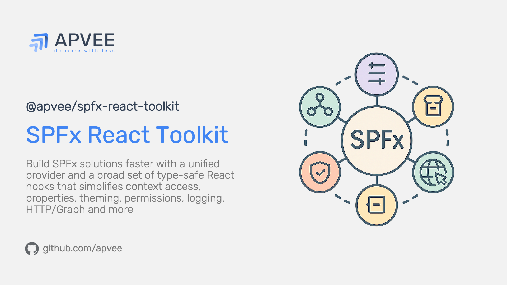

# SPFx React Toolkit

> A comprehensive React runtime, hooks, helpers, and services library for SharePoint Framework (SPFx). Simplifies SPFx development with instance-scoped state isolation, ergonomic hooks, and reusable non-React composition APIs across WebParts, Extensions, and Command Sets.



---

## Overview

**SPFx React Toolkit** is a production-ready library that simplifies SharePoint Framework development by providing unified React providers, strongly-typed hooks, and reusable public helpers/services.

Built on a provider-scoped runtime store, it delivers per-instance state isolation, automatic synchronization, and APIs that work both inside React hooks and in non-hook composition code.

### Key Benefits

| Benefit | Description |
|---------|-------------|
| 💪 **Type-Safe** | Full TypeScript support across hooks, helpers, and services |
| ⚡ **Optimized** | Provider-scoped runtime state with per-instance isolation |
| 🔄 **Auto-Sync** | Bidirectional synchronization between React and SPFx |
| 🎨 **Universal** | Works with WebParts, Application Customizers, Field Customizers, and Command Sets |
| 📦 **Modular** | Public hooks for React usage, plus helpers/services for non-hook composition |

### Features

- ✅ **35+ React Hooks** — Comprehensive API surface for all SPFx capabilities
- ✅ **Public Helpers** — Pure utilities for storage keys, property pane helpers, environment checks, logging, and context extraction
- ✅ **Public Services** — Reusable service factories for storage, SPFx context data, properties, theme, PnPjs, and provider composition
- ✅ **Instance Isolation** — State scoped per SPFx instance (multi-instance support)
- ✅ **PnPjs Integration** — Optional hooks for PnPjs v4 with type-safe filters
- ✅ **Cross-Platform** — Teams, SharePoint, and Local Workbench support

---

## Quick Start

### Installation

```bash
npm install @apvee/spfx-react-toolkit
```

### Basic Usage

```typescript
// In your WebPart
import { SPFxWebPartProvider } from '@apvee/spfx-react-toolkit';

public render(): void {
  const element = (
    <SPFxWebPartProvider instance={this}>
      <MyComponent />
    </SPFxWebPartProvider>
  );
  ReactDom.render(element, this.domElement);
}

// In your component
import { useSPFxProperties, useSPFxUserInfo } from '@apvee/spfx-react-toolkit';

const MyComponent: React.FC = () => {
  const { properties } = useSPFxProperties<IMyProps>();
  const { displayName } = useSPFxUserInfo();

  return <div>Hello {displayName}!</div>;
};
```

### Helpers and Services

Use public helpers and services when the logic must run outside a React hook while keeping the same behavior used internally by the hooks.

```typescript
import {
  createScopedSPFxStorageKey,
  createSPFxPnPListService,
  getSPFxUserInfo,
} from '@apvee/spfx-react-toolkit';

const user = getSPFxUserInfo(pageContext);
const filtersKey = createScopedSPFxStorageKey(instanceId, 'filters');
const tasks = createSPFxPnPListService(sp, 'Tasks', 50);
```

---

## 📚 Documentation

For complete documentation including:
- Installation & configuration
- All 4 provider components
- Complete hooks API reference (35+ hooks)
- Public helpers and services API references
- Code examples and best practices

**➡️ [View Full Documentation](https://github.com/apvee/spfx-react-toolkit/blob/main/docs/INTRODUCTION.md)**

---

## Requirements

| Requirement | Version |
|-------------|---------|
| Node.js | 22.x |
| SPFx | 1.18.0+ |
| React | 17.x |
| TypeScript | 5.3+ |

---

## License

MIT — See [LICENSE](./LICENSE) for details.

---

## Links

- [📖 Full Documentation](https://github.com/apvee/spfx-react-toolkit/blob/main/docs/INTRODUCTION.md)
- [📚 API Reference](https://github.com/apvee/spfx-react-toolkit/blob/main/docs/INDEX.md)
- [🧰 Helpers API](https://github.com/apvee/spfx-react-toolkit/blob/main/docs/api/helpers/INDEX.md)
- [🧩 Services API](https://github.com/apvee/spfx-react-toolkit/blob/main/docs/api/services/INDEX.md)
- [📦 NPM Package](https://www.npmjs.com/package/@apvee/spfx-react-toolkit)
- [🐛 Issues](https://github.com/apvee/spfx-react-toolkit/issues)

---

Made with ❤️ by [Apvee Solutions](https://github.com/apvee)
